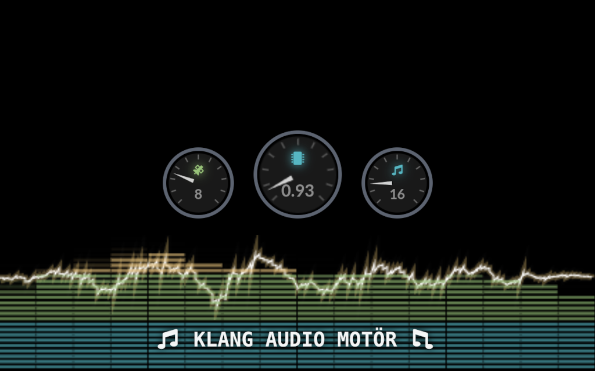

[](https://kotlinlang.org/docs/releases.html)
[](https://www.codefactor.io/repository/github/peekandpoke/klang)
[](https://www.gnu.org/licenses/agpl-3.0)

# Klang Audio Motör

Ein Klang-Generator | A Sound-Generator

This is the home of the Klang Audio Motör, a Kotlin multiplatform realtime audio generatör.



Currently supported platforms:

- JS / Web
- JVM

Currently supported live coding frameworks:

- Strudel (pure Kotlin reimplementation)

# Pre-Alpha-Demo

There are still some rough edges ... For the best experience use a chrome-browser on a laptop or pc please.

https://klang.finzo.de

# Module Structure

```
                            ┌──────────────────┐
                            │   klang (app)    │  Main application (JS/JVM)
                            └──┬──┬──┬──┬──┬───┘
                               │  │  │  │  │
          ┌────────────────────┘  │  │  │  └────────────────────┐
          │            ┌──────────┘  │  └──────────┐            │
          v            v             v             v            v
   ┌────────────┐ ┌─────────┐ ┌───────────┐ ┌──────────┐ ┌────────────────┐
   │  strudel   │ │klangui  │ │klangblocks│ │klangsc-ui│ │ klang-notebook │
   │            │ │         │ │           │ │          │ │                │
   │ Pattern    │ │ Shared  │ │ Visual    │ │ Editor   │ │  Interactive   │
   │ language   │ │ UI      │ │ block     │ │ CodeMirr │ │  notebook      │
   └──┬──┬──────┘ └──┬──┬───┘ │ editor    │ └──┬──┬──┬─┘ └───┬──┬──┬──┬───┘
      │  │           │  │     └──┬──┬─────┘    │  │  │       │  │  │  │
      │  │           │  │        │  │          │  │  │       │  │  │  │
      │  │     ┌─────┘  │    ┌───┘  │     ┌────┘  │  │       │  │  │  │
      │  │     │     ┌──┘    │   ┌──┘     │    ┌──┘  │       │  │  │  │
      v  v     v     v       v   v        v    v     v       v  v  v  v
   ┌─────────────────────────────────────────────────────────────────────┐
   │                         klangscript                                 │
   │              Scripting language: parser, interpreter                │
   └─────────────────────────────────────────────────────────────────────┘

   ┌──────────┐         ┌──────────────┐
   │ klangjs  │         │ strudel-ksp  │
   │          │         │              │
   │ External │         │ KSP doc      │
   │ JS decls │         │ processor    │
   │(CodeMirr)│         │ for strudel  │
   └──────────┘         └──────────────┘
       ^                       ^
       │                       │
   klangscript-ui          strudel
   (transitive)            (compile-time)


                    ┌──────────────────────┐
                    │    audio_bridge      │  Shared audio data types
                    └──┬───────────────┬───┘
                       │               │
              ┌────────┘               └────────┐
              v                                 v
       ┌────────────┐                    ┌────────────┐
       │  audio_be  │                    │  audio_fe  │
       │            │                    │            │
       │  Backend   │                    │  Frontend  │
       │  render    │                    │  playback  │
       └────────────┘                    └──┬─────────┘
                                            │
                                            v
                                     ┌─────────────────┐
                                     │ audio_jsworklet │
                                     │                 │
                                     │ WebAudio        │
                                     │ worklet         │
                                     └─────────────────┘

   ┌──────────┐          ┌──────────┐
   │  common  │          │  tones   │
   │          │          │          │
   │ Shared   │          │ Music    │
   │ utils    │          │ theory   │
   └──────────┘          └──────────┘
       ^                      ^
       │                      │
   (used by most modules)  (audio_fe, klangui, strudel)
```

## Modules

| Module            | Platform  | Description                                                                    |
|-------------------|-----------|--------------------------------------------------------------------------------|
| `klang`           | JS/JVM    | Main application — web UI, pages, routing, audio player integration            |
| `klangscript`     | Common    | Scripting language — hand-rolled parser, tree-walking interpreter, type system |
| `klangscript-ui`  | JS        | CodeMirror editor with code completion, hover docs, tool badges                |
| `klangjs`         | JS        | External JS declarations (CodeMirror bindings) — no project dependencies       |
| `klangui`         | JS        | Shared UI components — theme, hover popups, tool registry, SVG helpers         |
| `klangblocks`     | Common/JS | Visual block editor — AST-to-blocks, code generation, round-trip editing       |
| `strudel`         | Common/JS | Pattern language — Kotlin port of strudel.cc for live coding music             |
| `strudel-ksp`     | JVM       | KSP annotation processor — extracts DSL documentation from KDoc                |
| `audio_bridge`    | Common    | Shared audio data types — voice data, playback signals, audio config           |
| `audio_be`        | Common    | Audio backend — oscillators, filters, effects, voice rendering                 |
| `audio_fe`        | Common/JS | Audio frontend — playback scheduling, sample loading, engine facade            |
| `audio_jsworklet` | JS        | WebAudio worklet — runs audio rendering in a dedicated thread                  |
| `common`          | Common    | Shared utilities — caching, math helpers, platform abstractions                |
| `tones`           | Common    | Music theory — note names, scales, frequencies, MIDI conversion                |
| `klang-notebook`  | Common/JS | Interactive notebook support — cell execution, reactive evaluation             |
