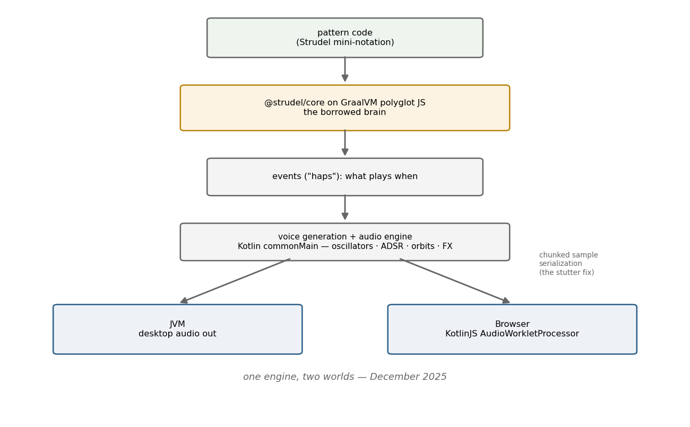

# First Sound

*One synthesizer, two worlds, and a borrowed brain — how klang began.*

## 1. The bet

Klang's first commit landed on **2025-12-20**, and it encoded a bet that still defines the project: the audio engine
would be **Kotlin Multiplatform, platform-agnostic from day one** — the same synthesis code producing the same sound on
a JVM and inside a browser tab. Not a native engine with a web port, not a web toy with a desktop wrapper: one
`commonMain`, two worlds.

That bet is why, months later, an offline WAV render and a live browser session are the *same* audio path. It is also
why every performance decision since has bowed to the stricter of the two masters — the browser's audio worklet, with
its ~2.7 ms block deadlines and a garbage collector waiting to ruin them.

## 2. The borrowed brain

A synthesizer needs something to play. Rather than design a pattern language first, klang borrowed the best one
available: **Strudel**, the JavaScript descendant of TidalCycles. The trick: run `@strudel/core` *unmodified* on the JVM
through GraalVM's polyglot JS engine, let it do what it does best — turn pattern code into a stream of timed "haps" —
and feed those events into our own voice generation and audio backend.

*Fig. 1 — the first architecture. The borrowed brain up top; everything below it ours, in Kotlin common code, fanning
out to two output worlds.*

This was scaffolding, and known to be scaffolding. It bought months: while Strudel handled the "what plays when," the
engine could grow oscillators (sine, square, saw, triangle, and a rough first supersaw), ADSR envelopes, delay lines,
per-group orbits, reverb, panning, distortion, FM — the actual *instrument*. Sample banks followed: percussive and
melodic sets, on-demand loading, pitch-matched playback that picks the best sample for a target note, the beginnings of
soundfont support.

By the end of the quarter the bet had paid its first dividend: something you could genuinely play, in a browser and on
the desktop, sounding the same.

## 3. The three scars

Every origin story keeps some scars. Ours turned out to be foreshadowing.

**`n()` is not `note()`.** Several hours went into a bug that was, in the end, a vocabulary problem: two functions that
look interchangeable and are not (`n` selects *within* a sound bank; `note` sets pitch). The immediate fix simplified
the JS bridge — but the lasting effect was an allergy. The engine's later obsession with **parameter parity** — the same
word must mean the same thing on every surface, divergences tested or eliminated — traces straight back to this
afternoon. A DSL's vocabulary is API surface, and it can lie to you.

**The worklet stutter.** Sending sample banks to the browser's
`AudioWorkletProcessor` as big blocks stuttered the audio thread — the serialization cost landed exactly where no cost
may land. The fix was custom **chunked serialization** in the worklet contract: slice the transfer, keep the audio
callback sacred. It was the first round of a fight the project never stopped fighting — everything that crosses onto the
audio thread pays rent — and the same wire would later be rebuilt end-to-end for a ~174× decode speedup. The audio
thread's rent only ever goes up.

**The per-sample callback.** The very first oscillator draft asked the engine for audio one sample at a time — a
callback per sample to produce a sine or a saw. It was *suuuuper* slow, and no micro-optimization inside the callback
could save it: the cost was the call itself, times 48,000, times every voice. The rewrite made **block-based processing
the law of the land**
— every generator and filter fills a buffer per call, and nothing in the hot path has been per-sample-dispatched since.
Of the three scars this one cut deepest architecturally: the Ignitor interface, the voice pipeline, the worklet
contract — the whole engine is shaped like a chain of buffer-fillers because of that first slow sine. And it paid a
dividend nobody planned: once every sound-maker was a self-contained fill-this-buffer unit, sound-makers became
*composable* — plus, times, filters, envelopes as combinators over buffer-fillers. The Ignitor DSL, the way klang
authors instruments today, exists by happy accident of that performance fix. The shape you choose for speed becomes the
shape you think in.

## 4. What was deliberately parked

Two things were tried, hurt, and consciously postponed rather than fought:
**Wasm** (the KotlinJS worklet path worked; the Wasm toolchain of late 2025 did not — parked, not abandoned) and any
thought of *replacing* the borrowed brain. The GraalVM bridge was JVM-only — the browser still ran real Strudel-JS
directly — and that asymmetry was tolerable for a prototype but obviously not an end state.

Which is exactly where the next chapter picks up: within weeks of first sound, the project began growing a brain of its
own — an interpreter, a pattern engine, and a way to prove they behaved like the original. That story — the
differential-testing oracle, the part/whole refactor, and a rename that amounted to a declaration of independence — is
the Q1 post.

## 5. What survived

Looking back from mid-2026, an unusual amount of that first quarter is still load-bearing: the commonMain engine
boundary, the orbit concept, the sample-bank pipeline, the worklet contract (rebuilt, same shape), and all three scars
as principles. The bet held. The brain, though — the brain had to go.
