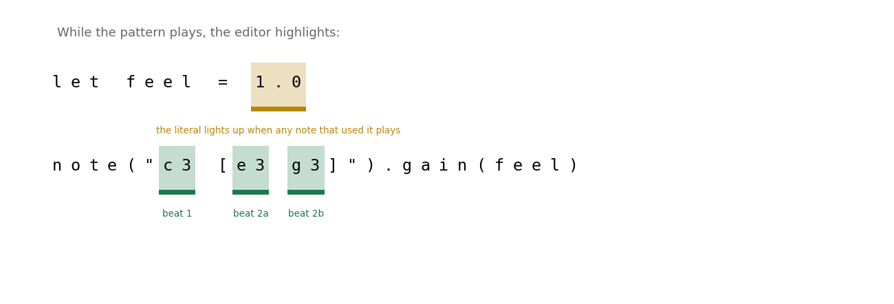
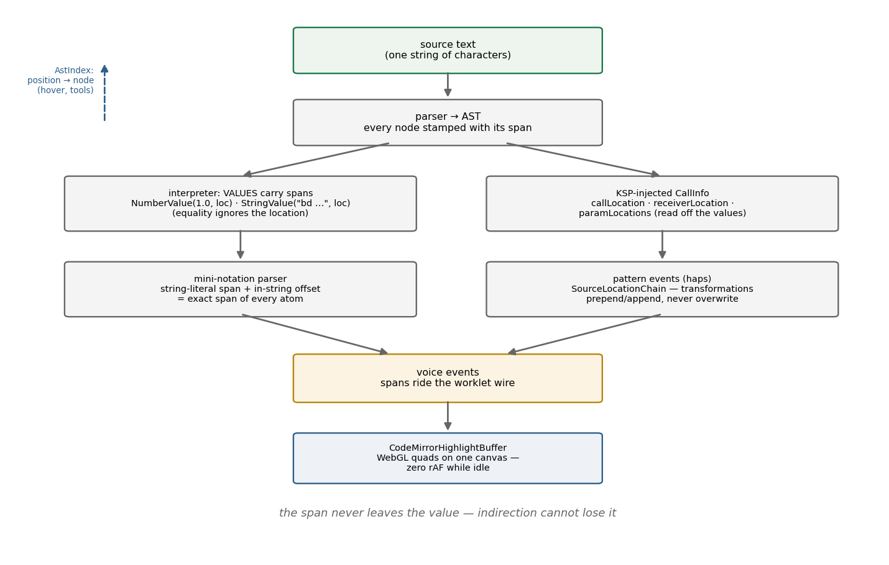

# The Position That Survived

*How a source location rides from the parser through the pattern engine to a
glowing rectangle in the editor.*

## 1. The problem: the editor must know what is playing

Live coding has one UI feature that separates "text editor next to a synth"
from an *instrument*: while the music runs, the code lights up. The atom
that just triggered flashes; you see your pattern breathe. For that to work,
every runtime event — thousands per minute — must know **which characters of
the source text it came from.**

That is a provenance problem, and it is harder than it looks, because the
distance between a character and a sound is long: a string literal is parsed
by a *second* parser (mini-notation), the result is transformed by pattern
combinators, evaluated into events, scheduled into voices, and shipped
across a wire to an audio worklet — and the answer has to come *back* from
that pipeline to the exact columns of the exact line. Lose the thread at any
step and the light shows nothing, or worse, the wrong thing.

And there's a subtler version of the problem that most systems don't even
attempt. Consider:

```javascript
let feel = 1.0

note("c3 [e3 g3]").gain(feel)
```

When those notes play, klang highlights the atoms `c3`, `e3`, `g3` — *and
the literal `1.0` two lines up.* The value participated, so its birthplace
lights up. That is the feature this post explains.



*Fig. 1 — illustration of the editor's highlight behavior: the atoms flash on their beats, and the `feel` literal glows whenever a note that used it plays. The location traveled with the value.*

## 2. Prior art

**Compilers** solved provenance long ago — DWARF debug info, line tables,
JavaScript source maps — but those map *code to code* for a debugger
stepping through it. They answer "what line is this instruction from," not
"light up the third atom inside a string literal, 200 times a minute,
without touching the DOM per event."

**Live-coding systems** are the real ancestors. Strudel — the JavaScript
pattern language klang [began life borrowing](../2026-03-21-growing-our-own-brain/index.md)
— highlights active mini-notation atoms in its REPL ([strudel.cc](https://strudel.cc)), and TidalCycles
editors do related tricks. The standard mechanism: the mini-notation parser
records each atom's offsets, events carry them, the editor draws. It works,
and it defines the baseline.

The baseline has a boundary, though: it lights up *pattern syntax*. A value that arrives through a variable or a function argument has usually lost its ancestry by the time it reaches an event — highlighting
stops at the quotation marks.

## 3. The thread: locations ride the values

Klang's design decision, made early (2026-01-20, when source-location
tracking landed): **provenance is a property of values, not of syntax.**



*Fig. 2 — the span's journey. Forward: parser → values → patterns → events →
voices → highlight overlay. Backward: `AstIndex` maps editor positions to
nodes for hover docs and tools.*

Step by step:

1. **The parser stamps every AST node** with its span — standard.
2. **The interpreter stamps every value.** `NumberValue` and `StringValue`
   carry an optional `location` — the span of the literal they were born
   from. The detail that makes this safe: **equality deliberately ignores
   the location.** Two `1.0`s from different lines are still equal;
   provenance is a passenger, never a participant in semantics. A value
   assigned to `feel`, passed through a call, returned from a helper —
   the location just rides along, because it's *in* the value.
   (One honest boundary: arithmetic severs the thread — `feel * 2` is a
   *new* value with no birthplace. The rule covers pass-through, not
   computation.)
3. **The KSP registration layer forwards call-site context.** Every
   registered DSL function [can receive a `CallInfo`](../2026-08-12-one-annotation-six-artifacts/index.md)
   — the call's own span, the receiver's span, and **per-parameter spans
   read straight off the argument values**. When `.gain(feel)` executes,
   the engine knows the argument's birthplace is `1.0` on line 1. No
   special-casing of variables anywhere: the value knew.
4. **The mini-notation parser composes spans.** `"c3 [e3 g3]"` is a string
   — but the `StringValue` knows where the string sits in the source, and
   the mini-notation parser knows each atom's offset *inside* the string.
   Literal-span + in-string-offset = an exact span per atom. An
   integration test pins this to the column: `sound("bd hh sd oh")` must
   yield four events whose spans point at columns 8, 11, 14, 17.
5. **Events carry a *chain*, not a single span.** A pattern event's
   `sourceLocations` is a `SourceLocationChain` — transformations
   **prepend and append, never overwrite.** An atom wrapped in `struct()`
   inside a `superimpose()` keeps every ancestor; the editor draws the whole chain — atom, string literal, call site — deduped, filtered to the current file, and capped, innermost first. Transformations
   add context; they are not allowed to orphan an event.
6. **Voice events cross the wire with their spans**, and the editor's
   highlight overlay draws them.

## 4. The last meter: drawing without paying

The display end has its own engineering story, because "highlight thousands
of events" is exactly the kind of feature that dies in production. The
first implementation was one DOM `<mark>` per event with a CSS `@keyframes`
pulse animating `border-color` — paint-bound properties that forced a
re-rasterization of every active mark, every frame. Weak GPUs choked. (No before/after frame numbers were recorded in the heat of that rewrite — a rare unmeasured claim in this series; the qualitative story below is from the component's own documentation.)

The current `CodeMirrorHighlightBuffer` is a single transparent WebGL
canvas over the editor: each highlight is a pooled quad, one ticker handles
scheduling and fade, only `x/y/alpha` change per frame — and the ticker
stops when nothing plays, so an idle editor costs **zero**
`requestAnimationFrame`. The CodeMirror state itself is never touched. The
same discipline that rules the audio thread — no per-event allocation, no
per-frame paint — turned out to be what the *visual* thread needed too.

## 5. The same thread, backwards

Provenance also runs in reverse. `AstIndex` maps an editor position to the
AST node at that position — the infrastructure behind hover documentation,
context menus, and the visual parameter tools. Click on `body("wood")` and
the editor knows which call you're in and which argument you're touching;
the [same generated metadata](../2026-08-12-one-annotation-six-artifacts/index.md)
that registered the function supplies the docs and the editing widget.
Forward, positions explain the music; backward, they explain the code.

## 6. Lessons

1. **Attach provenance to values, not syntax.** Everything else follows:
   variables, arguments, helper returns — no case analysis, no "highlight
   only works inside pattern strings." The one rule that keeps it honest:
   location must never affect equality or behavior. It's a passenger.
2. **Chains beat single spans.** Transformations are additive; the moment
   one is allowed to *replace* a location, some pipeline five steps later
   is pointing at the wrong code.
3. **Compose parsers' coordinate systems explicitly.** The mini-notation
   parser doesn't know about files; it knows offsets in a string. The
   string knows where it lives. Keep both and add — and pin it with a test
   that asserts actual line and column numbers.
4. **The display path is a hot path.** A provenance system that works but
   renders through per-event DOM mutation just moves the failure from
   "wrong highlight" to "dropped frames." The glow has a frame budget too.

The feature reads as a gimmick until the first time you watch a stranger's
song play with the code on screen — the music explaining itself, atom by
atom, constant by constant. Then it reads as the whole point.
