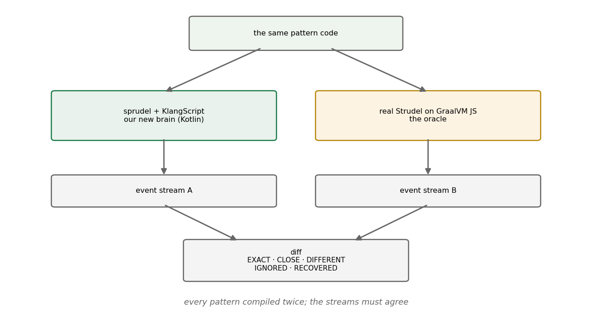

# Growing Our Own Brain

*Replacing a language runtime while every song depends on its exact behavior.*

## 1. The problem

By January 2026 klang made real music, but its brain was rented. Pattern evaluation ran on `@strudel/core` — real
Strudel — through a GraalVM polyglot bridge on the JVM, and directly as JavaScript in the browser. Three pressures made
that untenable:

1. **Two worlds, one brain missing.** The GraalVM bridge was JVM-only. A Kotlin-native pattern engine could run in
   `commonMain` — one implementation, both platforms, like the audio engine already did.
2. **The bridge taxed every note.** Every pattern query crossed a polyglot boundary on its way to the audio engine.
3. **We wanted our own direction.** Extending a language through a bridge means extending someone else's language. New
   pattern functions, our own DSL conventions, an interpreter we could put an IDE on — all of it wanted ownership.

But the risk was brutal and specific: a pattern language's value *is* its exact semantics. `"bd [sd sd] <hh oh>"` means
one precise arrangement of events in time, including every edge case of cycle boundaries, alternation, and fractional
timing. Reimplement it 99% right and every existing song plays 1% wrong — and nobody can say where.

## 2. Prior approaches, and why they weren't enough

**Clean-room reimplementation from the docs** fails silently: documentation describes intent; songs depend on behavior.
The gap between the two is exactly where the bugs live.

**Porting the original's test suite** covers what the tests cover. Strudel's suite is good, but no suite written *for*
an implementation exercises the edges a *re*-implementation gets wrong — the two codebases disagree in places neither
author thought to test.

The classic answer is **differential testing** — McKeeman's technique of running the same input through two
implementations and comparing outputs
[[1]](#mckeeman1998), best known from compiler fuzzing. Our situation was the textbook setup wearing headphones: a
reference implementation exists, it's executable, and its output — a stream of timed events — is exactly comparable.

## 3. The method: keep the old brain as an oracle

So the old brain wasn't removed; it was **demoted to an oracle**. The verification harness compiles every pattern
twice — once with the new Kotlin engine, once with real Strudel running in GraalVM's JS engine — and diffs the resulting
event streams.

*Fig. 1 — every pattern runs through both brains; the streams must agree.*

The diff is graded, not binary — the comparison verdicts in the harness are
`EXACT`, `CLOSE`, `DIFFERENT`, `IGNORED`, and `RECOVERED` — because two correct implementations still differ in float
dust, and a naive equality check would drown real divergences in noise. Which surfaced the deeper problem almost
immediately:

**Floating-point time drifts.** Cycle arithmetic — thirds of a cycle, sevenths, nested alternations — accumulates error
differently in every implementation. Two mathematically identical patterns diverge in the 15th decimal, then a boundary
comparison flips, and an event lands in the wrong cycle. The fix was to make time *exact*: first a `Rational` type,
later hardened into a fixed-point `CycleTime` value class (the JS BigInt hot path made pure rationals too slow). Time in
sprudel is not a `Double`, and that single decision closed a whole family of oracle disagreements.

The hardest campaign the oracle forced was the **part/whole refactor** — Strudel events carry both the *part* (the
fragment active in the queried span) and the *whole* (the full event it belongs to), and getting their interaction right
across `struct`, masks, and cycle boundaries is where a reimplementation quietly rots. The oracle turned "quietly" into
a red diff, case by case, until the semantics matched.

Meanwhile the language itself grew underneath: **KlangScript**, a JavaScript-ish interpreter written in Kotlin (parser
on `better-parse`), with a Kotlin-interop registration layer that a KSP processor eventually made nearly
boilerplate-free. The pattern engine became a library *inside*
that language rather than a runtime beside it.

## 4. The declaration

On **2026-03-21** the fork got its own name: **strudel → sprudel**. Partly housekeeping — the implementations had
genuinely diverged; new functions existed that upstream didn't have — and partly a promise about direction:
compatible in spirit and largely in syntax, but its own language from here.

The oracle outlived the independence it certified. `JsCompatTests` is still in the tree today, lazily constructing its
GraalVM context, politely skipping itself on non-GraalVM runtimes — a safety line back to the original, run whenever
pattern semantics change. Independence didn't mean burning the bridge; it meant not needing it.

## 5. What it bought, in hindsight

Every quarter since has cashed cheques this one wrote. The IDE features, intellisense, and named parameters of Q2 exist
because the interpreter is ours. Sound definitions, oscillators, and eventually whole engine pipelines became *language
objects* because the language could be extended freely. The browser dropped its last dependency on Strudel-JS. And the
verification habit — never trust a reimplementation without an executable oracle, grade the diff, make time exact —
became the house style for every risky migration after.

The borrowed brain served for one quarter. The oracle it left behind still serves today.

---

## References

1. McKeeman, W. M. (1998). *Differential Testing for Software.* Digital Technical Journal, 10
   (1), 100–107.
   [semanticscholar.org](https://www.semanticscholar.org/paper/Differential-Testing-for-Software-McKeeman/fc881e8d0432ea8e4dd5fda4979243cac5e4b9e3)
