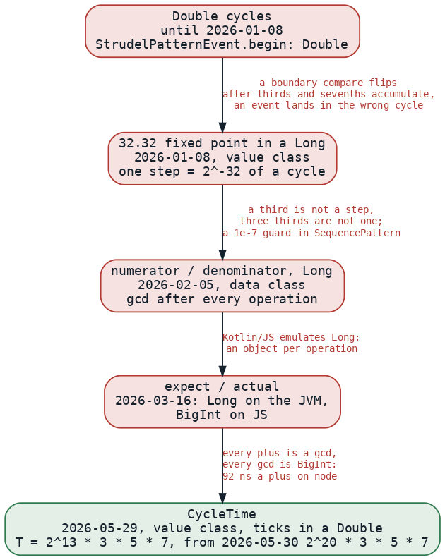
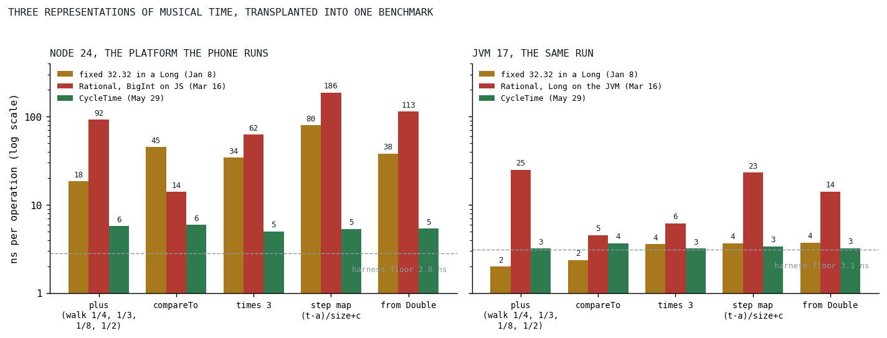

# The Triplet That Never Drifted

*Musical time went through five representations in five months, from a Double to a fixed point to two rationals to a fixed point again, and the last one made a third exact and a plus under six nanoseconds.*

This is the oldest post in the series and one of two whose optimization lives above the engine, in the pattern language, and it is as much about correctness as about speed, because in a sequencer the two are the same problem. A pattern divides a cycle into steps, a step into steps again, shifts them by fractions, stretches them by fractions, and asks, cycle after cycle, which events begin inside a window. A triplet inside a cycle must land exactly on the third, forever. Until January 8 the position of an event was a Double:

```kotlin
@Serializable
data class StrudelPatternEvent(
    /** The begin of the note (in cycles) */
    val begin: Double,
    /** The end of the note (in cycles) */
    val end: Double,
    /** The duration of the note (in cycles) */
    val dur: Double,
    /** The voice data */
    val data: VoiceData,
)
```

*[StrudelPatternEvent.kt at c0620dea](https://github.com/PeekAndPoke/klang/blob/c0620dea0e88a3e027df31031ea153528dbb8b74/strudel/src/commonMain/kotlin/StrudelPatternEvent.kt#L9-L19), the last commit before the first Rational file was added*

A Double holds a third as the nearest binary fraction, and a seventh, and a shifted, stretched, nested combination of them accumulates a different error on every path [[1]](#goldberg1991). Two patterns that are the same on paper come out different in the fifteenth digit, a comparison against a cycle boundary flips, and an event that belongs to cycle four is fetched in cycle five, or in neither. The dev diary's entry for the day says "fighting with floating point drift" and, on the next line, what was done about it.



*Fig. 1: The five representations of a cycle position, in order, with what broke on each and drove the next. Dates are the commits that introduced each; the numbers on the last edge are from the transplant benchmark of Fig. 2.*

## Five representations in five months

The first replacement, for about an hour that morning, really was a numerator and a denominator; by the afternoon it had been replaced by a 32.32 fixed point in a Long that kept the file's name, a value class with a private field of bits, thirty-two of them for the fraction:

```kotlin
/**
 * Rational number representation using 32.32 Fixed Point arithmetic.
 *
 * This implementation is a `value class`, meaning it is inlined to a primitive [Long] at runtime,
 * resulting in zero heap allocations for arithmetic operations.
 *
 * It uses 32 bits for the fractional part, providing a resolution of ~2.3e-10.
 */
@Serializable(with = RationalSerializer::class)
@JvmInline
value class Rational private constructor(private val bits: Long) : Comparable<Rational> {
```

*[Rational.kt at 302cf72d](https://github.com/PeekAndPoke/klang/blob/302cf72d586498f211b5fe3bdb72e660ae7c5a31/strudel/src/commonMain/kotlin/math/Rational.kt#L14-L24), January 8*

A fixed point makes drift disappear for every fraction whose denominator is a power of two, which is most of music, and rounds everything else to the nearest step. A third is not a step. Its nearest step is 1,431,655,765 of the 4,294,967,296 in a cycle, and three of those are 4,294,967,295: three thirds are one step short of one, and a sequence of three triplet steps ends one step before the cycle boundary it was supposed to meet. Five days later the diary records a full rational implementation tried and abandoned within the day, the commit log shows the file that held it added and deleted in the same evening, and the sequencer got a guard instead:

```kotlin
                val takeIt = intersectEnd > intersectStart &&
                        // IMPORTANT: Protection against floating point precision issues
                        (innerTo - innerFrom > MIN_QUERY_LENGTH)
```

*[SequencePattern.kt at 54beec47](https://github.com/PeekAndPoke/klang/blob/54beec477e5b3b56f75c72286057a878a0e6d580/strudel/src/commonMain/kotlin/pattern/SequencePattern.kt#L67-L69), January 13; the length is a ten-millionth of a cycle*

The guard held for three weeks. On February 5 the class became what its name said, a numerator and a denominator in two Longs, reduced by a gcd after every operation, and the KDoc names the model:

```kotlin
/**
 * Rational number representation using numerator and denominator.
 *
 * This implementation replaces the Fixed Point 32.32 arithmetic with exact rational arithmetic,
 * similar to Fraction.js. It stores values as [numerator] and [denominator].
 */
@ConsistentCopyVisibility
@Serializable(with = RationalStringSerializer::class)
data class Rational private constructor(val numerator: Long, val denominator: Long) : Comparable<Rational> {
```

*[Rational.kt at 7ed31a91](https://github.com/PeekAndPoke/klang/blob/7ed31a91b445e125434386651e66cc1146994971/strudel/src/commonMain/kotlin/math/Rational.kt#L14-L23), February 5*

That was correct, and on the JVM it was fine. In the browser it was not, and the reason is the type. JavaScript has no 64-bit integer, so Kotlin/JS emulates a Long with an object holding two 32-bit halves, and every add, multiply and compare on a numerator allocated one; the project's own style rule bans the type for that reason. The quarter's history file records the response as "removing `Long` everywhere (JS pain)", and on March 16 the class split into an expect declaration and two actuals, Long on the JVM and, on JavaScript, the native BigInt that the platform does have [[2]](#mdnbigint):

```kotlin
/**
 * Rational number representation using numerator and denominator.
 *
 * Platform implementations:
 * - JVM: Long-based numerator/denominator
 * - JS: Native BigInt-based to avoid Kotlin/JS Long boxing overhead
 */
@Suppress("EXPECT_ACTUAL_CLASSIFIERS_ARE_IN_BETA_WARNING", "unused")
@Serializable(with = RationalStringSerializer::class)
expect class Rational : Comparable<Rational> {
```

*[Rational.kt at 09c6e8d9](https://github.com/PeekAndPoke/klang/blob/09c6e8d90a9d5e59e6ba7d5b0c26d3a71b3a0ef5/strudel/src/commonMain/kotlin/math/Rational.kt#L11-L20), March 16*

## Every plus is a gcd

Here is what a plus cost on that path, in its final form, from the last commit before the class was deleted. It is careful code: the sign is precomputed, a coprime-denominator fast path skips the reduction, and the reduction that remains is against the small gcd of the denominators rather than the product. Every line of it is a BigInt operation:

```kotlin
        val g = gcd(d, other.d)

        // Coprime denominators (g == 1) — includes every "add an integer/cycle offset" case.
        // Proof: gcd(num, den) = gcd(num, g) = gcd(num, 1) = 1, so the result is already reduced.
        // Skip the divisions and the second gcd entirely. Common on the hot path.
        if (bigIntEq(g, BI_ONE)) {
            val num = bigIntAdd(bigIntMul(n, other.d), bigIntMul(other.n, d))
            val den = bigIntMul(d, other.d)
            val resultSgn = if (sgn == other.sgn) sgn else bigIntSign(num)
            return ofFinite(num, den, resultSgn)
        }

        val otherDOverG = bigIntDiv(other.d, g)
        val dOverG = bigIntDiv(d, g)
        val num = bigIntAdd(bigIntMul(n, otherDOverG), bigIntMul(other.n, dOverG))
        val den = bigIntMul(d, otherDOverG)

        // Smart reduction: inputs are reduced, so gcd(num, den) = gcd(num, g) (much smaller).
        val g2 = gcd(num, g)
```

*[Rational.kt (jsMain) at e57b2cf0](https://github.com/PeekAndPoke/klang/blob/e57b2cf02ac74973c84e0605b1d0f3630a9232d6/common/src/jsMain/kotlin/math/Rational.kt#L248-L285), the plus of the BigInt actual, the commit before its deletion*

A query walks a sequence by adding step widths, compares every event against the window's edges, maps outer time into a step by a subtraction, a division and an addition, and does this for every step of every pattern in the chain for every cycle. The whitepaper of August called the result a performance disaster on JavaScript, where every gcd and every plus hit BigInt in the hot path. Nobody wrote the number down at the time; it is measured below.

## A cycle in 110,100,480 ticks

The way out was the way in, a fixed point, with two things changed. The first is the base. The January class had a power of two for its step, which is why a third was not a step. The May class picks the number of ticks in a cycle to be divisible by everything music divides by; on May 29 it landed with 2^13 halvings, and the next day settled on the constant it has kept since:

```kotlin
    companion object {
        /** Ticks per cycle: 2^20 · 3 · 5 · 7. Highly composite → exact tuplets + fine dyadic grid. */
        const val T: Double = 110100480.0
```

*[CycleTime.kt at v0.1.0](https://github.com/PeekAndPoke/klang/blob/5c7d211957fc9719c80d0cb0aa838e9c9f9f09f5/common/src/commonMain/kotlin/math/CycleTime.kt#L116-L118)*

A third of a cycle is 36,700,160 ticks, exactly, and three of them are the cycle. So are a fifth, a seventh, a sixth, a twelfth, a fifteenth, a hundred-and-fifth, and every half of a half down to the twentieth halving. What is not exact is rounded to the nearest tick, and the class says which: ninths, twenty-fifths, elevenths, and halvings finer than one 1,048,576th of a cycle. The second change is the container. The whitepaper says the class is an Int under the hood; the code says a Double, and the code is right, for the reason the KDoc gives:

```kotlin
 * Stored as a [Double] holding an exact integer. This is safe because:
 * - IEEE-754 represents every integer up to 2^53 exactly, and our tick counts stay around 10^10
 *   even for marathon sessions (T ≈ 8.6e5 × ~1e4 cycles), far below 2^53 ≈ 9e15.
 * - Therefore `+`, `-`, unary minus, and `times(Int)` are **bit-exact with no rounding**.
 * - Rounding is only applied where a value is first snapped to the grid: [ofCycles], [ofSubdivision],
 *   [scaleBy]/[divBy]. That snapping is the intended quantization (e.g. a `0.001`-cycle humanization
 *   offset snaps to the nearest tick instead of polluting denominators).
 *
 * As a [JvmInline] value class this compiles to a bare `number` on JS (no boxing — unlike `Long`) and
 * a primitive `double` on JVM, so the abstraction is zero-cost on the hot path.
```

*[CycleTime.kt at v0.1.0](https://github.com/PeekAndPoke/klang/blob/5c7d211957fc9719c80d0cb0aa838e9c9f9f09f5/common/src/commonMain/kotlin/math/CycleTime.kt#L33-L42); the arithmetic follows at [L55-L64](https://github.com/PeekAndPoke/klang/blob/5c7d211957fc9719c80d0cb0aa838e9c9f9f09f5/common/src/commonMain/kotlin/math/CycleTime.kt#L55-L64)*

An Int would overflow in nineteen cycles; a Long is the type the whole project bans; a Double holding an integer is a JavaScript number, adds and compares as a machine double, and stays exact for about eighty million cycles, which is 2^53 divided by the tick count. A plus is a plus of two doubles. A compare is a compare. There is no gcd because there is no denominator: the whole grid shares one.

## What exact time fixed

The day after the class landed, a test was written that scans every alternation length from one upward over many cycles, and it exists because exact time exposed a bug that inexact time had hidden. Structural operators select which item plays in which cycle by dividing, and a division that rounds picks the wrong item at some cycle for any length that does not divide the tick count. The whitepaper kept the story in a box until August:

```html
                <span class="lab">A bug worth the war story</span>
                <p>
                    Structural operators like <code>seq(N)…slow(N)</code> were silently mis-selecting and
                    dropping events whenever N did not divide the tick constant. Once time was exact,
                    <code>arrange</code> and <code>&lt;…&gt;</code> alternation could be fixed to exact
                    integer-cycle selection. There is now a dedicated spec guarding it, because it is exactly
                    the kind of thing that quietly comes back.
                </p>
```

*[klang-whitepaper.html at 5332d52d](https://github.com/PeekAndPoke/klang/blob/5332d52d62fcf7c568ad192aab672e105f7beb13/docs/whitepaper/klang-whitepaper.html#L1169-L1178), the last version of the box before the section was cut on August 29*

The spec's own description is the precise version: an alternation of N items compiles to a sequence of N slowed by N, at output cycle c the active item must be c mod N, and for N that does not divide T the slowing rounds, so the floored step selection may pick the wrong item at some cycle. The fix was to select by integer cycle index rather than by a rounded division, and the guard scans lengths and cycles and asserts that no length ever fails, by the raw query and by the sampler that the control path uses. A second guard came in June for the other family of boundary bugs, a shift by two thousandths of a cycle that re-emitted a step straddling a cycle boundary in both adjacent cycles; that one was a clipping bug in the time-shift pattern, but the test that pins it down asserts onset times to a billionth of a cycle across a twelve-cycle window, which is an assertion one can only write once time is exact.

## Results

No benchmark was run in May, so the three classes were transplanted into one benchmark today: the January fixed point as it stood after the same-day revert, the JVM and JavaScript actuals of the rational from the commit before their deletion, and CycleTime as it stands, which is as it has stood since May 30. Five operations, each the shape a query performs: a walk adding a quarter, a third, an eighth and a half in turn; a compare; a scale by three; the sequence step mapping of a subtraction, a division and an addition; and the construction of a time from a Double, which is what a humanization offset or a tempo does.



*Fig. 2: Nanoseconds per operation for the three representations on node and on the JVM, log scale, medians of five trials of 300,000 operations. The dashed line is the harness floor, an empty operation behind the same interface, so each bar's cost is its height above the line. The transplant was deleted after the run; the artifact holds its source.*

| operation, node | fixed 32.32 in a Long | Rational, BigInt | CycleTime |
|---|---:|---:|---:|
| plus, the walk | 18.4 | 92.2 | 5.7 |
| compareTo | 45.2 | 14.0 | 5.9 |
| times 3 | 34.1 | 62.4 | 5.0 |
| step map, (t - a) / size + c | 79.5 | 186.1 | 5.4 |
| from a Double | 38.0 | 113.4 | 5.4 |
| the empty operation | 2.8 | 2.8 | 2.8 |

Every CycleTime row sits within about three nanoseconds of the floor, on both platforms, which is to say the operation itself is about the cost of the double arithmetic it compiles to. In raw per-operation cost the rational's plus was sixteen times as much on node and its step mapping thirty-five times, and the January fixed point, correct for nothing but powers of two, was slower than CycleTime on every row too, by three to fifteen times, which is the emulated Long doing its work. On the JVM the picture is the same in shape and a fraction of the size: the Long rational's plus is 25 nanoseconds and its step mapping 23, the two fixed points are at the floor, and nothing there would have hurt anyone. The problem was only ever on the platform the phone runs, which is why it was invisible for as long as the tests ran on the JVM.

These are operation costs, not query costs. How many of each a query performs depends on the pattern, and no whole-query measurement of May exists, so the post does not claim a factor for a song. The claim it makes is narrower and holds: the timing arithmetic of a sprudel query went from tens to hundreds of nanoseconds per operation to five, and the same change made every third, fifth and seventh exact.

## What transferred

Exactness and speed were the same decision. The reason a rational was slow is the reason it was exact, a denominator per value and a reduction per operation, and the reason CycleTime is fast is the reason it is exact, one denominator for the whole grid, chosen once, and no reduction ever. A fixed point is the right tool for musical time as soon as the base is chosen for music and not for the machine, which is the whole difference between January and May. The container matters as much as the arithmetic: the same integer count in a Long would have been an object on the platform that mattered, and a Double holding an integer is the one representation that is a primitive everywhere the engine runs, which is the rule [the engine side of the series](../2026-09-07-loop-shape-beats-pass-count/index.md) keeps arriving at from the other direction. And a bug that exact time exposed is a bug that inexact time had been hiding; the guard that scans every length is there because it would come back quietly, and since May 30 it has not.

## References

1. <a id="goldberg1991"></a>Goldberg, D. (1991). What every computer scientist should know about floating-point arithmetic. *ACM Computing Surveys*, 23(1), 5-48. <https://doi.org/10.1145/103162.103163>
2. <a id="mdnbigint"></a>MDN Web Docs. BigInt. *JavaScript reference, Global Objects*. <https://developer.mozilla.org/en-US/docs/Web/JavaScript/Reference/Global_Objects/BigInt>

*Sources inside the repository: `DEV-DIARY.MD` (the entries of 2026-01-08 and 2026-01-13), `docs/history/2026-Q1.md` and `2026-Q2.md`, the commits `302cf72d`, `a3ee1095` and `54beec47`, `7ed31a91`, `09c6e8d9`, `13e3be4b`, `aa31eb2b`, `8bf2f7e2` and `b7b31bbf`, `strudel/src/commonMain/kotlin/StrudelPatternEvent.kt` at c0620dea, `strudel/src/commonMain/kotlin/math/Rational.kt` at 302cf72d, 7ed31a91 and 09c6e8d9, `strudel/src/commonMain/kotlin/pattern/SequencePattern.kt` at 54beec47, `common/src/jsMain/kotlin/math/Rational.kt` at e57b2cf0, `common/src/commonMain/kotlin/math/CycleTime.kt` at v0.1.0, `docs/whitepaper/klang-whitepaper.html` at 5332d52d, `sprudel/src/commonTest/kotlin/lang/StructuralCycleSelectionSpec.kt` and `LangLateAlternationSpec.kt`, `.claude/skills/code-style/SKILL.md` (the boxed-type rule), and `docs/benchmarks/2026-09-16_rational-transplant.md` (today's numbers and the deleted benchmark's source).*
