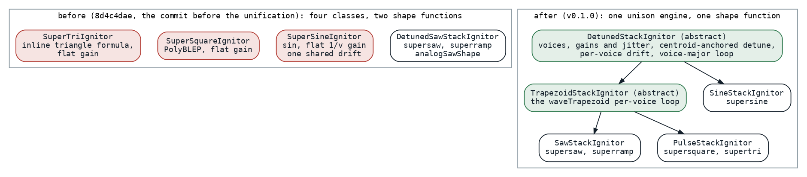
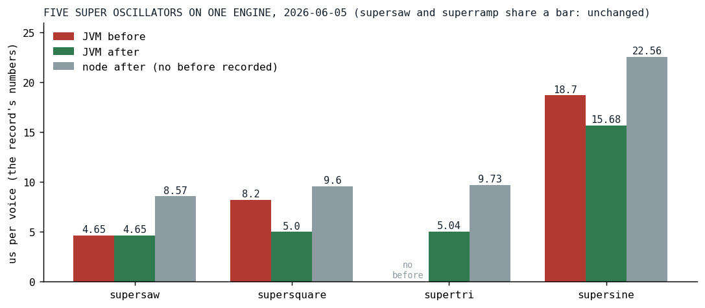

# One Engine for Five Waves

*Three hand-rolled unison oscillators and two shape functions became one of each, and a control-rate read stopped rendering a whole buffer to take one sample from it.*

This is the earliest post in the series about the engine itself, and it is about consolidation rather than a trick. In the first days of June the super oscillators, the detuned stacks behind every wide sound in the songs, were five oscillators in four classes, with five histories. The saw and the ramp had already been merged onto one shared engine. The sine, the square and the triangle each carried their own copy of the voice bookkeeping, their own arrays of phases and detunes, a flat gain of one over the voice count, and a single analog drift walk shared by every voice in the stack. Here is the supersine's inner loop for the drifting case, which the square and the triangle repeated with their own waveform:

```kotlin
                            // Voices 1..v: accumulate
                            for (n in 1 until v) {
                                var p = phases[n]
                                val baseInc = detunes[n]
                                for (i in ctx.offset until end) {
                                    buffer[i] = (buffer[i] + sin(p) * voiceGain)
                                    p += baseInc * d.nextMultiplier()
                                    p = p.wrapPhase(TWO_PI)
                                }
                                phases[n] = p
                            }
```

*[Ignitors.kt at 8d4c4dae](https://github.com/PeekAndPoke/klang/blob/8d4c4dae/audio_be/src/commonMain/kotlin/ignitor/Ignitors.kt#L815-L940), the commit before the unification*

Two shape functions drew the waveforms: one for the saw with its finite flyback, one for the pulse family as a trapezoid with a high plateau, a fall, a low plateau and a rise. And every parameter the three hand-rolled stacks read once per block, the voice count, the spread, the drift amount, they read by rendering the parameter's node into a scratch buffer of 128 samples and taking the first one.

## One shape

The saw and the trapezoid are the same shape. A saw is a trapezoid with empty plateaus; a triangle is one with a rise to the middle and a fall to the end; a square is one with short flanks around the plateaus; a raw edge is a flank of zero length. So one function draws all of them, in four segments, with the slopes precomputed by the caller so that the loop is multiply-only:

```kotlin
@Suppress("NOTHING_TO_INLINE")
internal inline fun waveTrapezoid(
    p: Double,
    riseEnd: Double,
    highEnd: Double,
    fallEnd: Double,
    riseSlope: Double,
    fallSlope: Double,
): Double = when {
    p < riseEnd -> -1.0 + p * riseSlope                   // rise −1 → +1
    p < highEnd -> 1.0                                    // high plateau
    p < fallEnd -> 1.0 - (p - highEnd) * fallSlope        // fall +1 → −1
    else -> -1.0                                          // low plateau
}
```

*[DspUtil.kt at v0.1.0](https://github.com/PeekAndPoke/klang/blob/v0.1.0/audio_be/src/commonMain/kotlin/DspUtil.kt#L86-L111)*

The saw configuration makes it bit-identical to the old saw shape, and the pulse and triangle are phase-shifted by starting with the rise but sonically the same. Six mono oscillator classes went away behind one, and a finite-slope edge needs no PolyBLEP [[1]](#valimaki2007), since a ramp of finite slope has no step discontinuity and its harmonics fall away fast enough that the aliasing stops mattering. That is a sound decision as much as a code one, and the sound side of these weeks has [its own post](../2026-06-30-killing-the-plastic-pipe/index.md).

## One engine

The three hand-rolled stacks folded into two subclasses of one abstract engine that owns everything they had each owned: the voice count read lazily from its parameter, the center-dominant gains with their amplitude jitter, the detune spacing with the gain-weighted mean removed so that the pitch centroid sits exactly on the note, one drift walk per voice, and the voice-major loop that renders each voice's whole block in one call. A subclass supplies two things, how to configure its shape from a voice's increment and how to render one voice's block.



*Fig. 1: Before, four classes for five oscillators, two shape functions, and the three hand-rolled stacks each with a flat gain and one shared drift walk. After, one abstract engine, one trapezoid engine under it for the saw and pulse families, and a sine subclass, each supplying only its shape.*

The consolidation was declared a sound change on purpose: the supersquare, the supertri and the supersine now sound like members of the supersaw family, center-dominant, drifting per voice, tuned on the note. The supersaw and superramp output is byte-identical, since their render loop moved into a method unchanged, the supertri's per-voice shape is byte-identical to the old triangle formula, and each variant got its own tuning constants, seeded to the supersaw's values so that the sound of the day was the supersaw's and could diverge later by editing a constant.

## One number instead of a buffer

The third change is the one the rest of the series leans on. Three concrete leaf kinds, the constant, the named parameter and the note frequency, were already special-cased by hand in the parameter reader, each helper repeating the same type checks, and anything composite, a parameter times the note frequency, was read by rendering it and taking the first sample. The interface gained a member that says what a node is:

```kotlin
    /**
     * The block-constant scalar value of this signal, or `null` if it varies within the block.
     *
     * Block-constant leaves ([ConstantIgnitor], [ParamIgnitor], [FreqIgnitor]) and pure pointwise
     * combinators (`plus`/`times`/… folding block-constant children) return their value here; everything
     * else (oscillators, filters, envelopes, LFOs) returns `null` (the default). Lets control-rate readers
     * take the scalar directly instead of rendering a scratch buffer, and lets the pulse `duty` path pick
     * the bake-once render over per-sample PWM.
     */
    fun controlRateValueOrNull(freqHz: Double, ctx: IgniteContext): Double? = null
```

*[Ignitor.kt at v0.1.0](https://github.com/PeekAndPoke/klang/blob/v0.1.0/audio_be/src/commonMain/kotlin/ignitor/Ignitor.kt#L41-L50)*

The leaves answer with their value, thirteen pointwise combinators fold over block-constant children, mirroring their own per-sample arithmetic and safety clamps, and everything stateful answers null, in which case the reader falls back to the scratch render that advances the node by a block as before. The readers that changed that day were the frequency and drift reads, the detune amount, the three spread reads in the stacks and the pulse's duty, which picks a bake-once shape over per-sample pulse-width modulation when the duty is a number. Eleven weeks later [the same member](../2026-08-19-half-a-song/index.md) became the gate of the constant folds in the arithmetic nodes, and the null that a memoizing wrapper answered by default turned out to have hidden every composite constant in the meantime; the next day [the tree rewriter](../2026-08-20-eleven-loops-one-pass/index.md) built on the same distinction between what is known per block and what is not.

## Results



*Fig. 2: Microseconds to render one 128-frame block of one note, the oscillator an eight-voice unison stack, which the record writes as "per voice", meaning per playing note: the archive record's numbers on a quiet machine, the JVM before where a before was recorded, the JVM after, and node after. No benchmark file of that day exists; the record is the source, and the supersaw is the control, unchanged.*

| oscillator | JVM before | JVM after | node after |
|---|---:|---:|---:|
| supersaw | 4.65 | 4.65 | 8.57 |
| supersquare | about 8.2 | 5.00 | 9.60 |
| supertri | | 5.04 | 9.73 |
| supersine | 18.7 | 15.68 | 22.56 |

The hot loops were untouched; only the once-per-block parameter read got cheaper, and the square lost its PolyBLEP. The record's own summary is the modest one: all comfortably real-time on the worklet. Today the same four rows, the same cases on the same hardware the benchmarks of that week ran on, read 5.4, 5.4, 5.5 and 6.5 microseconds on the JVM and 12.6, 12.0, 12.2 and 15.9 on node: the saw, the square and the triangle are level or a little worse, three months of engine on top of them, and only the sine dropped, which belongs to [the polynomial sine](../2026-09-15-eleven-digits-of-sine/index.md); these rows run with the drift off, so [the per-block drift](../2026-09-15-drift-for-free/index.md) is not in them. What the day bought is that such changes could be made once, because there was one engine to make them to.

## What transferred

Consolidation is the optimization that makes the others cheap. Every later change to the stacks in this series, the drift lanes, the per-block drift, the polynomial sine, the phase-wrap guards, landed once, in one engine, for five oscillators, and each of those posts would have been five posts otherwise. The control-rate member is the seed of the whole optimizer line: it is the first time the engine could ask a node whether it varies within a block and act on the answer, and everything from the constant folds to [the Affine node](../2026-09-15-the-promise-is-a-margin/index.md) is that question asked in more places. And a sound change declared as one, with the old output pinned where it was kept and the tuning constants seeded to the known sound, is how a consolidation gets through by ear.

## References

1. <a id="valimaki2007"></a>Välimäki, V., & Huovilainen, A. (2007). Antialiasing oscillators in subtractive synthesis. *IEEE Signal Processing Magazine*, 24(2), 116-125. <https://doi.org/10.1109/MSP.2007.323276>

*Sources inside the repository: `docs/tasks-archive/2026-06/20260605-oscillator-engine-unification.md` (the record, with the per-voice numbers in its Verification section), `audio/MEMORY.md` ("Oscillator Engine Unified"), the commits `8d4c4dae`, `7d5ad343` and `e303c66c`, `audio_be/src/commonMain/kotlin/DspUtil.kt` and `ignitor/Ignitor.kt` and `ignitor/Ignitors.kt` at v0.1.0 and at 8d4c4dae, `docs/benchmarks/2026-09-16_135425_jvm.md` and `_nodejs.md` (today's rows), `AnalogSawSpec`, `PulseShapeSpec`, `ControlRateValueSpec`.*
