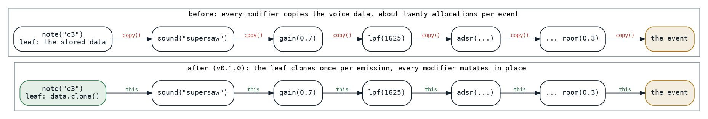
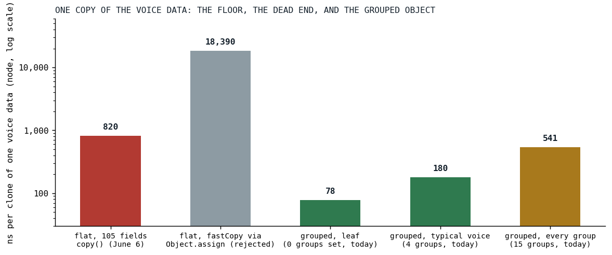

# Twenty Allocations per Note

*Every pattern modifier copied a 105-field voice object; making it mutable under a single-owner invariant, guarded by a golden of 2,822 events, cut the copies to one per event, and the one that remained is a story about V8.*

This post is not about the audio engine. It is about the layer above it, the pattern language that decides which notes sound when and with what settings, and about the object that carries those settings from a pattern's leaf to the engine's door. That object is a Kotlin data class with a hundred and five flat fields, one per knob a pattern can set, and in the first days of June every modifier in a pattern chain took it, called `copy` with one field changed, and passed the copy on:

```kotlin
/** Default modifier for patterns that populates VoiceData.value */
val voiceValueModifier = voiceModifier {
    val result = (it?.asDoubleOrNull() ?: it)?.asVoiceValue()

    copy(value = result)
}
```

*[lang_helpers.kt at ea4c2d4b](https://github.com/PeekAndPoke/klang/blob/ea4c2d4b0480832fc3b8cbbd99917710d688505c/sprudel/src/commonMain/kotlin/lang/lang_helpers.kt#L91-L96), the one modifier the sweep deliberately left copy-based, because it only ever runs on a fresh instance*

A voice in Der Schmetterling passes through gain, note, scale, sound, unison, envelope, filters, distortion, pan and a room on its way out, and each of those was an allocation of a hundred-and-five-field object, on the order of twenty per voice, for every event of every cycle, on the page's main thread, in JavaScript, with the garbage collector keeping the score.



*Fig. 1: A pattern chain as a list of modifiers. Before, every modifier returned a copy; after, the leaf clones once when it emits an event and every modifier mutates that clone and returns it.*

## An invariant, and a golden to hold it

The maintainer's proposal was the obvious one and the dangerous one: make the fields mutable and mutate in place. It is sound only under a strict invariant, which the task record states in one sentence: every query terminates at a leaf pattern that emits a fresh instance, and no pattern ever passes the same instance to two consumers or back into a stored source. An audit found the invariant achievable with a bounded fix. Only three leaf patterns handed out a stored, shared instance; everything downstream, the fan-outs, the joins, the time shifts, either re-queried and got fresh leaf events or built fresh data. Fixing the three leaves to clone per emission made the invariant hold engine-wide.

Aliasing bugs are silent, one voice's gain bleeding into the next event, so before a single field was made mutable a differential golden was built: a frozen copy of Der Schmetterling with its random seed pinned, queried cycle by cycle the way playback queries it, every event's wire-format data and tick-exact timing serialized and compared byte for byte against a committed file, 2,822 events, plus targeted patterns for the constructs the song lacks. Three runs produced identical output. Then the fields flipped to `var`, the leaves gained their clone, and all 113 copy-based setters became in-place setters through one helper:

```kotlin
/**
 * Creates a voice modifier that **mutates the receiver in place** and returns it, instead of
 * allocating via `copy(...)`.
 *
 * Safe because every [SprudelVoiceData] reaching a modifier is a single-owner clone — the leaf
 * emitters (`AtomicPattern`, `AtomicInfinitePattern`, `StaticSprudelPattern`) clone on emission, so
 * no instance is ever shared between events. This kills the per-event copy/GC churn that dominated
 * query cost. See `docs/tasks/mutable-voicedata-optimization.md`.
 */
fun voiceSetter(set: SprudelVoiceData.(Any?) -> Unit): VoiceModifierFn = { value -> this.set(value); this }
```

*[lang_helpers.kt at e9fa560c](https://github.com/PeekAndPoke/klang/blob/e9fa560c2cc9442182c585b5403f5f8907204fd7/sprudel/src/commonMain/kotlin/lang/lang_helpers.kt#L123-L132), the last commit of the conversion*

```kotlin
private val gainMutation = voiceSetter { gain = it?.asDoubleOrNull() }
```

*[lang_dynamics.kt at v0.1.0](https://github.com/PeekAndPoke/klang/blob/v0.1.0/sprudel/src/commonMain/kotlin/lang/lang_dynamics.kt#L22-L28)*

The golden earned its keep on the first sweep. A helper that parsed pattern text built its atoms from a shared empty singleton, and an in-place modifier corrupted the singleton, so that a guitar's envelope curve bled into the drums. The first fix cloned the singleton; the hardening removed it, since a shared mutable default is the root footgun of the whole design, and a second hardening the same day took away the constructor defaults the first had introduced, so that the only full-field constructions left, the clone, the merge and a factory, fail to compile if a field is ever added and silently dropped from the clone. The class KDoc carries the contract:

```kotlin
 * **All properties are `var` by design — for performance.** The pattern engine mutates voice data in
 * place down the modifier chain (via [io.peekandpoke.klang.sprudel.lang.voiceSetter]) instead of
 * allocating a fresh copy per modifier, which is what previously dominated query cost. The trade-off:
 * an instance is NOT safe to share — **the caller is responsible for cloning when a value might be
 * reused or handed to more than one consumer** (use [clone]). The leaf emitters (`AtomicPattern`,
 * `AtomicInfinitePattern`) clone on emission so every queried event owns its
 * data; mutate freely from there. There is intentionally no shared `empty` singleton — construct a
 * fresh one with `SprudelVoiceData()`. See `docs/tasks/mutable-voicedata-optimization.md`.
 */
```

*[SprudelVoiceData.kt at v0.1.0](https://github.com/PeekAndPoke/klang/blob/v0.1.0/sprudel/src/commonMain/kotlin/SprudelVoiceData.kt#L18-L35)*

## The copy that would not go lower

With one clone per event, the profile moved to that clone: about a quarter of the query path. Three things were tried on it and two of them are the reason this post exists. A hand-written clone as an explicit constructor call with a hundred and five arguments was no faster than the generated `copy`, which is the same call. A native copy on the JavaScript side, `Object.assign` onto an object created with the right prototype, one own-property copy instead of a hundred and five field reads, was measured at 18,390 nanoseconds against 820 for `copy`, twenty-two times slower. V8 optimizes the constructor-based copy, whose result has the same hidden class as every other instance [[2]](#bynens2018); an object built by create-and-assign falls into dictionary mode [[1]](#bruni2017), and everything that touches it afterward pays. The record filed it under rejected, do not retry, and the benchmark that measured it stayed in the repository as a warning with the number in its KDoc.



*Fig. 2: Nanoseconds per clone of one voice object on node, log scale: the flat object's copy, the rejected native copy, and today's grouped object at three fill levels. The June numbers are the record's; the grouped ones are from a run today.*

So 820 nanoseconds was the floor for a hundred-and-five-field object, and the record drew the only conclusion available: the remaining wins are fewer copies or a smaller object. The smaller object is what shipped, the next afternoon: the optional fields grouped into sub-objects, one per cluster, envelope, filters, pitch modulation, distortion, phaser, delay, reverb, sample and so on, each created lazily on the first write and mutated in place afterward. A leaf's data is mostly empty, and with grouping a leaf's thirty-five empty envelope and filter fields are five null references instead. The record had recommended immutable groups with copy-on-write; what shipped kept the mutation model and grouped underneath it:

```kotlin
 * **Why grouped:** the per-event leaf clone copies the whole [SprudelVoiceData]. A flat ~105-field class
 * copies all fields even though a leaf's data is mostly null. Grouping the optional clusters means a null
 * cluster is a single null reference (one slot, not cloned) instead of N null fields. [SprudelVoiceData.clone]
 * deep-copies only the non-null groups; setters lazily create a group on first write and then mutate it in
 * place (zero-copy), preserving the single-owner mutation model.
```

*[SvdGroups.kt at v0.1.0](https://github.com/PeekAndPoke/klang/blob/v0.1.0/sprudel/src/commonMain/kotlin/SvdGroups.kt#L10-L25)*

## Results

| clone of one voice object, node | ns per operation |
|---|---:|
| flat, 105 fields, `copy()` (June 6) | about 820 |
| flat, native `Object.assign` copy (rejected) | 18,390 |
| grouped, a leaf with no groups set (today) | 78 |
| grouped, a typical voice, four groups (today) | 180 |
| grouped, every group set (today) | 541 |

The leaf clone is the hot one, since it runs once per emitted event, and it is ten times cheaper than the flat object's copy was; the project's whitepaper records the grouped leaf at 47 nanoseconds, a run on a different day, and the shape of the result is the same. The typical voice, with an envelope, two filters and a distortion set, clones in a fifth of the old floor, and only an object with something in every one of its fifteen groups approaches it. On the JVM the same three clones are 110, 54 and 84 nanoseconds. Neither number exists in a benchmark file from June; the June numbers are the record's prose, and today's are in a file of their own.

## What transferred

Mutability is safe under an invariant you can state in one sentence and test with one golden, and the golden has to exist before the first field changes, because the failure it guards against is silent. The dead end is worth more than the win: an optimization that looks like a native fast path can be a slow path in disguise on a JIT that has opinions about how an object was built, and the only way to know is to measure it, which is why the rejected number lives in a KDoc and not only in a task record. And when a copy is at its floor, the lever is not a faster copy but a smaller thing to copy, which is a lesson [the engine side of this series](../2026-09-07-loop-shape-beats-pass-count/index.md) keeps finding in its own shape: the cost is in what a loop carries, not in how many times it runs.

## References

1. <a id="bruni2017"></a>Bruni, C. (2017). Fast properties in V8. *V8 blog*. <https://v8.dev/blog/fast-properties>
2. <a id="bynens2018"></a>Bynens, M., & Meurer, B. (2018). JavaScript engine fundamentals: Shapes and Inline Caches. <https://mathiasbynens.be/notes/shapes-ics>

*Sources inside the repository: `docs/tasks-archive/2026-06/20260607-mutable-voicedata-optimization.md` (the proposal, the audit, phases 0 to 3, the rejected list), `sprudel/MEMORY.md`, `docs/whitepaper/klang-whitepaper.html` (the 820 to 47 line), the commits `c303c333` through `e9fa560c`, `sprudel/src/commonMain/kotlin/lang/lang_helpers.kt` at ea4c2d4b and v0.1.0, `lang/lang_dynamics.kt`, `SprudelVoiceData.kt`, `SvdGroups.kt`, `pattern/AtomicPattern.kt` at v0.1.0, `sprudel/src/jvmTest/kotlin/golden/MutableVoiceDataGoldenSpec.kt`, `audio_benchmark/src/commonMain/kotlin/VoiceDataCopyBenchmark.kt` and `docs/benchmarks/2026-09-16_voicedata-copy.md` (today's numbers).*
