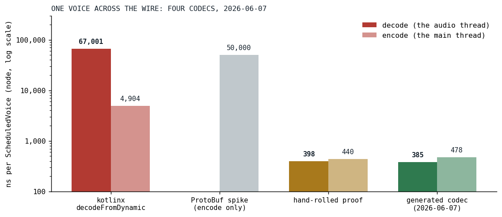
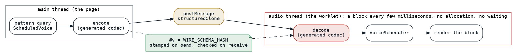

# Sixty-Seven Microseconds to 385 Nanoseconds

*The worklet decoded every scheduled voice with a generic serializer on the audio thread; a generated codec that trusts its input replaced it, and a schema hash guards the one case where trust would be misplaced.*

In the browser, Klangmotor's engine runs inside an audio worklet [[1]](#w3c-webaudio), on the thread that has to hand the sound card a 128-frame block every few milliseconds, under three at any common sample rate, and must never wait. It is the same thread [the rest of this series](../2026-08-19-the-phone-that-does-not-get-faster/index.md) measures on the phone, and the engine it feeds had just been [consolidated](../2026-06-05-one-engine-for-five-waves/index.md) two days earlier. Everything the engine is told, a voice to schedule, an instrument to register, a sample's chunks, arrives on that thread through a message port as a JavaScript object, and until June 7 the first thing the worklet did with a scheduled voice was decode it:

```kotlin
    private fun decodeScheduledVoice(obj: dynamic): ScheduledVoice {
        return codec.decodeFromDynamic(ScheduledVoice.serializer(), obj)
    }
```

*[WorkletContract.kt at c35bd16c](https://github.com/PeekAndPoke/klang/blob/c35bd16c316c7dd227d4b888f63db373a9177bc0/audio_be/src/jsMain/kotlin/WorkletContract.kt#L211-L217), the commit before the codec*

That one line is kotlinx serialization's dynamic decoder, and a microbenchmark of it on node put a single voice at 64,309 nanoseconds, on the audio thread. The encode on the page side was another 4,994, and the structured clone [[2]](#mdn-structured-clone) that the message port performs another 4,907. The decoder is slow for a good reason: it is defensive. It matches names to indices, keeps a seen-bitmask, tolerates unknown keys, dispatches on a discriminator for the sealed filter and envelope definitions, and constructs with defaults, all because it cannot know what it is given.



*Fig. 1: One scheduled voice across the wire on node, nanoseconds per operation, log scale: the kotlinx decoder as the task record's closing line re-measured it, 67,001 and 4,904 (the first baseline table read 64,309 and 4,994), the ProtoBuf spike (the only number recorded was its encode), the hand-rolled proof, and the generated codec. The decode is the bar that runs on the audio thread.*

## Trust the input

The first idea was a binary format, and it was tried and rejected in a spike that was never committed: kotlinx's ProtoBuf encoding on Kotlin/JS was slower than the dynamic one, fifty microseconds to encode. The idea that worked was to notice what the defensive decoder did not know and the project did: both ends of the wire are the same bundle. The page and the worklet are compiled together, from the same types, and a decoder that trusts that can read the fields it knows are there and construct the object directly. A hand-rolled proof of that, written in the microbenchmark, round-tripped equal to the kotlinx result and decoded in 398 nanoseconds.

Hand-rolling it for every type on the wire was not the plan. The wire has sealed command and feedback envelopes, the scheduled voice with its voice data, filter and envelope definitions, sample requests and chunks, and the instrument graph type with more than sixty subtypes and unbounded recursion. So the codec is generated. A source-retention annotation marks the protocol's roots:

```kotlin
/**
 * Marks a type as part of the audio-worklet wire protocol.
 *
 * The `:audio-wire-codec-ksp` processor generates a fast "trust the input" JS-object encode/decode for each
 * annotated type (plus its transitive graph), which `WorkletContract` uses instead of kotlinx
 * `encodeToDynamic` / `decodeFromDynamic`. Annotate the protocol ROOTS (the `KlangCommLink.Cmd` /
 * `KlangCommLink.Feedback` sealed types, `ScheduledVoice`); the processor walks referenced types from there.
 *
 * `SOURCE` retention — purely a compile-time marker for the processor, never present at runtime.
 * See `docs/tasks/worklet-codec-ksp.md`.
 */
@Retention(AnnotationRetention.SOURCE)
@Target(AnnotationTarget.CLASS)
annotation class WireFormat
```

*[WireFormat.kt at v0.1.0](https://github.com/PeekAndPoke/klang/blob/v0.1.0/audio_bridge/src/commonMain/kotlin/WireFormat.kt#L1-L21)*

The processor walks every root's transitive type graph and emits, for each class, an encode that assigns one property per constructor parameter and a decode that reads one property per parameter and calls the constructor. The decode half:

```kotlin
        sb.appendLine("fun ${decName(decl)}(o: dynamic): $qn = $qn(")
        for (p in params) {
            val n = p.name!!.asString()
            sb.appendLine("    $n = ${decExpr("o.$n", p.type.resolve())},")
        }
        sb.appendLine(")")
```

*[WireCodecProcessor.kt at v0.1.0](https://github.com/PeekAndPoke/klang/blob/v0.1.0/audio-wire-codec-ksp/src/main/kotlin/WireCodecProcessor.kt#L266-L287)*

Sealed types got a small integer tag and a `when`; enums travel as ordinals; lists as arrays with the element codec applied per item; a sample's PCM array passes through untouched. A shape the processor cannot handle is not skipped, it fails the build, so the codec covers a type completely or the build breaks. The generated file lands in the bridge module's JavaScript source set, because the codec uses `dynamic` and exists only there. The result, in the task record's closing line: decode 67,001 to 385 nanoseconds per operation, 174 times, encode 4,904 to 478, ten times, round-trips equal to the original.



*Fig. 2: The wire from the page to the worklet. The page encodes, the message port clones, the worklet decodes on the audio thread, and the schema hash rides the envelope from the encode to the decode.*

## The one case where trust is misplaced

Trusting the input assumes the page and the worklet are the same build, and that holds for one bundle. But the worklet module is fetched by URL, and a browser can cache it on its own, so a stale worklet can meet a fresh page after a deploy. The guard is derived, not maintained: while the processor walks the type graph it folds a structural hash of every type's fields, subtype lists and enum entries into one integer, so that any change to the wire changes the hash without anyone remembering to bump a version. The encode stamps it on the envelope, once per message, and the decode checks it first:

```kotlin
    private fun requireSchema(data: dynamic) {
        val v: Int? = data[PROP_VERSION]
        if (v != WIRE_SCHEMA_HASH) {
            error(
                "Worklet wire-schema mismatch: message has v=$v, this build expects $WIRE_SCHEMA_HASH. " +
                        "Frontend and audio worklet are different builds (stale cached worklet?) — reload."
            )
        }
    }
```

*[WorkletContract.kt at v0.1.0](https://github.com/PeekAndPoke/klang/blob/v0.1.0/audio_be/src/jsMain/kotlin/WorkletContract.kt#L1-L71)*

Four days later the codec found a bug of its own. The sealed type tag traveled under the key `t`, and the instrument graph has a node, the linear interpolation, with a field named `t`: the tag overwrote the field, and a graph with an interpolation in it was silently corrupted on the wire. The generated codec's own first tag was a positional ordinal under that key, and it had carried the collision since June 7, untested. The fix made both reserved keys non-identifiers, `#t` for the tag and `#v` for the schema hash, so that no Kotlin field can ever share a name with them, turned the ordinal into a stable string wire name, and added a round-trip case for the interpolation node to guard it. The same session took kotlinx serialization off the wire types entirely, and off the pattern library that had been holding them, a larger removal than planned, which the maintainer opted into once the premise that the annotations were vestigial turned out to be wrong.

## Results

| operation | kotlinx, June 7 | generated, June 7 | generated, today |
|---|---:|---:|---:|
| decode, the worklet, audio thread | 67,001 | 385 | 562 |
| encode, the page | 4,904 | 478 | 848 |
| structured clone, the message port | 4,907 | | 11,757 |

Nanoseconds per scheduled voice on node. The decode fell by a factor of 174 on the day, and the audio thread's per-voice cost with it, from a number a hundred voices could push over the block budget to one they cannot. Today's column is the same benchmark on the same platform three months later, and every number in it is larger: the voice data has gone from 72 fields to 82 in the meantime, and the clone has more than doubled, which is more than the field count alone accounts for. The shape of the result is unchanged, with the decode now a twentieth of the clone that the browser performs on the main thread, where in June it was a thirteenth. That clone is the part the project does not own, and the task record already names the only lever left there, positional arrays instead of keyed objects, to be measured before it is adopted.

## What transferred

A generic serializer pays for generality the same way a library sine does, and the project owns both ends of this wire, so the generality bought nothing. Generating the specific code is what made trusting the input affordable at the size of this protocol, and it is the same move [an annotation and a processor](../2026-08-12-one-annotation-six-artifacts/index.md) make elsewhere in the project. A version guard that a human must bump is a guard that will one day not be bumped; a hash folded from the schema by the same processor that emits the codec cannot be forgotten. And the collision between the type tag and a field named `t` is the reminder that a trusting codec trusts its own keys too, so the keys it reserves must be ones no field can have.

## References

1. <a id="w3c-webaudio"></a>W3C (2024). *Web Audio API 1.1*, First Public Working Draft, section AudioWorklet. <https://www.w3.org/TR/webaudio/#AudioWorklet>
2. <a id="mdn-structured-clone"></a>MDN Web Docs. The structured clone algorithm. <https://developer.mozilla.org/en-US/docs/Web/API/Web_Workers_API/Structured_clone_algorithm>

*Sources inside the repository: `docs/tasks-archive/2026-06/20260607-worklet-codec-ksp.md` (the baseline table, the design, the closing measurement), `docs/tasks-archive/2026-06/20260611-wireformat-enhancements.md` (the `#t` collision and the removal of kotlinx from the wire), `docs/history/2026-Q2.md`, the commits `096e5e7d`, `59e85839`, `27903cf2`, `17e41ea2` and `b7b31bbf`, `audio_bridge/src/commonMain/kotlin/WireFormat.kt`, `audio-wire-codec-ksp/src/main/kotlin/WireCodecProcessor.kt`, `audio_be/src/jsMain/kotlin/WorkletContract.kt` at v0.1.0 and at c35bd16c, `audio_benchmark/src/jsMain/kotlin/WorkletSerializationBenchmark.kt` and `docs/benchmarks/2026-09-16_worklet-serialization_nodejs.md` (today's numbers, node 24).*
