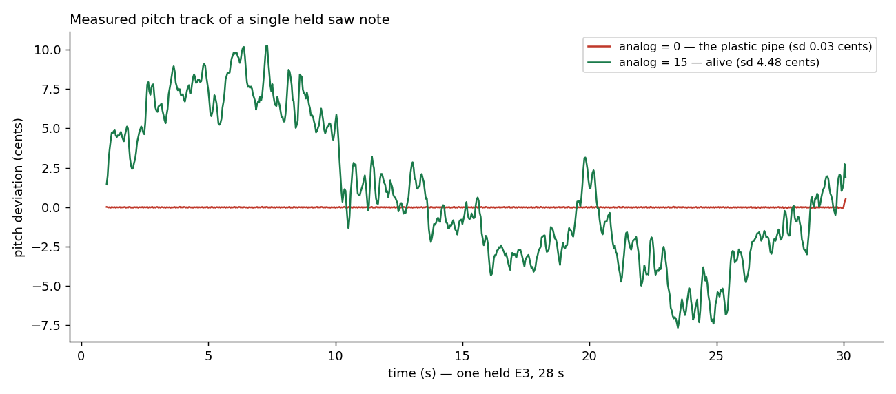
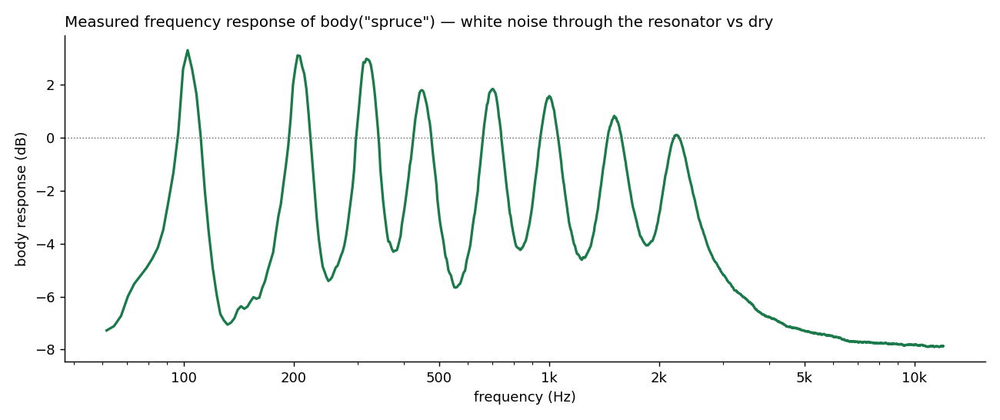

# Killing the Plastic Pipe

*A quarter spent hunting warmth: drift, a supersaw rebuilt, and a body that never rings on its own.*

## 1. The problem: perfection is the tell

By spring 2026 klang's engine was correct and fast, and it sounded like a **plastic pipe** — the in-house name for a
specific coldness. A held note was a held note: the same waveform, the same pitch, to the last digit, for as long as you
cared to sustain it. Nothing in nature does that. A real oscillator — a string, a reed, a 1970s VCO — is a physical
system bathed in noise: its pitch breathes, its filters wander, no two notes are twins.

The ear is a change detector. Feed it mathematical perfection and it doesn't hear "pure"; it hears *dead*. The whole
quarter became a hunt for the right imperfection — and "right" turned out to be a statistics problem as much as a taste
problem.

## 2. What usually gets tried

The standard remedies, each with a known failure mode:

**Vibrato via LFO** — periodic, and the ear catches periodicity instantly. A sine-shaped wobble reads as an *effect*,
applied; drift must read as a *property*, inherent.

**Static per-note detune** — draw a random offset at note-on and hold it. Cheap, common, and wrong twice: within a note
nothing moves (still dead), and across notes it reads as bad intonation rather than life — a melody where every note is
differently mistuned is a badly-fretted guitar, not a warm one. (Klang re-learned this one the hard way; see the seeding
lesson below.)

**Perlin-style noise modulation** — better, and widely used. But Perlin is a *lattice* construction: smooth by design
between grid points, with statistical regularities the ear can find on long notes. The physical quantity being
imitated — component noise integrated by an oscillator — has a different, well-known character: it is well approximated
by *filtered white noise*, and there is a standard process for that.

## 3. The drift: two timescales of Ornstein–Uhlenbeck

Klang's answer lives in `AnalogDrift.kt`, and it is small enough to read in one sitting. The model: real VCO pitch
instability has (at least) two distinct characters, so the generator layers two smoothed-noise processes —

- a **fast jitter** — ~50 ms time constant, ±0.2 cents per unit `analog`:
  the constant micro-wobble of a live oscillator;
- a **slow drift** — an Ornstein–Uhlenbeck layer with a correlation time of several seconds, ±0.8 cents per unit: the
  lazy, breathing wander that makes a sustained note feel alive.

Both are white noise pushed through one-pole dynamics — closer to the physics of component noise than any lattice field.
The hot loop, verbatim:

```kotlin
fun nextMultiplier(): Double {
    // xorshift32 — inline, no Random dispatch
    var s = rngState
    s = s xor (s shl 13)
    s = s xor (s ushr 17)
    s = s xor (s shl 5)
    rngState = s
    val x = s * ANALOG_INT_INV // uniform ≈ [-1, 1]

    val newYFast = yFast + alphaFast * (x - yFast)
    val newYSlow = ySlow + alphaSlow * (x - ySlow) - betaSlow * ySlow
    yFast = newYFast
    ySlow = newYSlow

    return 1.0 + newYFast * scaleFast + newYSlow * scaleSlow
}
```

Three details worth the ink:

**The RNG is inlined on purpose.** That xorshift32 is three shifts and three xors — no `Random.nextDouble()` dispatch,
no allocation, no permutation tables. Total per-sample cost: those six bit ops plus six multiplies and seven adds — ~20
ops, zero calls. This runs per voice
per sample on the browser's audio thread; anything fancier would be paying rent it doesn't need to.

**One noise source feeds both layers.** The same uniform draw drives the fast one-pole and the slow OU update — two
filters, two personalities, one stream.

**The seeding is the actual lesson.** The fast layer is seeded from its steady-state distribution — it settles within 50
ms, so starting it "warm"
is harmless and the micro-shimmer is present from the first sample. The slow layer is seeded **at center,
deliberately**. The first version seeded it at steady state too, and that was the static-detune failure all over again:
a short note never lives long enough for a process that slow to move, so each note simply *stuck* at its randomly-seeded
offset — per-note random detune, reading as wandering intonation on every melodic line. Seeding at center means **every
note attacks in tune, and the drift is something that happens to notes that live long enough to earn it.** The
imperfection has to respect the music's clock.



*Fig. 1 — measured from the engine: one held E3, pitch-tracked. Drift off:
sd 0.03 cents — the plastic pipe. Drift on (`analog = 15`): ±9 cents of slow breathing with fast shimmer riding on it,
and note how it starts near center — in tune — before wandering.*

## 4. The supersaw, rebuilt around the same philosophy

The same quarter rebuilt the supersaw — the JP-8000-style detuned stack whose anatomy Szabó
documented [[1]](#szabo2010) — and every change followed the same rule: *imperfection where the ear wants life,
precision where it wants pitch.*

- **Analog flyback instead of PolyBLEP.** The band-limited-step approach was dropped for a shaped flyback modeled on an
  analog sawtooth's reset — it softens high notes the way real hardware does, instead of ringing the way textbook
  anti-aliasing does.
- **The tuning anchor is a weighted centroid.** With per-voice detunes and gains in play, the *perceived* pitch is the
  gain-weighted mean of the stack — so that mean is computed and subtracted, anchoring every note exactly on pitch no
  matter what the ensemble is doing around it.
- **Jitter the gains, not the detunes.** Randomizing per-voice *amplitude*
  gives the ensemble life without touching intonation.
- **And the center voice is exempt.** Full gain jitter on the voice that carries the fundamental made some notes attack
  weak — so the center got a scaled-down share. Precision at the center, chaos at the edges.

That last item deserves a flag: it was the first time the project noticed that *the center voice of a unison stack is
special* — that randomness applied uniformly across an ensemble can randomly delete the one component the ear anchors
on. Pulling that thread properly, two months later, led to
the [fundamental lottery](../2026-08-12-the-fundamental-lottery/index.md)
and the phase pool. Q2 treated the symptom; Q3 found the disease.

## 5. The body: a resonator that never rings on its own

The third front was resonance. Synth notes stop at the oscillator; acoustic notes pass through a *body* — wood, air, a
cavity — that boosts some bands and swallows others. Klang's
`body()` models exactly that: a parallel bank of band-pass "modes" over a floor, with one constraint chosen on purpose —
**it is passive in the way that matters:** it rings nothing that wasn't played into it and never self-oscillates; its
modal peaks stay within ~3 dB while the valleys and rolloff carve away far more than the peaks add.



*Fig. 2 — measured from the engine: white noise through `body("spruce")`
versus dry, spectrum ratio. Eight modal peaks between 100 Hz and 2.2 kHz — none more than ~3 dB above unity — valleys
carved between them, and a high-frequency rolloff. Peaks modest, valleys deep — far more carved than added.*

The passivity constraint is audible as *trustworthiness*: a passive body can be pushed hard without blooming or ringing
on its own, and materials (`spruce`, `maple`, `mahogany`, …) become characters rather than effects.
`vowel()` was reworked on the same chassis the same quarter.

## 6. What the quarter taught

The plastic pipe died of a hundred cuts — drift, flyback, jitter, body, plus by-ear tuning rounds that no changelog
fully records. But the transferable lessons are three:

1. **Warmth is controlled imperfection, and the *statistics* of the imperfection matter.** The ear distinguishes
   filtered-white from lattice noise, periodic from aperiodic, moving from stuck. Choose the process to match the
   physics being imitated, not just the smoothness.
2. **Imperfection must respect the music's clock.** The seeding lesson:
   a slow process seeded at steady state turns short notes into random detune. When a note starts, it starts in
   tune; life accrues with duration.
3. **Precision and chaos are not opposites; they are assigned seats.**
   Centroid-anchored tuning under jittered gains; a stable center voice inside a randomized ensemble; a passive body
   under a living oscillator. Deciding *where* each lives is the actual sound design.

---

## References

1. <a id="szabo2010"></a>Szabó, A. (2010). *How to Emulate the Super Saw.*
   B.Sc. thesis.
   [PDF](https://www.adamszabo.com/internet/adam_szabo_how_to_emulate_the_super_saw.pdf)
