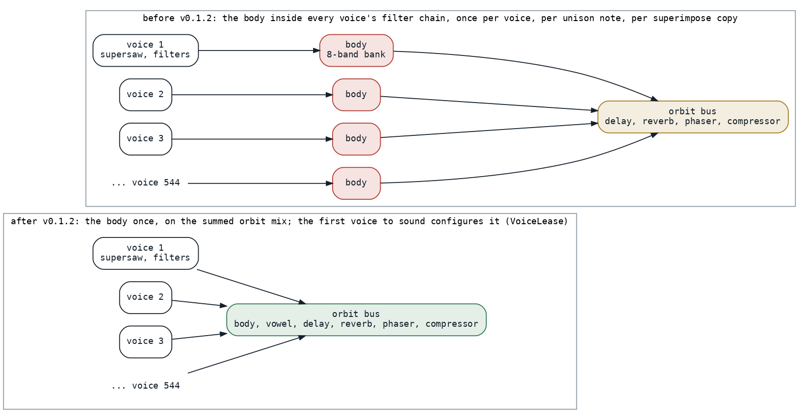
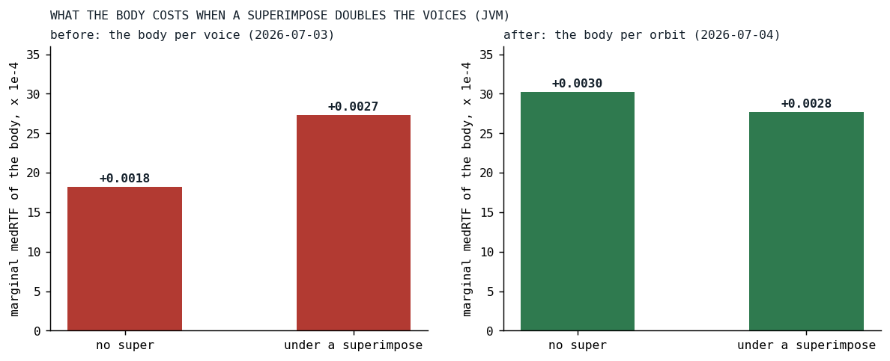
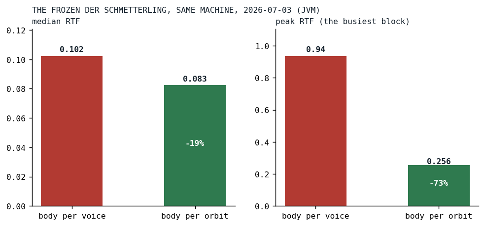

# The Body That Played a Thousand Times

*The first whole-song measurement found a guitar body resonator running once per voice under a nested superimpose; moving it to the orbit cut the busiest block by three quarters.*

Until July 3 the engine had been measured one effect at a time, on hand-made voices. That day a song-level benchmark was written that compiles real song text, schedules every voice the way playback does, drives the offline render graph and times every block, and its first subject was Der Schmetterling, whose busiest block in the browser sat around half of real time. The first thing the new harness did was rank the voices in isolation:

| voice | onsets | median RTF | peak RTF | share of the song |
|---|---:|---:|---:|---:|
| GTR2, supersaw, nested superimpose | 1088 | 0.0514 | 0.222 | about 52% |
| GTR1, supersaw, unison 9 | 544 | 0.0292 | 0.057 | about 30% |
| LEAD, superramp, unison 5 | 192 | 0.0182 | 0.052 | about 18% |
| bass, drums, hats, pink noise | 16 to 68 each | under 0.003 | | about 2% each |

The three super-synth voices were the song's cost, and one of them was half of it. GTR2 had a superimpose inside a superimpose, and each superimpose copies the voice, so every note scheduled eight voices, 1,088 across the benchmark's eight cycles, and every copy re-ran the whole per-voice chain. Here is the instrument as it was written, the nested copy on the second-to-last line and the body on the last:

```javascript
    .coarse(2).coarseos(4).pan(0.3).superimpose(
      x => x.pan(0.7),
      x => x.postgain(0.09).hpf(220).lpf(3400).scaleTranspose("<4!7 [2 [3 4@3]]!1 4!7 [-7 -3] 4!7 [2 [3 4@3]]!1 4!7 [-3 [2 4@3]]>")
           .pan(0.2).superimpose(pan(0.8))
    ).superimpose(hpf(3500).lpf(6200).postgain(0.02)).mute("<0!128 1!16 0!16>").pipeline("pedal").body("wood").bodyMix(0.30)
```

*[DerSchmetterling.kt at ba7fab68](https://github.com/PeekAndPoke/klang/blob/ba7fab68/src/commonMain/kotlin/builtinsongs/DerSchmetterling.kt#L47-L58), the last edit of the song on July 3*

## What the body cost, and where

The body is a bank of eight state-variable bandpass filters in parallel, a caricature of a guitar's top plate, and at the time it was a filter in the voice's own chain, built right next to the lowpass and the notch:

```kotlin
            // Formant's bands are vowel-specific — per-voice offset would smear vowel character. Skip.
            is FilterDef.Formant -> LowPassHighPassFilters.createFormant(bands, mix, sampleRateDouble)
            // Body modes are fixed resonances — per-voice offset would smear the body character. Skip.
            is FilterDef.Body -> LowPassHighPassFilters.createBody(bands, mix, sampleRateDouble)
```

*[VoiceFactory.kt at af1c08dc](https://github.com/PeekAndPoke/klang/blob/af1c08dc/audio_be/src/commonMain/kotlin/voices/VoiceFactory.kt#L353-L359), the commit before the move*

On GTR1 that was 544 scheduled voices with eight filters each, on the order of 4,300 filter passes for one instrument, and the harness's ladder priced the body at 0.0066 of median RTF on that guitar, the most expensive single effect in the song, ahead of the analog drift. The analysis then asked the question that decided the design: does a superimpose multiply the body? A two-by-two experiment, a voice with and without the body, with and without a superimpose that doubles it, said yes and more than yes. The body cost 0.0018 alone and 0.0027 once the superimpose had doubled the voices, and the two together cost more than the sum of each, an interaction of about 0.0009. The expensive thing in the song was not any single effect. It was a per-voice effect placed under a superimpose stack, paid once per copy.

## A body is not a note

The decision, the maintainer's, was that body and vowel are timbre resonators, properties of the instrument, and that the orbit, the bus a voice is mixed into, is the grouping unit for that: they become orbit-level effects only, run once on the summed mix, and voices that need independent resonance go on different orbits. That turns the cost from a function of the voice count into a function of the orbit count, for the guitars from about 544 instances to one.



*Fig. 1: Before, every voice on the orbit carried its own body, so a nested superimpose ran hundreds of them; after, the orbit bus runs one on the mix, and the voice that sounded first configures it.*

The voice factory pulls the two definitions out of the chain before it bakes the filters and routes them to the orbit through the voice:

```kotlin
        // Body / vowel are orbit-level Katalyst effects now — pull them out of the per-voice filter
        // chain (they're routed to the Cylinder via the Voice). Everything else stays per-voice.
        val bodyDef = data.filters.getByType<FilterDef.Body>()
        val vowelDef = data.filters.getByType<FilterDef.Formant>()
        val voiceFilterDefs = data.filters.filters.filter { it !is FilterDef.Body && it !is FilterDef.Formant }
```

*[VoiceFactory.kt at v0.1.2](https://github.com/PeekAndPoke/klang/blob/v0.1.2/audio_be/src/commonMain/kotlin/voices/VoiceFactory.kt#L93-L112)*

Two things had to be invented for the orbit to own an effect. The first is who configures it. All the voices on an orbit share one set of bus effects, and without arbitration the configuration would flip to whichever voice rendered last every block, which in the worst case rebuilds a filter bank on the audio thread every block. The answer is a lease:

```kotlin
 * All voices on an orbit share one set of bus effects (body, vowel, reverb, delay, phaser, compressor).
 * Without arbitration the config flip-flops last-writer-wins every block; worst case (two voices, different
 * settings) it thrashes an effect — e.g. rebuilding a filter bank on the audio thread every block. This
 * lease makes the FIRST voice to sound the orbit's **owner**: while that voice is alive its settings stick
 * and other voices are ignored. Put voices that need independent bus settings on different orbits.
 *
 * **Liveness by absence, not by a death signal.** A live, started voice re-offers itself EVERY block (its
 * `SendRenderer` → `Cylinder.updateFromVoice` runs every block it renders). So the owner "checks in" each
 * block. If it misses a block — for ANY reason: natural end, cut/choke, or playback cleanup — the lease
 * lapses and the next offering voice takes over. No per-removal-path hooks needed.
```

*[VoiceLease.kt at v0.1.2](https://github.com/PeekAndPoke/klang/blob/v0.1.2/audio_be/src/commonMain/kotlin/cylinders/katalyst/VoiceLease.kt#L1-L63)*

That lease is the mechanism [a later post in this series](../2026-09-15-zombies/index.md) meets from the other side, when removing a silent voice early changed which voice owned an orbit. The second invention came the next day: a live change of material or mix rebuilds the bank, and a rebuild on a sounding orbit clicks, so a crossfade of about twelve milliseconds swaps the old bank for the new one. With it came a library of materials, their resonances anchored in the acoustics literature [[1]](#fletcher1998), and a user-settable dry floor. The plan of the day before had already accepted the sound change, to be validated by ear: the body now resonates the summed, already distorted, panned mix, and a body of a sum is not the sum of the bodies.

The design had a cost, and the record lists it as a table of conflicts: an orbit can hold one body now, so seven builtin songs had to be re-orbited. Sakura had wood, glass and tube all on the default orbit; Seltsamere Dinge's melody and its glass superimpose collided; Der Schmetterling's two guitars, both wood on one orbit, would have shared a body, and the commit that moved the resonator also moved the second guitar to an orbit of its own.

## Results



*Fig. 2: The two-by-two, before and after: the body's marginal cost on a voice with and without a superimpose that doubles it. Before, the body under the superimpose cost half again as much; after, it costs the same either way, since the orbit runs it once regardless of how many voices feed the bus. JVM, from the July files, which ran 512-frame blocks. The two panels are separate runs, so read the shape within each panel, not the heights across them.*



*Fig. 3: The frozen Der Schmetterling, same machine, same day: median and peak RTF with the body per voice and per orbit. The busiest block, the section where the lead, both guitars, the bass and the drums all sound, fell from 94 percent of real time to 26.*

| metric | body per voice | body per orbit | change |
|---|---:|---:|---:|
| median RTF | 0.10228 | 0.08265 | -19% |
| peak RTF, the busiest block | 0.936 | 0.256 | -73% |

The peak is the number that matters for a phone, since a phone drops out on its worst block and not on its average, and the peak fell by a factor of 3.7 on a change that touched no oscillator, no distortion and no drum. The within-run two-by-two after the move shows the mechanism: the body's cost is flat against the superimpose count, 0.0030 without and 0.0028 with, where before it had been multiplicative. The analog drift still multiplied, because it is per voice by nature, and that is [a later post's](../2026-09-15-drift-for-free/index.md) problem. Today the body is still among the most expensive single effects the engine has, 4.9 microseconds per block on the JVM, where it edges out the reverb, and 7.9 on node, where the reverb at 10.6 costs more; it is simply paid once.

## What transferred

The cheapest per-voice work is the work moved out of the voice, and the question to ask of every effect is whose property it is: a note's, or the instrument's. A superimpose is a voice multiplier, and anything under it is multiplied, so the interaction, not the effect, is what a ladder has to measure. The harness that found this was written that morning and every post in this series since has run on it, which is the other result of July 3: before the measurement there was an opinion that the guitars were expensive, and after it there was a table with a row that said which one, by how much, and why.

## References

1. <a id="fletcher1998"></a>Fletcher, N. H., & Rossing, T. D. (1998). *The Physics of Musical Instruments* (2nd ed.). Springer. <https://doi.org/10.1007/978-0-387-21603-4>

*Sources inside the repository: `docs/benchmarks/2026-07-03_der-schmetterling-cpu-analysis.md` (the ranking, the ladders, the two-by-two, the conclusions), `docs/benchmarks/2026-07-04_233042_song_jvm.md` (the two-by-two after the move), `docs/tasks-archive/2026-07/20260703-body-vowel-orbit-katalyst.md` (the decision and the A/B result), `docs/tasks-archive/2026-07/20260704-body-vowel-materials-floor-crossfade.md`, `audio/MEMORY.md` (the two entries of 2026-07-03 and 2026-07-04), the commits `af1c08dc`, `ba7fab68`, `eb6428ff` and `e17d1113`, `docs/benchmarks/2026-09-16_135425_jvm.md` and `_nodejs.md` (today's Body and Vowel rows), `audio_be/src/commonMain/kotlin/voices/VoiceFactory.kt` at af1c08dc and v0.1.2, `cylinders/katalyst/KatalystBodyEffect.kt`, `VoiceLease.kt` at v0.1.2, `KatalystFilterSwap.kt` at v0.1.3, `src/commonMain/kotlin/builtinsongs/DerSchmetterling.kt` at ba7fab68.*
