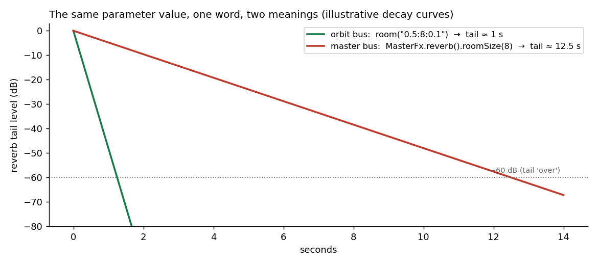

# The Same Word Must Mean the Same Thing

*An order-of-magnitude bug, and the DSL design principle it bought us.*

## 1. The bug

While wiring klang's new master stage — the `master(Master.of(...))` chain that rides the pattern like any voice —
reverb landed on both buses. Same effect, same parameter name, same value:

```javascript
// per-orbit:
pattern.room("0.5:8")                 // roomSize = 8

// master bus:
master(Master.of(MasterFx.reverb().roomSize(8)))
```

One of these produces a tail of about **one second**. The other, about **twelve and a half**.



*Fig. 1 — the same value, the same word, two rooms an order of magnitude apart.*

The cause was archaeology, not malice: the sprudel side had inherited a divide-by-ten from its Strudel ancestry, the
master side read the value raw. And the parameter that *actually* controls the tail length — `roomFade` — existed on
only one of the two buses. Nobody had lied; two honest pieces of code had simply never been introduced to each other.

## 2. Why this class of bug is worse than a crash

A crash tells you where it happened. A **vocabulary divergence** tells you nothing — it reads as *your own bad taste*.
You set `roomSize(8)` on the master, it sounds like a parking garage, and the natural conclusion is "I chose a bad
value," not "this word means something else here." The author adjusts by ear, ships a workaround, and the divergence
burrows into every song written on top of it. By the time it's found, fixing the *bug* means changing the *sound* of
shipped music — which is why the correction had to land together with the master stage, before anything relied on it.

Sound-design DSLs are unusually exposed to this class. The same concept genuinely lives in many places — a voice, an
orbit bus, a master bus, an oscillator definition — and each surface grows its own code path. Without a counter-force,
every parameter is one refactor away from dialect drift.

## 3. The principle

So it became a standing rule rather than a bugfix:

> **The same params must be available in the sprudel DSL, Ignitor, Master
> etc. — and they need to mean the same thing.**

Three checks, applied per parameter, across every surface it could sensibly appear on: same **name**, same
**scale/units**, same **availability**. The first parity audit caught more than the headline bug: `room` (orbit) vs
`wet` (master) naming the same amount, `roomsize` on a 0–10 scale next to
`roomfade` on 0–1, a `delaycap` knob with no slot in the delay's compound string, and two parameters that were stored,
documented, and *never read*.

## 4. The rule for exceptions

The part that keeps the principle honest: some asymmetries are **correct**, and a parity rule with no way to record them
just converts them into perpetual "fix" attempts.

The canonical one: the master bus's house limiter runs 5 ms of lookahead; the authored `MasterFx.limiter()` runs
**zero** — by design. A lookahead limiter delays the signal it protects. On the summed master that delay is uniform
and harmless; on a per-playback limiter it would shift that playback late against every other one, a silent timing bug
that reads as "my drums feel loose." Same word, *justifiably* different behavior.

The rule: a deliberate exception is **documented where it lives and pinned by a test**. Klang has a spec that asserts
the two limiters' defaults — the shared values *and* the divergence — so the asymmetry is data, not folklore. Anyone who
"unifies" the two timings turns the suite red and finds the reasoning in the failure message.

## 5. The takeaway

Parameter parity is the principle of least astonishment applied to a vocabulary. In a system where the same concept
appears on four surfaces, the meaning of a word is an *invariant to be tested*, exactly like a filter's stability or a
limiter's ceiling:

- same name, same scale, same availability — audited per effect;
- divergences either get fixed **before anything ships on top of them**, or get documented and **asserted by a test**;
- and when a parameter can't keep a promise on some surface, it shouldn't exist there at all.

An afternoon of fixing, a permanent line item in every review since. Cheap at ten times the price — and this bug,
fittingly, charged twelve and a half.
