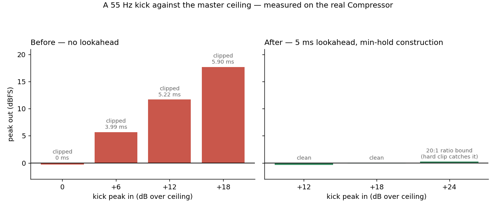
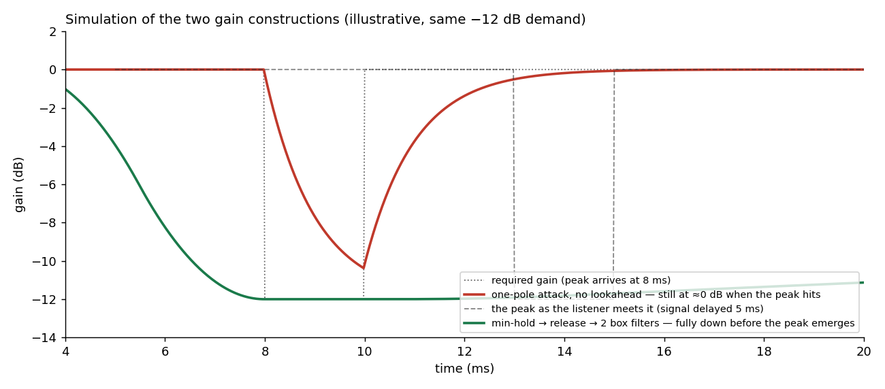
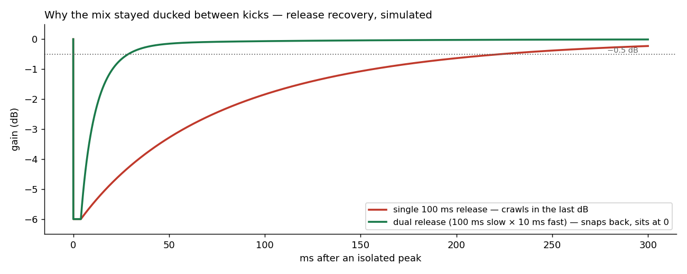

# The Limiter That Couldn't See

*How a master limiter cracked every big transient, and what it took to give it eyes.*

## 1. The problem: the knock

Users described it as a *knock* — a dry crack riding on top of every big kick, worse the louder the mix ran. The master
stage had a limiter, and the limiter had a ceiling, and the ceiling was being enforced. Just not by the limiter.

Klang's compressor was feed-forward with **zero lookahead**: the detector saw each sample at the same instant the gain
stage did. Against a fast transient that is simply too late — measured on the real `Compressor` with the master stage's
own constants, a 55 Hz kick at +18 dB over the ceiling passed through with the gain *still at exactly 0.00 dB one
millisecond in* — the detector's smoothed envelope had not yet crossed threshold. The ceiling was enforced by the hard
clip that sits after the limiter as a last resort:

| kick peak in | peak out (pre-clip) | hard-clipped for |
|--------------|---------------------|------------------|
| 0 dBFS       | −0.33 dBFS          | 0 ms             |
| +6 dBFS      | **+5.67 dBFS**      | **3.99 ms**      |
| +12 dBFS     | **+11.67 dBFS**     | **5.22 ms**      |
| +18 dBFS     | **+17.67 dBFS**     | **5.90 ms**      |

Every loud transient was a 2–6 ms square-edged burst — and the window *grew*
with the amount of limiting, which is exactly what "it knocks when it has to limit a lot" had been telling us.

*Fig. 1 — the same kick test before and after. The "before" bars aren't a limiter failing gracefully; they're a clip
doing the limiter's job.*

## 2. The obvious fix doesn't work

"Add lookahead" sounds like one parameter. It is not. Delaying the signal so the detector sees the future is not enough
by itself — the gain still moves through the same too-slow attack. Measured, +12 dB kick, 1 ms one-pole attack:

| lookahead | delay only  | + running-max detector |
|-----------|-------------|------------------------|
| 0 (today) | +11.67 dBFS | —                      |
| 1.5 ms    | +11.67      | +10.16 — still clips   |
| 3.0 ms    | +4.86       | +1.57 — still clips    |
| 5.0 ms    | +3.64       | 0.00 — still clips     |

(The ceiling sits at −0.35 dBFS, so a 0.00 dBFS peak is still a clip.)

A one-pole with τ = 1 ms needs several τ to settle; it cannot reach full reduction inside any sane window regardless of
how early it is warned. Three things must change *together*: a delay line, a detector that looks across the whole
window, and an attack shape that completes inside it. And even then our first prototype had a hole: two peaks arriving
0.2–0.5 ms apart restarted the attack ramp mid-flight, and the second one clipped.

## 3. Prior art: the problem is solved, credit where due

The construction that handles all of it — any number of peaks in the window, no special cases — comes from Geraint
Luff's *Designing a straightforward limiter* [[1]](#luff2022):

1. compute the per-sample **required gain** from the *undelayed* signal;
2. take a **moving minimum** over the lookahead window — this is what makes the gain start falling *before* the peak,
   for every peak, always;
3. a **release stage** — instant down, one-pole up;
4. **smooth** with two cascaded box filters (C¹ by construction — no corners for the ear to find);
5. **delay the signal** by the window and apply.

*Fig. 2 — the two constructions against the same −12 dB demand (simulation). The one-pole is still near 0 dB when the
peak hits; the min-hold gain is settled at −12 dB before the delayed peak emerges.*

Two details cost us real debugging and deserve the ink:

**The budget arithmetic overlaps; it does not add.** An early revision budgeted `lookahead = window + smoothing`.
Wrong — and it clips. Every term entering the smoother must already respect the gain required at the sample emerging
from the delay, which forces `L ≥ D + 1` and bounds the smoothing *inside* the window, in **taps, not milliseconds**
(ceil-rounding drifts by a sample, and one sample is a click). Luff's article states the equivalent insight; our
prototype independently found the failure before we found the article.

**The release goes *before* the smoother.** The tempting arrangement — smooth first, then `min` with a one-pole
release — is C¹ everywhere except the crossover between the two paths, where the gain slope drops ~40× in one sample.
That corner is the same artifact class the two-box cascade exists to prevent; putting release before the boxes keeps the
entire trajectory C¹ and the safety proof one line: `release ≤ held` pointwise, so `box(release) ≤
box(held) ≤ required`.

## 4. Results, and the pump we decided to keep paying for

With 5 ms of lookahead and the construction above, the +12 dB kick exits at **−0.37 dBFS with zero samples clipped**
(the old path: +11.67 dBFS, 5.22 ms of clipping). The knock is gone — confirmed by ear the same day. One honest
boundary: at ratio 20:1 the residual above threshold is `overshoot/ratio`, so around +20 dB over ceiling the "brickwall"
admits up to a full decibel and the hard clip quietly returns as the true last resort. That bound is arithmetic, not a
bug,
and it is documented rather than hidden.

Then the by-ear pass found the *next* problem: with clean catches came a **pump** — the bed stayed ducked between kicks,
swelling continuously on dense material. Measured at realistic drive, the mix was still 1.25 dB down 100 ms after each
kick. The fix was a **dual release**: a slow one-pole (100 ms) that absorbs sustained reduction, times a fast branch
(release/10)
that handles the residual — instant down, quick up.

| release design     | recovery to −0.5 dB | beat-rate gain mod | mean GR  |
|--------------------|---------------------|--------------------|----------|
| single 100 ms      | 187.1 ms            | 0.97 dB            | −0.76 dB |
| **dual 100/10 ms** | **23.5 ms**         | **0.37 dB**        | −0.24 dB |

*Fig. 3 — why the bed never came back between kicks: a single exponential release crawls in its last dB. The dual
release snaps back and sits at zero. (simulation).*

And here is the honest punchline: when we A/B'd it level-matched on material built to be maximally unkind, the audible
pump difference was *"really subtle."* **The dual release shipped anyway — for the loudness.** At an identical output
ceiling the mean level rose from −1.59 dB to −0.55 dB, because the mix simply spends less time ducked. Same peak, one dB
louder, one extra divide per sample on a single instance. We came for the artifact and stayed for the headroom.

## 5. What the peak meter never told us

The lesson that outlived the feature: **output peak is a nearly useless quality metric for a limiter**, because every
broken variant we built had a defensible peak number at some setting. The measurements that actually caught things:
non-fundamental energy on a sustained low sine (catches release misbehavior the peak can't see), the **gain trajectory
itself as a signal**
(max |Δgain| per sample — the C⁰ corner is instantly visible there and invisible everywhere else), and a ramp-length
invariance sweep (a correct construction must produce the *same* peak at any smoothing length; any difference is a shape
bug). The invariance sweep now guards the suite alongside the dual-release test ("the bed recovers between kicks"), both
mutation-checked — collapsing the dual release back to a single branch turns the suite red. The other two remain
development-harness measurements for now, with the gain-trajectory probe first on the wishlist.

One asymmetry is deliberate and spec-pinned: **only the house limiter has lookahead by default.** An authored,
per-playback limiter with latency would delay its playback against every other one — so the authored
`MasterFx.limiter()` *defaults* to zero lookahead, and a test asserts the divergence so nobody "fixes" it. It's a
default, not a wall: the knobs are there — `MasterFx.limiter().lookahead(seconds).attack(seconds)` — for anyone who
wants the clean catches on an authored chain and accepts the latency that comes with them (capped at 50 ms, since
lookahead is the one parameter that sizes a buffer on the audio thread).

The limiter can see now. What it watches over is the same song — just one decibel more of it.

---

## References

1. Luff, G. (2022). *Designing a straightforward limiter.* Signalsmith Audio.
   [signalsmith-audio.co.uk/writing/2022/limiter](https://signalsmith-audio.co.uk/writing/2022/limiter/)
   — the moving-minimum → smoothing → delay construction, and the insight that the smoothing budget lives inside the
   lookahead window.
