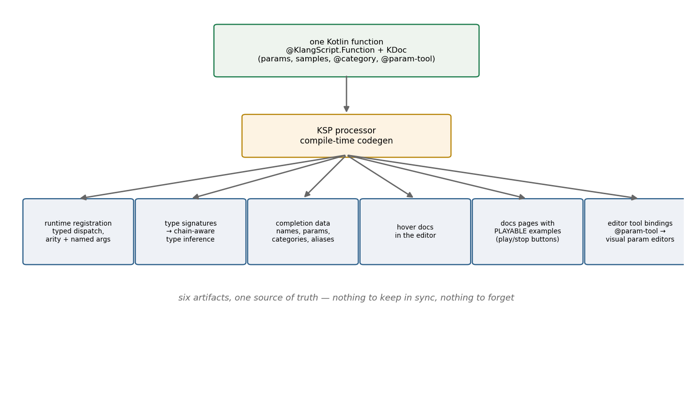

# One Annotation, Six Artifacts

*How KlangScript's KSP processor turns a KDoc comment into a language surface.*

The [white paper](../../whitepaper/klang-whitepaper.html) tells the general KlangScript story — JavaScript-shaped
syntax, Kotlin-shaped standard library, a hand-written interpreter with no `eval` and no host-interop hole
[[1]](#whitepaper). This post is the deep dive into one sentence of it:

> *"You annotate a Kotlin function or object with `@Function` / `@Method` /
> `@Object`, and the processor generates the stdlib registration, the type
> signatures, the completion data, and the hover documentation — all from
> one source of truth."*

That sentence undersells it. By our count it's six artifacts, and the sixth one plays music.

## 1. The problem: a language surface is five things pretending to be one

A scripting language embedded in an engine is never just an interpreter. Every function a script can call exists in
several places at once: the **runtime binding** (what actually executes), the **type signature** (what the analyzer
believes), the **completion entry** (what the editor offers), the **documentation** (what the human reads), and — in
klang's case — the **visual editor binding** (which UI widget edits which parameter).

Maintain those five by hand and they *will* diverge — not might, will. The doc says one thing, the completion suggests
another, the runtime accepts a third. Every divergence is a small lie to the user, and klang had already learned what
vocabulary lies cost (see
[The Same Word Must Mean the Same Thing](../2026-08-03-the-same-word/index.md)).

There's a security angle too. KlangScript's sandbox rule is *everything a script can reach is explicitly registered from
Kotlin* — no reflection, no interop escape hatch. That's the right boundary for running strangers'
songs, but it means the registration layer can't be waved away: it IS the language surface, function by function.

## 2. What usually gets tried

**Hand-maintained registries** — the default, and the divergence machine described above. Adding a function means
touching four files, and the fourth gets forgotten.

**Runtime reflection** — let the host language introspect itself. Ruled out twice over: reflection is precisely the
sandbox hole the design forbids, and on Kotlin/JS it's also a performance tax the audio-adjacent runtime can't pay.

**Separate doc toolchains** — generate docs from source with one tool, completion from another config, registration by
hand. Three sources of truth is not fewer than two.

The direction that works is the one compilers took decades ago: **make the declaration the single source and generate
everything else at compile time.** Kotlin's hook for that is KSP — the compile-time symbol processor — and klang leans
on it hard.

## 3. The pipeline



*Fig. 1 — one annotated function in, six artifacts out, at compile time.*

Here is a real registered function, exactly as it lives in the tree — the
`body()` resonator (the star of
[Killing the Plastic Pipe](../2026-06-30-killing-the-plastic-pipe/index.md)):

````kotlin
/**
 * Adds a resonating body to the voice — a bank of fixed resonances mixed on
 * top of the dry source so it sounds like a physical instrument instead of
 * a synthetic/plastic tube.
 * ...
 * ```KlangScript(Playable)
 * note("c3 e3 g3").body("wood")              // warm wooden body
 * ```
 *
 * @param material The body material — one of `wood`, `cedar`, `tube`, ...
 * @param-tool material SprudelBodySequenceEditor
 * @category effects
 * @tags body, resonator, modal, formant, material, wood, cedar, ...
 */
@KlangScript.Function
fun SprudelPattern.body(material: PatternLike? = null, callInfo: CallInfo? = null): SprudelPattern =
...
````

One function, one comment. (That trailing `callInfo: CallInfo?` never reaches the script, by the way — the processor
recognizes the type and injects call-site information itself, so the script-facing signature is just `body(material)`.
Even the parameter list is curated in translation.)

The processor (`klangscript-ksp`) walks every symbol carrying `@Library`, `@Object`, `@TypeExtensions`, `@Function`,
`@Method`, `@Property` or `@Constant`, parses the KDoc — description,
`@param` docs, fenced code samples, and a small custom tag vocabulary — and emits Kotlin source into the build. What
comes out:

1. **Runtime registration.** Typed dispatch code — including arity-overload resolution and named-argument support — so
   the interpreter calls the function without reflection. Default parameter values are extracted and baked in as
   literals.
2. **Type signatures.** Fed to the expression type inferrer, which is what makes *chained* completion work: after
   `Osc.supersaw(...)` the analyzer knows it holds a `SuperSaw`, offers `.spreadPower()` and `.phasePool()`, and still
   resolves base methods like `.lowpass()` through a static supertype walk. (The type map has one intentional hole —
   `Long` is excluded, because it boxes on Kotlin/JS. Even the codegen bows to the audio thread.)
3. **Completion data.** Names, parameters, defaults, `@category` for grouping, `@tags` for search, `@alias` for
   alternative names.
4. **Hover documentation** in the editor — the KDoc description and per-param docs, at the call site.
5. **Visual editor bindings.** `@param-tool material
   SprudelBodySequenceEditor` binds that parameter to a specific visual editing tool in the studio UI — the doc comment
   wires the GUI.
6. **Documentation pages with playable examples.** Fenced blocks tagged `KlangScript(Playable)` in the KDoc are
   extracted as typed samples and rendered in the docs UI with **play/stop controls** — and blocks tagged
   `KlangScript(Executable)` get a run button and an output panel. The examples in the manual are not screenshots of
   music; they are music.

## 4. Why compile time is the point

Everything above could be built at runtime with enough reflection and registry code. Doing it in KSP buys three
properties that matter here specifically:

- **The sandbox stays sealed.** Generated code is ordinary, explicit Kotlin — the interpreter dispatches through it like
  hand-written bindings. No reflection at runtime means no reflection *capability* at runtime.
- **Kotlin/JS stays fast.** Registration cost is paid at build time; the browser loads plain functions. The same
  reasoning that rebuilt the worklet wire codec as KSP-generated (67 µs → 385 ns per decode) applies to the language
  surface.
- **Divergence becomes a compile error, not a doc bug.** Rename a parameter and the registration, signature, completion
  and docs all change in the same commit, because they are the same artifact.

## 5. The payoff, felt

The practical effect is that klang's DSL grows at conversation speed. When the unison phase pool shipped, its combined `.phasePool(on, kMin, kMax,
drawTries, ...)` call appeared in autocomplete with named parameters, typed against the `SuperSaw` subtype, documented
on hover, the day the function was written — because there was nothing else to write. One function, one comment; the
language surface follows.

The habit it builds is the quiet win: since the KDoc *is* the manual, the completion, and the UI wiring, there is real
pressure to write it well — and one place to fix it when it's wrong. Documentation that generates behavior doesn't rot;
rot breaks the build.

---

## References

1. <a id="whitepaper"></a>*Klang Audio Motör — A White Paper*, §03
   "KlangScript — the language you type" (2026).
   [docs/whitepaper](../../whitepaper/klang-whitepaper.html)
