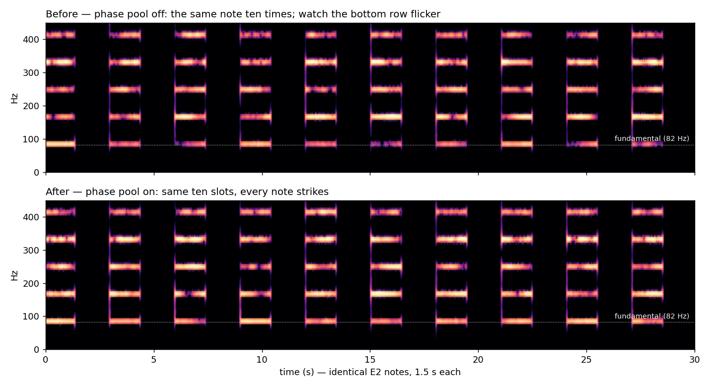
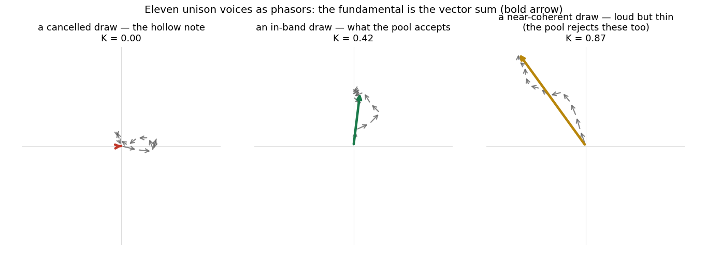
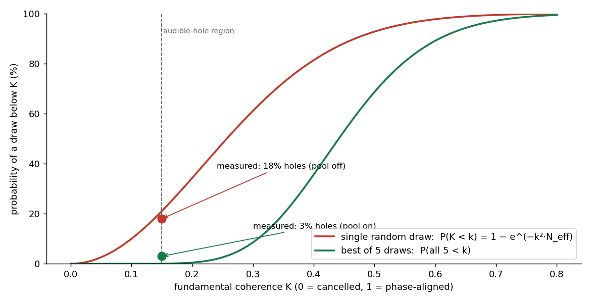
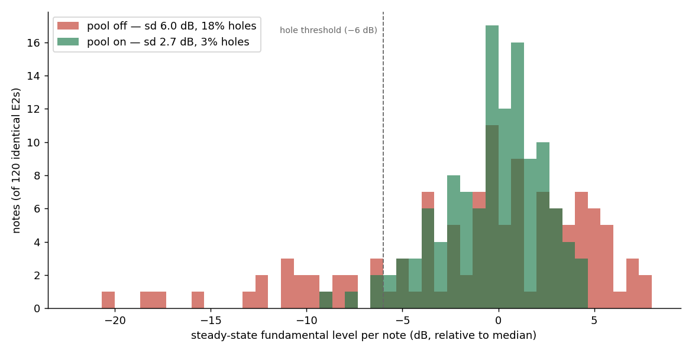
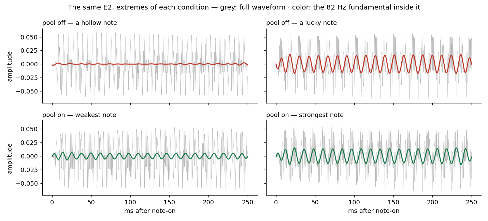

# The Fundamental Lottery

*Why every supersaw note was a dice roll, and how we rigged the game.*

## 1. The problem: some notes have bass, some don't

Klang's current test piece is a synthesizer impression of a rock band — supersaw
"guitars", a sine bass, synth drums. The low rhythm guitar plays a driving, machine-gun eighth-note riff on E2. And for
weeks, something was wrong with it that no mixing decision could touch: **the notes were not the same.** Same pitch,
same velocity, same patch — but some notes struck with a full, punchy low end and some arrived hollow, thin, almost
apologetic. The pattern was random. Blind listening reviews kept flagging it without being asked:
*"weak, hollow, phasey onsets"*, *"some notes have bass, some don't."* Played loud, it felt like the house was shaking —
not in the good way. In the unpredictable way.

We measured it before theorizing. Render the *same E2 note 120 times* in isolation, then track the level of the
fundamental (82 Hz) in each note's steady state:

- spread across identical notes: **σ = 6.0 dB**, full range **30 dB**
- **18% of notes stuck more than 6 dB below the median** — for their entire duration
- and a note born hollow stayed hollow: early-vs-steady correlation r ≈ 0.6

The rest of the spectrum was fine — broadband onset level varied by barely 1 dB. Only the fundamental gambled. Here is
what that looks like:



*Fig. 1 — the same E2, ten times in a row. Top: the bottom row of the harmonic ladder — the fundamental — flickers from
note to note like a faulty neon sign, while the upper harmonics stay steady. Bottom: the fix described in this post.*

## 2. Why it happens: eleven arrows, summed nose-to-tail

A supersaw is N slightly-detuned sawtooth voices — eleven, in our patch. Each voice starts at a random phase; that
randomness is deliberate and old (Roland's JP-8000 established the recipe, and Szabó's classic analysis
[[szabo2010]](#references) documents the architecture). Random phases are what make the ensemble *lush* instead of a
single fat saw.

But the fundamental of the summed ensemble is the **vector sum of eleven unit phasors** — eleven arrows, each pointing
in a random direction, chained nose-to-tail. Sometimes the chain marches outward: loud, full fundamental. Sometimes it
curls into a circle and lands back at the origin: the fundamental *cancels itself*, and the note plays without its
lowest harmonic.



*Fig. 2 — three real draws for an 11-voice ensemble. The bold arrow is the fundamental the listener receives.*

And the cruel detail that turns a curiosity into a defect: **at low pitch the arrows barely rotate.** The voices'
detunes are fractions of a semitone, so at E2 the phasor configuration takes 8–60 seconds to reshuffle — against a 130
ms note. Each note is born with a face and dies wearing it. High notes escape (the same detunes are 4× faster per
octave); the low riff takes the lottery at full odds, note after note after note.

The statistics are textbook: the magnitude of a random phasor sum follows a Rayleigh law,

```
P(K < k) = 1 − exp(−k² · N_eff)        N_eff = (Σg)² / Σg²
```

where K is the fundamental's coherence (0 = cancelled, 1 = perfectly aligned)
and N_eff counts the effectively contributing voices. For our gain profile, N_eff ≈ 10.5 — which predicts 16–21% of
notes below the audible-hole threshold. We had measured 18%. When a one-line formula reproduces your bug rate, you can
start trusting its predictions.

## 3. What others do about it

The synthesizer world has known both ends of this trade-off for decades, and essentially ships a binary choice:

**Phase reset (key-sync).** Start every voice at phase zero. Deterministic, punchy — and dead. A coherent ensemble is
just one loud saw; the lushness *is*
the incoherence. Every synth with a "phase" knob at 0% offers this, and every sound designer learns why it's wrong for
pads.

**Free-running / random phase.** The JP-8000 lineage and the modern default — Serum, Vital and friends expose a "phase
randomization" amount, and at 100% you get exactly the lottery described above. The industry ships the dice.

**Designed phase tables.** Outside synthesis, Schroeder derived phase sets that minimize the peak factor of a multitone
signal [[schroeder1970]](#references)
— deterministic, flat, used in measurement signals to this day. But one fixed table means every note is *identical*, and
low crest factor was never a musical objective. Nobody tuned these for how a note *feels*.

**And then there's telecommunications.** An OFDM radio signal is a sum of many carriers with data-dependent phases —
mathematically the *same object* as our unison ensemble — and radio engineers suffer the same Rayleigh statistics as a
peak-to-average-power problem. Their standard fix, **Selected Mapping**
[[baeuml1996]](#references), is disarmingly simple: generate several candidate phase mappings, evaluate each, transmit
the best one. It has been in production since 1996. Two industries away, the solution to our problem had been running
for thirty years — nobody had told the synthesizers.

## 4. The bridge: scoring a note before it exists

Why did synthesis never import that trick? Because selecting among candidates requires *evaluating* them, and evaluating
a sound seems to require rendering it. That assumption is false for the fundamental. For any harmonic waveform, the
ensemble's fundamental is available in closed form — not just at note-on, but for all time:

```
A₁(t) ∝ | Σₙ gₙ · e^{ i·2π·(φₙ + Δₙ·t) } |
```

Eleven complex exponentials. A few hundred nanoseconds. A candidate phase draw can be scored **before it makes a
sound** — and once scoring is free, Selected Mapping becomes available to a synthesizer at note-on rates.

With one musical amendment the radio engineers never needed. In telecom you select the *best* candidate; maximum
coherence is unambiguously good. In music it is not: K → 1 is phase-aligned saws — thin, static, the key-sync sound. The
"distortion" we are avoiding is also the timbre we love. So klang selects into a **band**: draws are accepted when K
lands in a configurable window (default 0.30–0.55) — *good, never best*. The band's lower edge removes the holes; the
upper edge protects the lushness. (It is also, unintentionally, a new timbre control: a band of 0.05–0.25 is a
deliberately hollow pad that breathes into existence.)



*Fig. 3 — the Rayleigh law for a single draw (red) and for best-of-five selection (green), with the measured hole rates
from Section 5.*

## 5. The wave-pool

The full mechanism, as shipped:

1. **Banded best-of-5.** At note-on, draw five candidate phase sets, score each analytically, keep the one closest to
   the band. The Rayleigh tail — the catastrophic draws — is eliminated at the source.
2. **A vocabulary, not a dice cup.** Accepted draws live in a bounded pool (~256 entries) keyed per orbit — per
   *instrument*, effectively. Notes pull from the pool round-robin. A real guitar doesn't roll new physics per note; it
   has *its* strikes. The pool gives each synth voice a finite, personal vocabulary of strikes — and the two guitars in
   the piece, holding separate pools, slowly develop separate characters.
3. **Evolution without decay.** Every ~10th note, a fresh banded draw replaces a **random** pool entry — not the worst
   one. Evicting the worst would homogenize the pool toward the band center; random eviction keeps it a fair rolling
   sample forever. The vocabulary fully renews every ~20 minutes of playing: the instrument drifts, the quality floor
   doesn't.
4. **Warm from the first note.** Because scoring is analytic, the pool doesn't need play-time to fill — a work-capped
   warmup seeds it at creation, and top-ups cost microseconds. (An early "eagerly fill everything at load"
   design measured up to 292 ms of render-callback stall and was replaced by the amortized fill.)
5. **Off by default.** `phasePool` ships disabled; the engine without it is bit-identical to before.

The DSL surface is one call:

```javascript
Osc.supersaw(freq = Osc.freq(), voices = 11, spread = 0.07)
    .phasePool()                          // on, family defaults
    // or, tuned:
    .phasePool(kMin = 0.30, kMax = 0.55, drawTries = 5, refreshEvery = 10)
```

One implementation in the shared unison engine covers the whole family — supersaw, supersquare, superpulse, supertri,
superramp, and supersine, where the stakes are highest: a sine has *only* a fundamental, so for a supersine pad the
coherence K isn't the low end of the note, it's the entire note.

## 6. Results

The validation harness renders the same E2 120 times and measures each note's steady fundamental. Pool off vs on, same
patch, same engine, same day:

| metric                      | pool off | pool on     |
|-----------------------------|----------|-------------|
| σ across identical notes    | 6.0 dB   | **2.7 dB**  |
| full range                  | 29.8 dB  | **13.7 dB** |
| p10 floor                   | −9.7 dB  | **−3.9 dB** |
| holes (> 6 dB below median) | 18%      | **3%**      |
| hollow notes persist (r)    | 0.60     | 0.37        |



*Fig. 4 — 120 identical notes each. The left tail — the hollow notes — is where the lottery lived.*



*Fig. 5 — the extremes of each condition. Grey: the full waveform — nearly identical in every panel, which is exactly
why the defect resisted every level-based diagnosis. Color: the 82 Hz fundamental extracted from it. Before:
present in one note, absent in its identical twin. After: the weakest and strongest notes are siblings.*

And the part no measurement can certify but ears can: the low guitar finally *punches*, every time. The high melody —
fifteen unison voices, dense fast lines, essentially all onsets — cleaned up too, which the theory had undersold:
coherence time scales with pitch, but the *attack moment* is governed by the draw at every pitch, and a melody is made
of attack moments. Full-mix spectra with the pool on and off differ by less than 0.3 dB in every band: the consistency
costs nothing in balance, and the steady-state texture — the lushness the randomness exists to provide — is untouched.

## 7. What's still open

The residual 3% of quiet notes (target was < 1%) is suspected to be per-note gain jitter — a separate, deliberate
randomness the pool doesn't govern — and awaits one confirming measurement. Harmonics 2 and 3 are statistically
independent of the fundamental and still free-range; long pads may eventually want the band to score a weighted
low-harmonic sum instead of A₁ alone. And the band itself is waiting to be abused creatively — nobody has written the
deliberately-hollow-pad piece yet.

The deeper lesson we're keeping: the fix wasn't more randomness or less randomness. It was *auditioning* randomness —
cheaply enough that the audition is invisible. The dice still roll; the engine just refuses to play the worst throws.

---

## References {#references}

1. <a id="szabo2010"></a>Szabó, A. (2010). *How to Emulate the Super Saw.*
   B.Sc. thesis. [PDF](https://www.adamszabo.com/internet/adam_szabo_how_to_emulate_the_super_saw.pdf)
2. <a id="schroeder1970"></a>Schroeder, M. R. (1970). Synthesis of low-peak-factor signals and binary sequences with low
   autocorrelation. *IEEE Transactions on Information Theory*, 16 (1), 85–89.
3. <a id="baeuml1996"></a>Bäuml, R. W., Fischer, R. F. H., & Huber, J. B. (1996). Reducing the peak-to-average power
   ratio of multicarrier modulation by selected mapping. *Electronics Letters*, 32 (22), 2056–2057.
