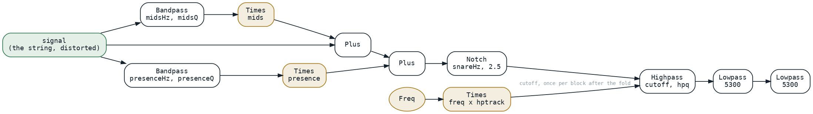
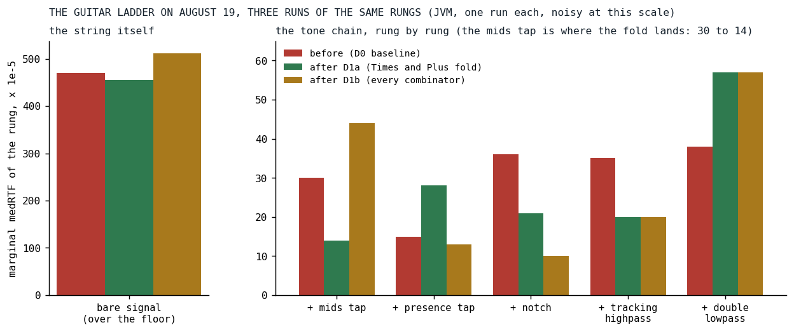

# Half a Song

*A one-line override, a fold ladder in two nodes, and fifteen missing overrides: a five percent desktop win that was run-or-not-run on the phone.*

An instrument in Klangmotor is a tree of nodes, and on August 19 every node still rendered the way the first one had: a whole 128-frame block into a buffer, for each of its inputs, and then a loop combining them. A multiply took its left operand into the output buffer, rendered its right operand into a scratch buffer, and multiplied the two:

```kotlin
private class TimesIgnitor(private val a: Ignitor, private val b: Ignitor) : Ignitor {
    override fun generate(buffer: AudioBuffer, freqHz: Double, ctx: IgniteContext) {
        a.generate(buffer, freqHz, ctx)
        ctx.scratchBuffers.use { tmp ->
            b.generate(tmp, freqHz, ctx)
            val end = ctx.offset + ctx.length
            for (i in ctx.offset until end) {
                buffer[i] = safeOut(buffer[i] * tmp[i])
            }
        }
    }
```

*[Ignitor.kt at v0.3.1.4](https://github.com/PeekAndPoke/klang/blob/v0.3.1.4/audio_be/src/commonMain/kotlin/ignitor/Ignitor.kt#L102-L119)*

That is the right shape when both operands are signals. The right operand of a level knob is not a signal. It is a parameter, read once per note or per block, and the guitar of Der Schmetterling had three of them in its tone chain alone, each rendered into 128 identical doubles every block so that a loop could read them back.



*Fig. 1: The guitar's tone chain as it was written on August 19: two parallel bandpass taps, each with a level multiply, a notch, a highpass whose cutoff tracks the note, and two lowpasses. Every gold box is a multiply by a block-constant operand, a parameter or the note frequency times a parameter; the gold ellipse is the note frequency it reads.*

## What the measurement said first

The unified-EQ plan of that day had a bolder goal, fusing the chain's filters into one pass, and its first deliverable was a measurement of untouched code with a checkpoint written into it: if the tone chain measured under 15 percent of the guitar's cost, stop and re-scope. It measured 22 percent. The honest ceiling of a fused equalizer came out at three to five percent of the song, and the measured CPU lived in the bare signal, 78 percent of the voice: the unison stack, the oversampled distortion and the analog drift. The checkpoint escalated, the maintainer decided to continue the plan for reasons that were not performance, and the same review that produced the escalation listed two free wins to take regardless. The first of them is this post.

## The null that hid every composite

The engine already had a way to read a block-constant node as one number instead of a buffer: an optional override that returns the node's scalar value or null. Constants, parameters and the note frequency implemented it, and so did the pointwise arithmetic over them. What nobody had noticed is that the builder wraps every non-leaf node in a memoizing wrapper, so that a subtree shared by two consumers renders once per block, and the wrapper inherited the default: null. A composite constant such as the note frequency times a tracking parameter reported that it varied within the block, and the highpass reading it as its cutoff rendered a scratch buffer every block to take one sample out of it. The first commit is one override, pure delegation:

```kotlin
    /**
     * Pure delegation. Every node that reports non-null here is stateless (Constant/Param/Freq
     * leaves and pointwise combinators over them), so bypassing the block cache for the scalar
     * read has no side effects and equals the cached buffer's samples bit-for-bit. Without this
     * override, the wrapper that [buildIgnitor] puts around every identity-cached non-leaf node
     * (Variants and the pitch-mod nodes dissolve instead of being wrapped) reported `null` and
     * forced composite constant subtrees (e.g. `Times(Freq, Param)`) onto the scratch-render
     * fallback in [Ignitor.blockStartValue].
     */
    override fun controlRateValueOrNull(freqHz: Double, ctx: IgniteContext): Double? =
        inner.controlRateValueOrNull(freqHz, ctx)
```

*[MemoizingIgnitor.kt at v0.3.1.5](https://github.com/PeekAndPoke/klang/blob/v0.3.1.5/audio_be/src/commonMain/kotlin/ignitor/MemoizingIgnitor.kt#L10-L84)*

## The fold

The second commit made the multiply and the add consult that scalar before rendering. A block-constant operand is not rendered at all; the other side renders into the output and one in-place loop applies the constant. Both constant, one fill. The ladder in the multiply:

```kotlin
        if (aConst && bConst) {
            val ka = a.controlRateValueOrNull(freqHz, ctx)
            val kb = b.controlRateValueOrNull(freqHz, ctx)
            if (ka != null && kb != null) {
                // Both constant: one multiply, one safeOut, one fill — bit-identical to the
                // per-sample paths, which compute the same op on the same operands per index.
                buffer.fill(safeOut(ka * kb), ctx.offset, ctx.offset + ctx.length)
                return
            }
        }

        if (bConst) {
            val kb = b.controlRateValueOrNull(freqHz, ctx)
            if (kb != null) {
                a.generate(buffer, freqHz, ctx)
                mulConstInPlace(buffer, ctx, kb)
                return
            }
        }
```

*[Ignitor.kt at v0.3.1.5](https://github.com/PeekAndPoke/klang/blob/v0.3.1.5/audio_be/src/commonMain/kotlin/ignitor/Ignitor.kt#L212-L267)*

Bit-identical by construction: the fold arm copies its own operation's loop, the multiply keeps its clamp everywhere and the add stays bare, and a scratch buffer full of one value multiplied per index is the same IEEE operation on the same operands as the constant multiplied in place. The gate is a structural flag computed once at construction, because on the JVM the nullable scalar is a boxed value and asking for it per block on the common non-folding path would have cost more than it saved. A flag that says constant while the scalar comes back null is a contract breach, and the policy for it is silent fall-through to the always-correct scratch path, never a throw on the render thread. The contract itself went into the interface, because the scalar now fed the audio path and not only the control reads:

```kotlin
     * CONTRACT (load-bearing since the constant-fold in `plus`/`times` consumes this on the
     * AUDIO path, not just for control-rate reads): an override MUST
     *  1. be pure — no state advanced, no side effects, no `ctx` mutation; callable any number
     *     of times per block, including zero;
     *  2. be bit-identical to the node's own [generate] output for every sample in
     *     `[offset, offset+length)` of the same block.
     * A node that is merely *slowly varying* must return `null` — a non-null value here turns
     * `x * node` into a stepped per-block multiply with no spec failing loudly.
```

*[Ignitor.kt at v0.3.1.5](https://github.com/PeekAndPoke/klang/blob/v0.3.1.5/audio_be/src/commonMain/kotlin/ignitor/Ignitor.kt#L36-L85)*

The third commit took the same ladder through every combinator, subtract, divide, modulo, minimum, maximum and power, each with its own guards copied exactly and its non-commutative sides handled separately, added partial folds for the ternary nodes whose bounds are almost always constant, since a clamp between minus one and one had been two scratch renders per block, and wrote the missing override into fifteen node kinds: square root, sign, tanh, floor, ceiling, round, fraction, reciprocal, square, the two polarity converters, modulo, interpolation, range and select. One missing override anywhere in a parameter subtree returned null and killed folding for the whole subtree above it. The select node's override resolves all three of its children before it answers, deliberately not short-circuiting on the condition, because an untaken branch with stateful nodes must keep advancing exactly as the render does.

## What it cost to review

The first fold commit went through four review rounds and 25 findings, and the plan distilled them into a checklist before the third commit: parity oracles must not fold themselves, so every operand of a reference is opacified; parity is not liveness, so every fast path gets a probe that counts renders, since deleting a fold branch leaves every parity case green; guard engagement needs discriminating values, since a NaN divisor discriminates where a zero cannot; every new windowed loop gets a sub-block case in production shape; and every override lands with its own line in the agreement table between the flag and the scalar. Handed to the next round's reviewers as "verify handled", the checklist took the third commit through two rounds instead of four, with zero arithmetic divergence found in the first. Twelve mutations went red on the second commit and nine on the third, each on the intended test.

## Results



*Fig. 2: The guitar ladder, a benchmark that adds the tone chain one stage at a time onto the bare string and reads each rung's cost over the one before it, on August 19 before the fold, after the second commit and after the third. JVM, one run each, and noisy at this scale: the rungs move by more than the fold on the stages it does not touch. The mids tap, the first level multiply, is where it lands.*

| measure | before | after D1a | after D1b | today |
|---|---:|---:|---:|---:|
| chain total, rung 5 minus rung 0 | 0.00153 | 0.00139 | 0.00144 | 0.00143 |
| guitar voice, rung 5 minus the floor | 0.00623 | 0.00594 | 0.00656 | 0.00438 |
| mids tap, marginal over the bare signal | 0.00030 | 0.00014 | 0.00044 | 0.00079 |

Median RTF on the JVM. The chain total went from 0.00153 to 0.00139, nine percent, and the guitar voice 4.7 percent; the mids tap's marginal cost halved, which is the scratch render of its level parameter gone. The third commit changed nothing on this ladder, as expected, since the guitar's chain uses none of the operators it folded; those pay in other instruments. Today's column is on an engine that has since fused the chain's serial filters into one pass and replaced the sine, so it measures something else; it is there to show the ladder still runs, not to isolate the fold.

The maintainer's by-ear test on the folded engine: no audible change on Der Schmetterling, and a slight perceived CPU improvement. The on-device result, in the plan's capitals: half of Der Schmetterling runs again, the stall now only at the lead's entry, where a seventeen-voice unison, a nested superimpose and a steel body make the song's peak footprint. The plan's own reading of that is the sentence this post exists for. A desktop-measured five percent per voice translated to run-or-not-run territory on the phone's small caches. The desktop had, that same day, refused the cache hypothesis: a polyphony sweep from one to sixty-four voices found the chain's marginal cost flat, and the one anomaly, a third more at thirty-two voices, was the CPU's boost clock decaying under a long run. The phone confirmed the hypothesis the desktop could not see, and from then on the plan reads every desktop percentage through that lens.

## What transferred

A fold is what you do when you know something at build time that the render loop does not, the oldest move in the compiler book [[1]](#aho2006), and the knowledge here was structural: a parameter cannot vary within a block, so nothing that depends only on parameters can either. That is the graph optimizer's idea in its first form, one node at a time and at render time; [the pass that rewrites the tree](../2026-08-20-eleven-loops-one-pass/index.md) came the next day and [the margin that let it move a multiply](../2026-09-15-the-promise-is-a-margin/index.md) a month later. Two smaller lessons. A capability that is opt-in per node is only as good as its worst gap: one wrapper's default null had hidden every composite constant in every instrument. And the desktop is a poor judge of what a percent is worth; the same five percent was a rounding error on a Ryzen and half a song on an A55.

## References

1. <a id="aho2006"></a>Aho, A. V., Lam, M. S., Sethi, R., & Ullman, J. D. (2006). *Compilers: Principles, Techniques, and Tools* (2nd ed.). Pearson. <https://www.informit.com/store/compilers-principles-techniques-and-tools-9780321486813>

*Sources inside the repository: `docs/plans/unified-eq.md` (Context, D0, D1a, the fold-work checklist, D1b with the by-ear and on-device notes of 2026-08-19), the commits `2daaf761`, `974a18db` and `d3f664f4`, `docs/benchmarks/2026-08-19_130650_song_jvm.md`, `_152633_`, `_161817_` (the ladder before, after D1a and after D1b) and `2026-09-16_141712_song_jvm.md` (the ladder today), `2026-08-19_134527_song_jvm.md` and `_140344_` (the polyphony sweep), `audio_be/src/commonMain/kotlin/ignitor/Ignitor.kt` and `MemoizingIgnitor.kt` at v0.3.1.4 and v0.3.1.5, `ConstantFoldParitySpec.kt`, `ControlRateScalarParitySpec.kt`, `src/commonMain/kotlin/builtinsongs/DerSchmetterling.kt` at v0.3.1.4.*
