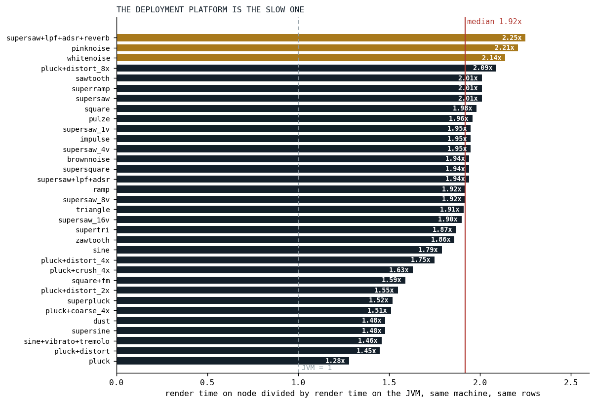
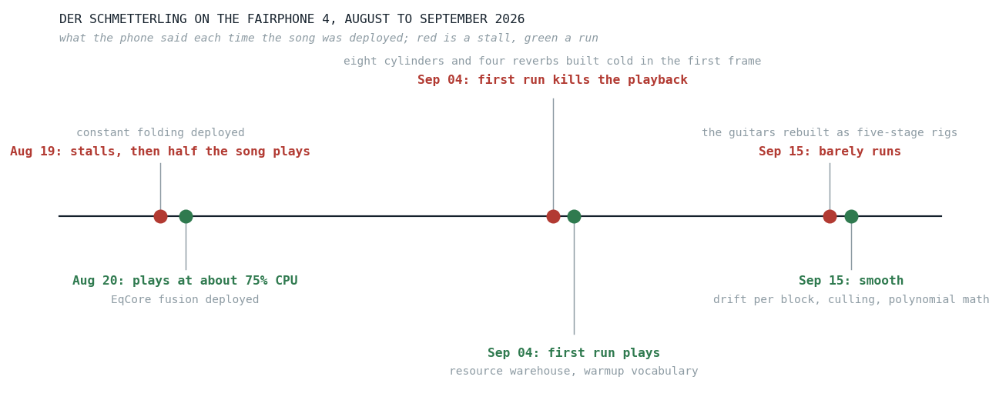
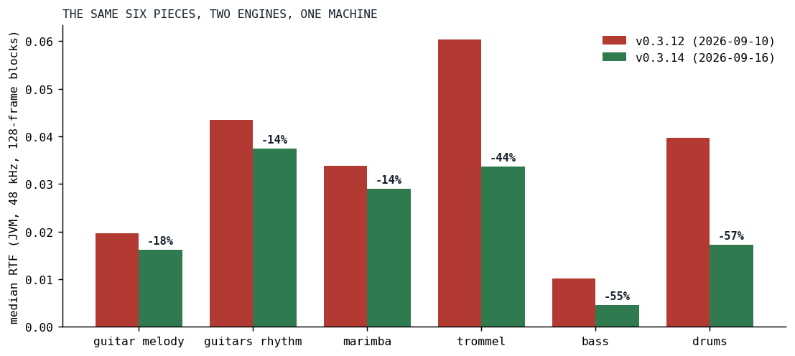

# The Phone That Does Not Get Faster

*A 2021 Fairphone, a song that keeps growing, and the one number that tells them apart.*

Every performance target that mattered for Klangmotor has had the same shape: **Der Schmetterling runs on the Fairphone 4.** Not "the engine is fast", not "the benchmark improved". A named song, on a named phone, in a browser tab, without a stutter.

This post is the first of a series about how that sentence was kept true through a summer in which the song got heavier every week. Each later post takes one optimization: what the phone said before it, why this one and not another, what it changed, and what it cost in sound. This one sets the table. It says what the phone is, what we measure, and why the obvious measurement would have told us the optimizations went the wrong way.

## The phone

The Fairphone 4 shipped in October 2021 on a Snapdragon 750G [[1]](#gsmarena-fp4) [[2]](#wiki-fp4): two Cortex-A77 cores at 2.2 GHz and six Cortex-A55 cores at 1.8 GHz, on an 8 nm process, with 6 or 8 GB of RAM. The A55 is ARM's small core. Its level-one cache is a configurable 32 to 128 KB and its level-two 64 to 256 KB [[3]](#wiki-a55), and Qualcomm does not publish which end of that range the 750G uses. The A77 has 128 KB of L1 and 256 to 512 KB of L2 [[4]](#wiki-a77).

The desktop the benchmarks in this series run on is an AMD Ryzen 9 PRO 7940HS: eight Zen 4 cores boosting to 5.2 GHz, 1 MB of L2 per core and 16 MB of L3 [[5]](#notebookcheck-7940hs). It is not a fair fight, and that is the point. A song that fits the desktop with room to spare can still fall off the phone, and the phone is where a listener might actually press play.

Klangmotor renders inside the browser's AudioWorklet: one thread, a block of 128 frames every 2.67 milliseconds at 48 kHz, and no second chance. In Chrome on Android that thread runs on V8, the same engine as Node.js [[6]](#nodejs-v8), which is why the node numbers in this series are the ones that count and the JVM numbers are the ones that are convenient.

We chose the phone for one reason. It does not change. The desktop gets a new JIT, a new kernel, a warmer afternoon; the songs get another guitar stage; the phone from 2021 stays what it was. A fixed target turns "fast enough" from a feeling into a measurement.

## The number

Everything below is measured in **RTF**, the real-time factor: the time it took to render a stretch of audio divided by the length of that audio. A 128-frame block is 2.67 ms of sound. If the engine renders it in 0.27 ms, the RTF is 0.1, a tenth of the time available. Below 1.0 is faster than real time. At 1.0 the audio thread misses its deadline and the sound breaks up.

Two RTFs matter for a song. The **median RTF** is the steady-state average, the share of a core the song takes. The **peak RTF** is the single busiest block, and the peak is what makes a phone stutter: a song can sit at a comfortable median and still drop out on the block where every drum and guitar note starts at once. The song benchmark skips the first 0.35 seconds before it looks for the peak, because the one-time allocations at the start of a song are a different problem, told in the post about the resource warehouse.

The desktop measures RTF on the JVM because that is where the tooling lives. The phone runs on V8. The gap between the two is not a constant, but it is not wild either.

*Fig. 1: The same 33 oscillator rows, rendered on the JVM and on node on one machine, as the ratio of render times. The median is 1.92; the white and pink noise rows and the reverb chain sit above 2.1, the bare plucked strings below 1.6, until oversampling pushes a pluck to 2.09. Source: the benchmark comparison of 2026-08-19.*

A JVM number multiplied by two is a fair first guess at node. The phone is another multiple on top, and that one we have never measured precisely: on the device we have a CPU gauge and our ears, which is why the timeline below is written in words rather than numbers.

## What the phone said

*Fig. 2: Der Schmetterling on the Fairphone 4, the six times between August 19 and September 15 that the phone changed its answer. Red is a stall, green a run. The gray line beside each is what had changed in the engine, or in the song.*

Six answers, three cycles of the same story. On August 19 the song stalled; with block-constant arithmetic folded out of the guitar chain it played half way, then stalled at the lead's entry. A day later, with the guitar's filter tail fused from about eleven nodes down to five, it played at about 75% CPU, and the plan that had set the goal marked it met.

Two weeks later the song's first run killed the playback again, and it took four deployments on September 4 to find out why. The day before, the suspect had been the delay rings: 7.68 MB per orbit, zero-filled on the audio thread at the first note that touched it, about 63 MB for a song that uses eight orbits. The resource warehouse made those lazy and right-sized, and the first run still died. What was left was the first frame building eight cylinders and four reverb networks at once, about a megabyte of objects and a great deal of cold code, which weighs more on a phone than on a desktop. A warmup that builds every node kind in silence before the first note fixed that, and the first run played.

Then, on September 15, the song could barely run again. Nothing in the engine had regressed. The guitars had been rebuilt over the intervening days into five-stage rigs, pickup to cabinet, with oversampled distortion in all five stages, three of them at four times the rate, and the phone that had been fine with a filtered supersaw was not fine with that. The same evening the analog drift, the wander we had spent a spring putting into every oscillator ([Killing the Plastic Pipe](../2026-06-30-killing-the-plastic-pipe/index.md)), stopped stepping every lane per sample, and with culling and polynomial transcendentals already in, the song was smooth.

That third cycle is the reason this series exists. The engine got faster all summer, and the phone was in trouble anyway, because the song got heavier faster.

## The number that lies

Here is what the obvious chart looks like. On the desktop, on August 19, the live Der Schmetterling rendered at a median RTF of 0.0752. On September 15, with culling, the polynomial math and the block-rate drift landed, the live song rendered at 0.0791. Plotted as one line, the summer's work made the song five percent slower.

The line is true and the conclusion is false, because two things moved at once. We know this because the song benchmark also renders a frozen copy of Der Schmetterling as it was on July 3, the same text every time, door renames aside. That frozen song went from 0.0870 to 0.0756 over the same period on the same machine: thirteen percent faster on identical work. The live song ate the whole gain and a little more, in the shape of the guitar rigs.

So the live song's RTF over time is not a score. It is the difference between two scores, an engine getting quicker and a song getting heavier, and it says nothing about either on its own. Every result in this series is therefore stated on **fixed work**: the same voice, the same chain, the same frozen instrument, before and after. Where a live-song number appears, the song's version stands next to it.

## The honest scoreboard

Fixed work needs two things: pieces that do not move, and a measure of how much they ask.

The pieces are the six instruments of Der Schmetterling, each rendered solo on a frozen copy of the song text, so that the engine is the only thing that can move a piece's number between two runs. When an instrument changes for real, it gets a new dated snapshot and the old one stays.

The measure is a census of the graph each note renders. Klangmotor builds a voice from a tree of nodes, an oscillator, filters, a distortion stage, an envelope, and after the graph optimizer has had its say, that tree is what the engine walks once per 128-frame block. The census counts three things per note from that optimized tree: how many **passes over the block** it takes (a fused equalizer of four sections is four, a unison stack of nineteen voices is nineteen), how many **buffer reads and writes per sample** those passes move (an in-place pass is two, a pass over two signals three, a shaper oversampled four times moves the block around several times over), and how many **bytes of state** a note holds between blocks. The counts are a model read off the runtime's own lowering, pinned by hand-counted graphs, and their job is to hold the denominator still.

With those, the score for one piece is its render time per sample per pass, and for one engine change it is the ratio of that number before and after on the same piece. We call the table that collects these rows the ledger. It is appended to, never edited, by one command after every optimization round, and a piece's history reads down one column.

*Fig. 3: The ledger's first reading: the six frozen pieces on the engine of September 10 and of September 16, the same machine, medians of three runs each. The September round is culling, the polynomial sine and exponentials, the analog drift stepped per block, the arithmetic folds and the polyphase decimator. The older engine predates the ledger, so its rows were measured by carrying the frozen pieces into a checkout of that tag.*

| piece | passes per note | before (3 runs) | after (3 runs) | change |
|---|---:|---:|---:|---:|
| guitar, melody rig | 48 | 0.0196 (0.0186 to 0.0202) | 0.0161 (0.0154 to 0.0165) | -18% |
| guitars, rhythm rig | 57 | 0.0435 (0.0411 to 0.0453) | 0.0375 (0.0356 to 0.0385) | -14% |
| marimba | 18 | 0.0339 (0.0301 to 0.0377) | 0.0290 (0.0244 to 0.0345) | -14% |
| Orchestertrommel | 24 | 0.0604 (0.0551 to 0.0613) | 0.0337 (0.0336 to 0.0359) | -44% |
| bass | 7 | 0.0101 (0.0094 to 0.0106) | 0.0045 (0.0045 to 0.0059) | -55% |
| drums (samples) | 1 | 0.0397 (0.0362 to 0.0479) | 0.0173 (0.0171 to 0.0183) | -57% |

Three things in that table are worth a second look, and each is a later post.

The rhythm guitar note is 57 passes, and nineteen of them are the unison stack's voices before a single filter has run; the pitch envelope, the pluck burst, the envelope and the five-stage rig are the other 38, and the whole note moves 303 buffer samples per input sample, most of them in the three shapers that run at four times the rate. Where the time goes is a different question from where the passes are: a census of the same guitar the day before the September round, with one stage at a time swapped for its plain version, put the rig at 30% of the guitar's cost, the analog drift at 19%, the string extras at 6%, and the supersaw stack with the envelope and the per-node overhead at the remaining 45%. The string is at least as expensive as the amplifier, and the amplifier's cost is its oversampling, not its filters.

The drums halved their RTF while their cost per voice went **up**. Before, 24 voices were active per block; after, six were rendering. Culling had stopped the silent tails, and the voices left were the ones doing the work. Per-voice cost is not the score either; per-pass cost is.

And the marimba's three runs span forty percent, because one of them caught a pause with a peak RTF of 1.2, a garbage collection or a compilation, and reads nineteen percent above the median. The median absorbs it and the spread reports it. Every number in this series comes with its spread, and a number without a spread is a number we have not measured three times.

## The rules for the rest of the series

- Same machine, same harness version, same session for an A/B, and the platform named. Node is the deployment platform; the JVM is the convenience.
- Fixed work only. A live-song number never stands alone.
- Medians of three runs, with the spread. The peak block reported next to the median.
- The harness itself is suspect. On September 7 we found the ignitor benchmark had been rendering every voice twice per block, so every absolute microsecond it printed before that day is double the truth. Ratios within one run survived; absolutes did not. The posts say which side of that day their numbers come from.
- Bit-identical is the default claim for an optimization. Where a change is only within a margin, or only by ear, the post says so, and says what guarded it.

What the phone cannot tell us in numbers, it tells us in the only currency that matters here: whether the song plays. The rest of the series is about how many times we had to earn that again.

## References

1. GSMArena. Fairphone 4 full specifications. <https://m.gsmarena.com/fairphone_4-11136.php>
2. Wikipedia. Fairphone 4. <https://en.wikipedia.org/wiki/Fairphone_4>
3. Wikipedia. ARM Cortex-A55, citing ARM's Technical Reference Manual. <https://en.wikipedia.org/wiki/ARM_Cortex-A55>
4. Wikipedia. ARM Cortex-A77, citing ARM's Technical Reference Manual. <https://en.wikipedia.org/wiki/ARM_Cortex-A77>
5. Notebookcheck. AMD Ryzen 9 PRO 7940HS processor benchmarks and specs. <https://www.notebookcheck.net/AMD-Ryzen-9-PRO-7940HS-Processor-Benchmarks-and-Specs.725627.0.html>
6. Node.js documentation. The V8 JavaScript engine. <https://nodejs.org/learn/getting-started/the-v8-javascript-engine>

*Sources inside the repository: `docs/plans/unified-eq.md` (the on-device notes of August 19 and 20), `docs/plans/resource-warehouse.md` (the four measurements of September 4), `docs/tasks-archive/2026-09/20260916-ignitor-optimizer-arithmetic-folds.md` (September 15), `docs/benchmarks/2026-08-19_121412_song_jvm.md` and `docs/benchmarks/2026-09-15_203953_song_jvm.md` (the frozen and live song), `docs/benchmarks/2026-08-19_202119_compare.md` (Fig. 1), `docs/benchmarks/ledger.md` (Fig. 3).*
