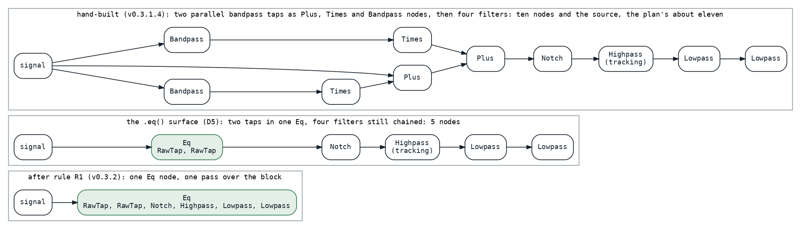
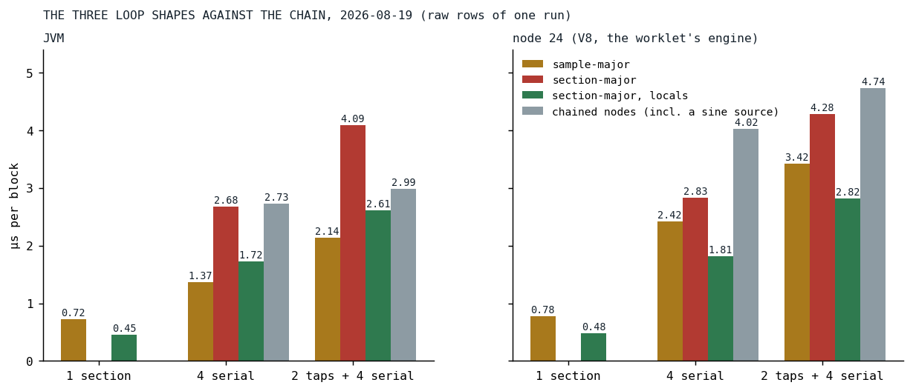

# Eleven Loops, One Pass

*A guitar's tone chain ran as eleven nodes, each a loop and a scratch buffer; the fused equalizer runs it as one, and the loop shape inside that one was decided by the platform that matters.*

The plan opened with its goal in bold: Der Schmetterling runs on [an older Fairphone 4](../2026-08-19-the-phone-that-does-not-get-faster/index.md) again. The guitars were about 98 percent of the song's cost, and the maintainer's expectation was that a guitar's cost went into its tone chain. The plan's first deliverable measured that expectation and escalated: the chain was about 22 percent of a guitar voice, the bare signal 78, and the honest ceiling of a fused equalizer was three to five percent of the song. The work went ahead anyway, with the constant folding of block-constant arithmetic as its first leg, because the chain was still the largest thing that could be made cheaper without changing a sound. Two parallel bandpass boosts, a notch, a highpass that tracks the note, two lowpasses, written the way every Klangmotor instrument is written, as a chain of calls, and rendered the way every chain was rendered on August 19: each node a full loop over the 128-frame block, reading one buffer and writing another, about eleven of them per note. Four instruments used that guitar; unison shared one chain per note, and the superimpose copies re-ran it per copy.



*Fig. 1: The guitar tail as it was hand-built, as the `.eq()` surface let the song write it a day later, and as the optimizer rule fuses it: one node, one pass.*

## The decisions before the code

Six decisions were agreed with the maintainer on August 19, and they shaped everything after. An equalizer is a list of sections, the way every parametric EQ is. The tree is built exactly as authored, and a pure, separately testable pass rewrites it, so the chained syntax stays the syntax and old songs fuse for free. Bit-identity is a hard requirement: whatever the pass rewrites must render the same samples, to the bit, as the unrewritten graph, on both platforms, including the sub-block renders where a voice starts mid-block. The core is layered for reuse, a frequency-agnostic `EqCore` in the filters package with no dependency on the ignitor package, so that a future native port inherits one thing. Constant folding in the binary combinators, as the extra that came first. And the smallest possible pieces, each tested, review-looped and measured, even when that means touching the same code multiple times.

## One loop, three shapes

`EqCore` holds arrays of coefficients and state, one slot per section, each section a trapezoidal state-variable filter in Andrew Simper's formulation [[1]](#simper2013), and renders the list in one call. The question was the loop. Three shapes were on the ballot: sample-major, one loop over the samples with a per-sample dispatch on the section type; section-major, one specialized loop per section with the state in arrays; and section-major with the two state words snapshotted into locals for the duration of one section's loop and written back after it. The third is what shipped:

```kotlin
        val n = sectionCount
        val end = offset + length
        for (s in 0 until n) {
            val ca1 = a1[s]
            val ca2 = a2[s]
            val ca3 = a3[s]
            val ck = k[s]
            var s1 = ic1[s]
            var s2 = ic2[s]
            when (type[s]) {
                LOWPASS -> {
                    for (i in offset until end) {
                        val v0 = buffer[i]
                        val v3 = v0 - s2
                        val v1 = ca1 * s1 + ca2 * v3
                        val v2 = s2 + ca2 * s1 + ca3 * v3
                        s1 = (2.0 * v1 - s1).flushDenormal()
                        s2 = (2.0 * v2 - s2).flushDenormal()
                        buffer[i] = v2
                    }
                }
```

*[EqCore.kt at v0.3.2](https://github.com/PeekAndPoke/klang/blob/v0.3.2/audio_be/src/commonMain/kotlin/filters/EqCore.kt#L291-L323)*

The first bake-off was misleading. On a loaded desktop the sample-major loop led at four sections, and one of the three runs drifted by half on its baseline. The decision was taken the next session on a quiet machine, in both case orders, on both platforms, and the platforms disagreed:



*Fig. 2: The three shapes at one, four and six sections, against the chained per-filter nodes, microseconds per block, the raw rows of the reversed-order run of August 19. The chained rows include a bare sine source, which the plan's comparability rule subtracts; the corrected figures are in the text. Plain section-major was not measured at one section.*

On node, the engine under the browser's audio worklet and therefore the one the phone runs, section-major with locals won at every section count: at one section 0.44 against sample-major's 0.74 microseconds, at four 1.77 against 2.38, at six with two taps 2.78 against 3.38, all corrected for the harness's copy. On the JVM sample-major won at four sections and above by about 18 percent. Plain section-major lost everywhere, and the reason is recorded in the core's KDoc for the port that will inherit it: the buffer and the two state arrays are all arrays of doubles, the JIT cannot prove they do not alias, and every store into the buffer forced the state to be reloaded. The per-sample type dispatch of the sample-major loop, which the JVM amortizes over the sections, never amortizes on V8, whose inline caches are per call site [[2]](#bynens2018).

The decision was for node. The project's sound-first ranking puts the device first, and the JVM's headroom for offline renders is ten times what it needs. The losers were deleted the same day. One more number from the bake-off decided a rule: a single filter as a one-section core is a wash on the JVM and 38 percent cheaper on node than the single filter node it replaces, so the optimizer converts standalone filters too, not only chains.

## The node, the surface and the seeded voice

The wire node came next, an `Eq` over an inner signal with an ordered list of sections, each section a sealed type with its own parameters rather than an enum with an ordinal, per the house rule for anything that crosses the wire. The adapter that renders it produced the workstream's sharpest catch in its first review round: it resolved the section parameters before rendering its upstream, and a parameter that carried a modulator drew from the engine's one global random stream in a different order than the chained path had. The guitar chain was safe only because its parameters are block-constant. The fix was to render the upstream first; the lesson became a task the maintainer directed the same day: every voice gets its own seeded random stream, dealt at the top of voice construction, so that the order of draws between voices never matters again and an offline render is reproducible for the same playback id. That change dissolved a whole class of bugs, and it is what later let the optimizer's parity corpus contain drift, noise and unison at all, since two trees can be rendered with the same seed and compared.

The authoring surface followed on August 20: `.eq()` opens a fused equalizer, `.band()` adds a serial bell, `.tap()` a parallel boost. The tap was not in the plan. Migrating the guitar's parallel bandpass boosts to serial bells is not a conversion, because bells multiply and taps sum, and the leftover cross term measured 4.5 dB at 1200 Hz on the real patch; the raw tap section, built for bit-identity with the chained form, was the faithful shape, and the surface made it reachable. The song was migrated by hand onto it the same day, in the maintainer's copy, and reached the repository the next evening: its two taps into one node and the four serial filters still chained after it, and the plan's milestone note was written:

> Der Schmetterling runs smoothly on the FF4 at ~75% CPU

*[unified-eq.md at v0.3.3](https://github.com/PeekAndPoke/klang/blob/v0.3.3/docs/plans/unified-eq.md#L799-L800), the note of August 20*

The desktop measured 33 percent less CPU on the same change. The note is careful about what had fused: the tail was five nodes, down from eleven, not one.

## The rule

The optimizer landed on August 21, without the song being edited again. Its rule, stated by the maintainer and enforced literally: nothing ever moves, only direct neighbors fuse.

```kotlin
    return when {
        // Continue an Eq that this filter sits directly on top of. Guarded on the ORIGINAL
        // inner: if that Eq is shared, appending would fork it and duplicate every section.
        inner is IgnitorDsl.Eq && refCounts.isExclusivelyOwned(originalInner) ->
            inner.copy(sections = inner.sections + section)

        // Otherwise start a fresh Eq. A single filter converting to a one-section Eq is a
        // measured win on the deployment platform (Node 0.44 vs 0.74 us/block) and a wash on
        // the JVM, so standalone conversion is ON. See the D2a bake-off record in the plan.
        else -> IgnitorDsl.Eq(inner = inner, sections = listOf(section))
    }
```

*[IgnitorDslOptimizer.kt at v0.3.2](https://github.com/PeekAndPoke/klang/blob/v0.3.2/audio_bridge/src/commonMain/kotlin/IgnitorDslOptimizer.kt#L184-L225)*

The walk is post-order, so a run of adjacent filters folds into one node one filter at a time as the walk unwinds. The guards are the rest of the rule: a filter with a non-zero `analog` never fuses, because that switches the filter to its saturating branch, which is character the core does not implement; a one-pole never fuses, because there is no one-pole section and substituting a state-variable filter would change the sound; and a node that is shared with another chain never fuses, because absorbing it would compute it twice. A gain multiply between two filters is a wall too, since `k · lowpass(x)` and `lowpass(k · x)` do not produce the same bits. Under that rule the song's tail became one node, and the rule table pins it:

```kotlin
        val eq = authored.optimize().shouldBeInstanceOf<IgnitorDsl.Eq>()
        eq.inner.shouldBeInstanceOf<IgnitorDsl.Sawtooth>()
        eq.sections.map { it::class.simpleName } shouldBe listOf(
            "RawTap", "RawTap", "Notch", "Highpass", "Lowpass", "Lowpass",
        )
```

*[IgnitorDslOptimizerSpec.kt at v0.3.2](https://github.com/PeekAndPoke/klang/blob/v0.3.2/audio_bridge/src/commonTest/kotlin/IgnitorDslOptimizerSpec.kt#L63-L88)*

The review loop on the optimizer ran five rounds and eight reviewer passes, about fifty findings, and from the third round on found no correctness defect. What it left in the record is a lesson about the promise itself: bit-identity is a testing hazard as well as a guarantee. Where the correct and the incorrect behavior render the same samples, a test that compares output proves nothing, and three guards exist only for that reason: the voice factory is pinned to read the optimized tree, an optimizer that becomes more conservative is invisible to parity and needs shape assertions, and the order of random draws is observable only with two consumers on one seeded stream.

## Results

The bake-off session's summary line for the guitar tail reads 40 percent less on node and 28 percent less on the JVM, raw rows. The node half is the shipped shape. The JVM half was the sample-major candidate, deleted that day; the shipped shape was 13 percent under the chain raw and, once the chain's sine source is subtracted, 26 percent over it. On the JVM, on August 19, the six-section pass with its input copy lost to the chain. Today, with the engine as it stands and both benchmark tables in the repository:

| row | JVM, August 19 | node, August 19 | JVM, today | node, today |
|---|---:|---:|---:|---:|
| chained: 2 taps + 4 filters (with its sine source) | 2.99 | 4.74 | 4.38 | 5.90 |
| fused: 6 sections | 2.61 | 2.82 | 3.96 | 3.77 |
| chained: 4 filters (with its sine source) | 2.73 | 4.02 | 3.66 | 3.81 |
| fused: 4 sections | 1.72 | 1.81 | 2.59 | 2.25 |
| the sine source alone | 0.92 | 1.23 | 0.44 | 0.58 |

Microseconds per block. The chained rows include a sine source the fused rows do not, and the source has since become a polynomial, so the row to subtract shrank; corrected, the four-filter chain against the fused four sections is 20 percent less on the JVM today and 33 percent less on node, and the full tail is 30 percent less on node and level on the JVM. The bake-off's ranking of the two platforms has held for a month: node is where the fusion pays.

## What transferred

Two lessons, and the series keeps meeting both. The loop shape decides: a section-major loop with its state in locals beat the same arithmetic with its state in arrays by a factor the JIT's alias analysis explains, and a per-sample dispatch that one platform amortizes the other never does. And node decides: when the JVM and V8 disagree, the phone runs V8, and the plan's ranking was written so that the choice needed no discussion. A third, smaller one: the surface reached the device before the optimizer did, because a song can be migrated by hand in an evening, and the optimizer's job was never to make the song fast, it was to make every song fast without an edit.

## References

1. <a id="simper2013"></a>Simper, A. (2013). Solving the Continuous SVF Equations Using Trapezoidal Integration and Equivalent Currents. Cytomic. <https://cytomic.com/files/dsp/SvfLinearTrapOptimised2.pdf>
2. <a id="bynens2018"></a>Bynens, M., & Meurer, B. (2018). JavaScript engine fundamentals: Shapes and Inline Caches. <https://mathiasbynens.be/notes/shapes-ics>

*Sources inside the repository: `docs/plans/unified-eq.md` (the decisions, the D2a bake-off record, the milestone note of 2026-08-20, the bit-identity dossier), the commits `c843dc64`, `302e7f66`, `1d30c9bf`, `5ba804bc`, `a4b19970`, `d3b77cc4`, `03e995ca` and `076683ab`, `docs/benchmarks/2026-08-19_201841_*` and `2026-08-19_202119_*` (the bake-off in both case orders), `docs/benchmarks/2026-09-16_135425_jvm.md` and `_nodejs.md` (today's rows), `audio_be/src/commonMain/kotlin/filters/EqCore.kt`, `audio_bridge/src/commonMain/kotlin/IgnitorDslOptimizer.kt`, `IgnitorDsl.kt`, `EqCoreSpec.kt`, `IgnitorDslOptimizerSpec.kt`, all at v0.3.2.*
