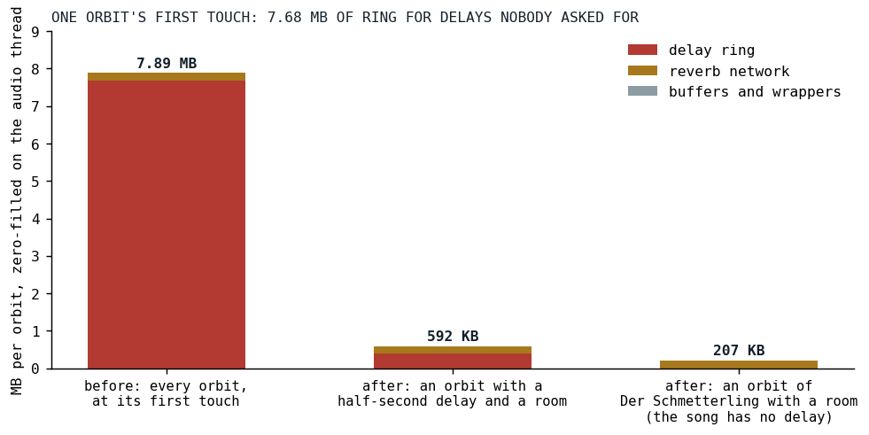
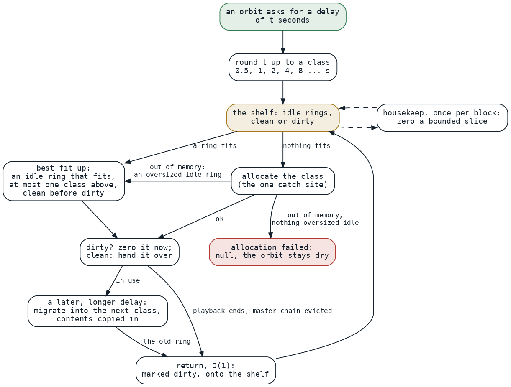

# Seven Megabytes of Silence

*Every orbit allocated a ten-second delay ring at its first touch, on the audio thread, for delays no song ever asked for; the fix is a shelf, a ladder, and a warmup that runs every path before the first note.*

Most posts in this series end in a table of microseconds. This one has none, because the problem was never how fast the engine rendered a block. It was what happened in the block where an orbit was touched for the first time. An orbit in Klangmotor is a bus with its own effects, a delay and a reverb among them, and until September 3 an orbit's constructor allocated the delay's ring unconditionally:

```kotlin
    val delay = KatalystDelayEffect(
        delayLine = DelayLine(maxDelaySeconds = 10.0, sampleRate = sampleRate),
        blockFrames = blockFrames,
    )
```

*[Cylinder.kt at 55f3bcaf](https://github.com/PeekAndPoke/klang/blob/55f3bcaf5363215ea1e620ade70d1e5111b35a43/audio_be/src/commonMain/kotlin/cylinders/Cylinder.kt#L55-L58), the commit before the warehouse*

Ten seconds of stereo doubles at 48 kHz is 480,000 frames times two channels times eight bytes, 7.68 MB, and the runtime zero-fills it on allocation. The plan measured what one orbit's first touch cost and where it went:



*Fig. 1: One orbit's allocation at first touch, before and after. The ring was 97 percent of it. After the change nothing is allocated until a song asks, and the smallest ring class is 385 KB; that bar is the cold-shelf case, since after the warmup the shelves already hold sixteen rings, networks and orbits and a song that asks normally allocates nothing.*

Der Schmetterling touches eight orbits, the count-in alone on one of them for two cycles and the band on the other seven in the frame it enters, so a first play zero-filled about 63 MB on the audio thread, two 480,000-element arrays at a time, inside callbacks that have under three milliseconds each. That was the stutter [the phone](../2026-08-19-the-phone-that-does-not-get-faster/index.md) had on every first run. And the delays the songs actually use, every one in the corpus, are written as an eighth to a quarter of a cycle, between a quarter and half a second. The ring was twenty to forty times larger than anything ever asked of it, allocated for orbits that had no delay at all. The plan's sentence for it: the ring is not a cost to manage, it is a mis-sizing to remove.

## The ladder and the shelf

The decisions, agreed with the maintainer on September 3, read like a warehouse because that is what the component is called. No delay configured, no ring. A ring is allocated at the first configuration of a delay time and sized to a class: powers of two from half a second, no ceiling.

```kotlin
    fun classFrames(minFrames: Int): Int {
        var frames = baseFrames

        while (frames < minFrames && frames <= Int.MAX_VALUE / 2) {
            frames *= 2
        }

        // Past Int range on the ladder (12 hours at 48 kHz) — hand the request through as is; the
        // allocation will fail and report null, which is the right answer for a 24 GB ring.
        return if (frames < minFrames) minFrames else frames
    }
```

*[SizedBuffers.kt at v0.3.7](https://github.com/PeekAndPoke/klang/blob/v0.3.7/audio_be/src/commonMain/kotlin/warehouse/SizedBuffers.kt#L117-L131)*

The ratio is two rather than the Fibonacci ratio of 1.6 because the ladder's job is headroom, not packing: a coarser step means a changing delay time crosses a class boundary, and forces a regrow, less often, and right-sizing had already solved the memory problem twenty times over. Class zero holds half a second plus the 64 frames of interpolation margin a delay needs beyond its time, which a review round insisted on, since without it a quarter note at 120 BPM, exactly half a second, would have fallen into class one and doubled its memory. There is no maximum: a sixty-second delay gets the 64-second class, about 49 MB, and the one-time allocation it asked for. A ring only grows, by migration into the next class with its contents copied in, so a delay that is ringing keeps ringing across the resize; and it never shrinks, because a shrink is an allocation and a copy for no audible benefit, and dropping it deleted a whole family of decisions about when and with what hysteresis that could not be made well.

Returned rings go onto a shelf. The maintainer's concern, verbatim in the plan: with size classes "we will not know upfront which rings to keep, so we would need some kind of heuristic, which can always be exactly wrong." So there is no heuristic. Nothing is pre-filled by prediction; a ring goes onto the shelf when it is returned, at the end of a playback, at a master-chain eviction or after a migration, and, as decided, a request takes the smallest idle ring that is big enough; as built, a clean one beats a dirty one whatever its class, within the bound the next section explains. A cache cannot be exactly wrong: its worst case is empty, and empty is the old behavior minus 97 percent of the cost. The re-evaluate-and-play loop that is live coding hits the shelf every time, because the rings that come back are precisely the ones the next run wants.



*Fig. 2: A ring's life. The request is rounded up to a class and served from the shelf when an idle ring fits, at most one class above the need, clean before dirty; otherwise the class is allocated, at the single site that catches a failure, and only when that fails does an oversized idle ring serve. A grow migrates into the next class with the contents kept. A return is constant-time and marks the ring dirty; a bounded slice is zeroed per block by housekeeping.*

Two of the arrows in that figure were review findings. The third round's major, found by both reviewers: the teardown zeroed every ring and network twice, and the warmup's cleanup retired sixteen orbits inside one render callback, about 19 MB of stores on the phone this exists for; the plan's own claim that clearing at return was away from any onset was false at every return site. Clearing became deferred housekeeping, one bounded slice per block, with a return costing nothing where it happens. The fourth round's major, also found by both: the best fit was unbounded, so a quarter-second delay could be handed an idle 32-second ring and a dirty 24 MB master ring could be zeroed inside an onset block, the stall relocated from the return to the rent. The fit is bounded at one class above the need, which is exactly the maintainer's example of a two-second request taking an idle four.

## Null instead of dead

Before the warehouse an allocation failure was fatal on both platforms: an uncaught throw inside the worklet's process call ends the processor permanently, and the JVM's out-of-memory error kills the render thread. A live coder who typed a delay of six thousand seconds lost the set until a reload. The warehouse is the only allocation site for what it owns, so it is the only catch site:

```kotlin
        fun allocateOrNull(frames: Int): StereoBuffer? = try {
            StereoBuffer(frames)
        } catch (e: Throwable) {
            null
        }
```

*[SizedBuffers.kt at v0.3.7](https://github.com/PeekAndPoke/klang/blob/v0.3.7/audio_be/src/commonMain/kotlin/warehouse/SizedBuffers.kt#L341-L350)*

The rent returns a nullable ring, and the maintainer's point about that choice is the whole design: the compiler tells us every place that needs a null check. The rule that an audio callback never allocates is as old as audio callbacks [[1]](#bencina2011); the warehouse is the deterministic allocator that rule recommends instead, with the one difference that its failure is a value. A grow that fails keeps the ring it has and clamps the time to it; a first allocation that fails takes an oversized idle ring if the shelf has one, and otherwise leaves the effect dry on that orbit, since a device that cannot find 385 KB is moments from killing the tab anyway:

```kotlin
    fun configure(timeSeconds: Double, feedback: Double, cap: Double) {
        if (timeSeconds >= MIN_ACTIVE_DELAY_SECONDS) {
            // No ring and none to be had: the orbit stays dry rather than the worklet dying.
            val line = ensureRing(timeSeconds) ?: return
```

*[KatalystDelayEffect.kt at v0.3.7](https://github.com/PeekAndPoke/klang/blob/v0.3.7/audio_be/src/commonMain/kotlin/cylinders/katalyst/KatalystDelayEffect.kt#L186-L198)*

Every refusal is counted and rides the diagnostics feed to the frontend, so the interface can say that a delay time was reduced for lack of memory instead of the set going quiet. The house rule against exceptions in hot paths is not broken by this: a catch around one large allocation, once per ring, is not a per-sample throw, and on the JVM catching the out-of-memory error at a single big-allocation site is the one sound pattern for it, since the allocation that failed never happened and the heap is as it was.

## The stall that moved

The plan is a diary of two days, and the four device notes across it and its follow-up task are the honest part. All four are dated September 4. With the lazy rings, the migration, the shelved master rings, the lazy reverb networks and the return path built, the first run of Der Schmetterling still killed the playback. Its first frame built eight orbits and four reverb networks at once, and compiled the reverb, the effect constructors and every instrument graph the song uses, because the warmup had only ever played a sine and a sample on one orbit. About a megabyte of bytes; the object graphs and the just-in-time compiler weigh as much on a phone. So orbits joined the warehouse too, and the warmup was rebuilt to render sixteen orbits, each starting in its own block so that no frame builds more than one, each with a delay, a room and a filter, and to hand all sixteen back to the shelves before it reports ready, about 90 milliseconds after start.

The second measurement: better, not perfect. The count-in was fine; when the other voices came in there was a spike, then hiccups that stabilized, and a second run was clean. That is the signature of cold code, not of resources. The song's instruments are custom graphs composed of node kinds the warmup had never executed, and each kind's first blocks compiled on the audio thread. The fix is a vocabulary:

```kotlin
/**
 * The ignitor VOCABULARY the warmup plays: synthetic graphs that together touch every `IgnitorDsl`
 * node kind, so the first note of a song's own instrument does not JIT that kind in a live frame.
 * ...
 */
object WarmupVocabulary {
```

*[WarmupVocabulary.kt at v0.3.7](https://github.com/PeekAndPoke/klang/blob/v0.3.7/audio_be/src/commonMain/kotlin/WarmupVocabulary.kt#L62-L79)*

Six synthetic graphs, waves, supers, noises, math, filters and effects, finite by construction, registered on the warmup playback exactly as a song registers its own instruments and rotated over the sixteen orbits. A specification enumerates the sealed hierarchy of node kinds by reflection and fails when a kind exists that no graph executes and no reason excludes. The third measurement was "a bit better, still a massive spike when all voices set in", and the fourth, after the vocabulary was made to run the optimized form of each graph and a filter chain with a non-zero analog amount, the saturating branch the song's guitar actually takes and which the optimizer had fused away in the warmup: the warmup works, the first run plays. What remains visible is the warmup's own spike to 100 percent on the headroom gauge before the song starts, sixteen wet orbits compiling every graph on first execution, the cold work deliberately paid in silence. The maintainer's verdict: fine to see it.

## What transferred

The stall moved twice in one day, from allocation to construction to compilation, and each move was found by a hand on a phone, not by a benchmark; a first-run problem can only be measured on a first run. A cache that is stocked by return cannot be exactly wrong, because its worst case is the day before. A nullable return type is the cheapest audit there is: the compiler enumerates every consumer that must now decide what silence means. And the honest close is a task, not a claim: the plan's follow-up says to profile the tutti on the phone before guessing again, and that the second run being clean still means first-time work, per session, somewhere the vocabulary cannot reach.

## References

1. <a id="bencina2011"></a>Bencina, R. (2011). Real-time audio programming 101: time waits for nothing. <http://www.rossbencina.com/code/real-time-audio-programming-101-time-waits-for-nothing>

*Sources inside the repository: `docs/plans/resource-warehouse.md` (the problem measured, the decisions, the five review rounds, three of the four Fairphone notes of 2026-09-04), `docs/tasks/future/first-run-spike-v2.md` (the fourth), the commits `111c7355` through `d3fb76ba` (in particular `ef33ccd4`, `e3124973`, `929b9520`, `7b026cf2`, `0354c9da`, `da002b73` and `7874fab2`), `docs/benchmarks/2026-07-03_der-schmetterling-cpu-analysis.md` (the first-note allocation spike named two months earlier), `audio_be/src/commonMain/kotlin/cylinders/Cylinder.kt` and `effects/DelayLine.kt` at 55f3bcaf, `audio_be/src/commonMain/kotlin/warehouse/ResourceWarehouse.kt`, `SizedBuffers.kt`, `cylinders/katalyst/KatalystDelayEffect.kt`, `WarmupVocabulary.kt` and `WarmupRunner.kt` at v0.3.7.*
