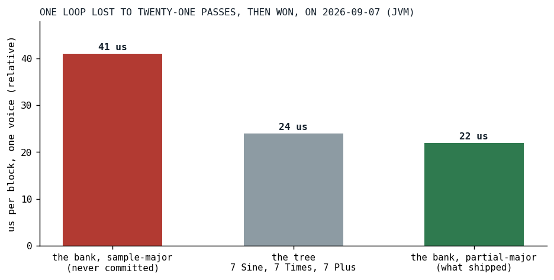
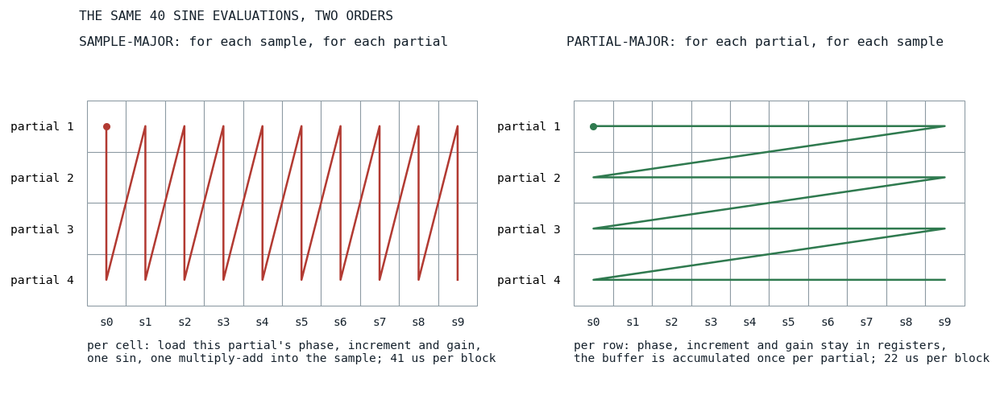
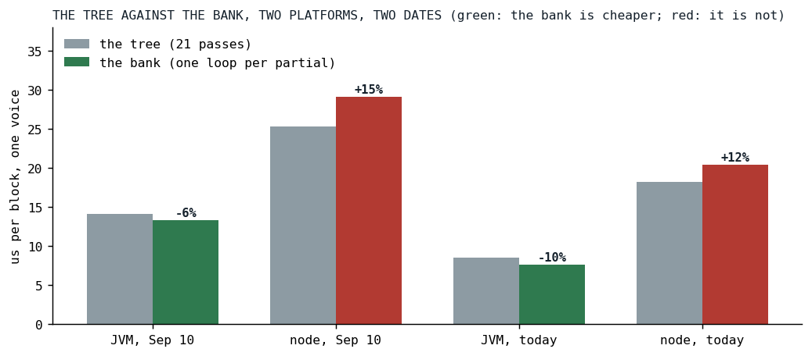
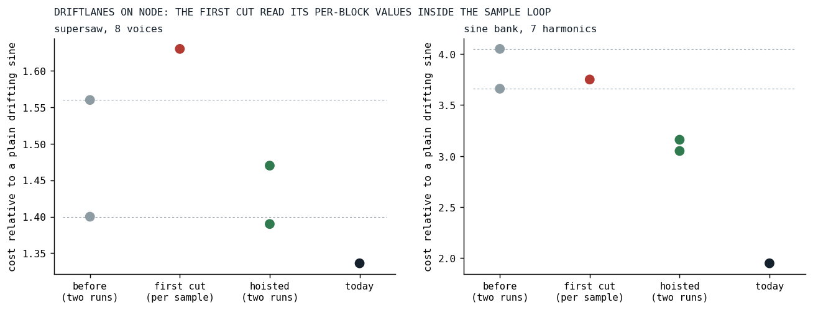

# Loop Shape Beats Pass Count

*Twenty-one block passes were cheaper than one loop, twice, and both times the fix was where a value lived.*

The bass of Der Schmetterling plays a low E that most speakers cannot reproduce, so it carries its own harmonics: the ear rebuilds a 41 Hz fundamental from partials at 82 to 328 Hz, the trick every small speaker's DSP relies on, done at the source where the pitch is known. Until September 7 that stack was written by hand:

```javascript
  let harmonics = Osc.sine(freq = Osc.freq().mul(2)).mul(1/2)
    .add(Osc.sine(freq = Osc.freq().mul(3)).mul(1/3))
    .add(Osc.sine(freq = Osc.freq().mul(4)).mul(1/4))
    .add(Osc.sine(freq = Osc.freq().mul(5)).mul(1/5))
    .add(Osc.sine(freq = Osc.freq().mul(6)).mul(1/6))
    .add(Osc.sine(freq = Osc.freq().mul(7)).mul(1/7))
    .add(Osc.sine(freq = Osc.freq().mul(8)).mul(1/8))
```

*[DerSchmetterling.kt at b03db364](https://github.com/PeekAndPoke/klang/blob/b03db364/src/commonMain/kotlin/builtinsongs/DerSchmetterling.kt#L122-L128), the commit before the bank*

Seven added partials, each a sine node, a multiply and an add. In Klangmotor every node renders a whole 128-frame block into a buffer before the next node reads it, so that is twenty-one passes over the block per voice on top of the bass they are added to, plus the `sin` calls per sample that any such voice must pay, eight of them with the fundamental's own. The maintainer's question was "could we make an operator out of this", and the plan's answer was a native partial bank, `Osc.sine(x => x.harmonics(7))`, with the count and the rolloff read once per block as signals, so that brightness could be an envelope. The cost argument in the plan was the obvious one: twenty-one passes become one.

## The bank that was slower

The first cut of the bank did what the argument said. One loop over the samples, and inside it a loop over the partials, each partial's phase, increment and gain read from an array, advanced, written back. One pass. It measured 41 microseconds per block against the tree's 24. The loop with one pass was nearly twice as slow as the graph with twenty-one.



*Fig. 1: The seven-harmonic voice in its three shapes on September 7, JVM, microseconds per block. The sample-major bank was never committed; it was measured, rejected and rewritten the same day. That day's harness rendered every voice twice, which was found and fixed the same evening, so the bars are relative to each other and about double the real cost.*

The rewrite turned the loops inside out, the interchange every compiler textbook describes [[2]](#allen1984): for each partial, one tight loop over the samples, with the phase in a local variable and the buffer accumulated once per partial. That is the shape the engine's unison stacks already had, and it brought the bank to 22 microseconds, under the tree at last:

```kotlin
        private fun renderPartial(
            buffer: AudioBuffer, off: Int, end: Int, first: Boolean,
            phaseIn: Double, d: Double, g: Double,
            pm: DoubleArray?, sharedDev: DoubleArray?, wShared: Double, own: AnalogDrift?, wOwn: Double,
        ): Double {
            var ph = phaseIn

            for (i in off until end) {
                val s = g * sin(ph)
                buffer[i] = if (first) s else buffer[i] + s
```

*[Ignitors.kt at v0.3.8.2](https://github.com/PeekAndPoke/klang/blob/v0.3.8.2/audio_be/src/commonMain/kotlin/ignitor/Ignitors.kt#L316-L356)*



*Fig. 2: The same forty sine evaluations in the two orders, a diagram. Sample-major reloads every partial's state for every sample; partial-major keeps one partial's state in registers for the whole block and touches the buffer once per partial. The microsecond figures are the day's, relative.*

Why the tree had won: each of its sine nodes is exactly this tight loop, phase in a local, and the multiplies and adds are passes over a 1 KB buffer, which nobody measured for cache residency but which is small enough to stay in the first level. The sample-major bank did more work per sample than the tree did per sample, eight array reads and writes for the phase alone, and the JIT could keep none of it in a register. The number of passes was never the cost. What a loop carries between iterations, and where it keeps it, is.

## What the bank actually bought

The commit's own numbers say the bank was a modest CPU win on the JVM, 24 to 22 on that day's doubled scale. What it bought for certain was the authoring: the bass became one line with a brightness fader, and a golden test pins that line to the hand-rolled tree at 1e-12. The plan had already named where a real saving would come from, and gated it: with no drift and no pitch modulation, every partial's phase is a multiple of one base phase, and a Chebyshev recurrence gives all eight sines from two trig calls per sample instead of eight. That path is still unbuilt, waiting for a song profile that puts sine banks in the top rows.

Today's numbers, run for this post with the engine as it stands, add the part the first day could not know:



*Fig. 3: The tree against the bank on both platforms, on September 10 (after the harness fix) and today. Green where the bank is cheaper, red where it is not. Node run-to-run variance is wide, and each pair is from one run.*

| run | the tree | the bank | change |
|---|---:|---:|---:|
| JVM, September 10 | 14.11 | 13.32 | -6% |
| node, September 10 | 25.27 | 29.06 | +15% |
| JVM, today | 8.49 | 7.65 | -10% |
| node, today | 18.19 | 20.45 | +12% |

Microseconds per block, one voice. On the JVM the bank is a little cheaper than the tree and stays so. On node, which runs V8, the engine under the browser's audio worklet and therefore the one [the phone](../2026-08-19-the-phone-that-does-not-get-faster/index.md) runs, the twenty-one-pass tree is cheaper than the one-loop bank, on both dates. Both loops are partial-major now; the likeliest difference is what else sits inside the bank's inner loop, the null checks for pitch modulation and the two drift terms, which the tree's plain sine loop does not carry. The lesson of the first day, read on the second platform, cuts the other way: a loop that carries less beats a loop that does more, even when the lighter loop is run twenty-one times.

## The same lesson, three days later

On September 10 the drift lanes moved into one component. [The analog drift](../2026-06-30-killing-the-plastic-pipe/index.md) is a pitch wander per oscillator, and a unison stack, a partial bank or a plucked-string chorus wants one lane per voice, or one lane shared by all, or a blend; the bank had grown that blend privately, and the question "can the super oscillators reuse analogSpread" produced one container, `DriftLanes`, for every multi-voice site, with `analogSpread` as the knob on the whole family. The first cut read the blend's per-block values, the two weights, the two mode flags and the lane out of its array, off the container inside the sample loop, through a public inline method. On the JVM that was free. On Kotlin/JS it cost a drifting eight-voice supersaw about 16 percent and the superpluck about 12, measured against the engine before the change in the same sitting.



*Fig. 4: Each drift row divided by a plain drifting sine from its own run, on node: the engine before the change twice (the dashed lines mark that spread), the first cut, the build with the values hoisted twice, and today. The plain sine has no lanes, so it carries the machine and V8's state and nothing else, which is why the ratio is the number to read and not the microseconds. Today's engine also carries [the polynomial sine](../2026-09-15-eleven-digits-of-sine/index.md) and the per-block drift, which is where the last drop comes from, not from this change.*

The fix has the same shape as the bank's: hoist every per-block value into a local before the sample loop, and blend through one inline function whose inputs are all locals, so that on Kotlin/JS the expansion reads no object property per sample:

```kotlin
@Suppress("NOTHING_TO_INLINE")
internal inline fun driftStep(
    own: AnalogDrift?,
    shared: DoubleArray?,
    wShared: Double,
    wOwn: Double,
    i: Int,
): Double {
    if (shared == null) {
        return if (own != null) own.nextMultiplier() else 1.0
    }

    if (own == null) {
        return 1.0 + shared[i]
    }

    return 1.0 + wShared * shared[i] + wOwn * (own.nextMultiplier() - 1.0)
}
```

*[DriftLanes.kt at v0.3.11](https://github.com/PeekAndPoke/klang/blob/v0.3.11/audio_be/src/commonMain/kotlin/ignitor/DriftLanes.kt#L188-L214)*

The container's KDoc ends with the instruction to its callers, and with the number that made it an instruction:

```kotlin
 * **How a hot loop uses it.** Hoist [ownLane], [sharedWalk] and the two weights into locals ONCE
 * per voice, before its sample loop, and call [driftStep] with them. Everything they carry is
 * constant for the block, and a loop that read them off the container per sample paid for it: on
 * Kotlin/JS that cost a drifting 8-voice supersaw about 16 percent (Node, 2026-09-10).
```

*[DriftLanes.kt at v0.3.11](https://github.com/PeekAndPoke/klang/blob/v0.3.11/audio_be/src/commonMain/kotlin/ignitor/DriftLanes.kt#L11-L63)*

Two more things the day recorded. The endpoints of the blend are exact rather than a limit: at spread 1 only a voice's own lane advances, at spread 0 only the shared one, which makes spread 0 measurably cheaper, on the JVM a supersaw of eight voices at 5.34 against 6.90 microseconds per block. And node's run-to-run variance is wide enough, two runs of one identical engine differed by 28 percent on a row, that a claim of this kind needs a control row that the change cannot touch and a ratio, not a raw number. Every drift number in this post is such a ratio, or a pair from one run.

## What transferred

The JIT sees the loop, not the graph. A node count is a number about the tree, and the cost is a number about what each inner loop carries between two samples and whether that fits in a register; twenty-one tight loops beat one loop with array-carried state on the JVM, the only platform that shape was ever measured on, and a lighter tight loop beats a heavier one even at twenty-one to one. V8 charges for a property read in the loop that HotSpot hoists on its own, its inline caches being per call site [[1]](#bynens2018), so a Kotlin/JS hot loop takes its per-block values as locals, through an inline function whose parameters are all locals. And the platform that matters is the one to measure on, with a control row, because the JVM number said "fine" both times and the phone would not have.

## References

1. <a id="bynens2018"></a>Bynens, M., & Meurer, B. (2018). JavaScript engine fundamentals: Shapes and Inline Caches. <https://mathiasbynens.be/notes/shapes-ics>
2. <a id="allen1984"></a>Allen, J. R., & Kennedy, K. (1984). Automatic loop interchange. *Proceedings of the ACM SIGPLAN '84 Symposium on Compiler Construction*, 233-246. <https://doi.org/10.1145/502949.502897>

*Sources inside the repository: `docs/plans/sine-partial-banks.md`, `docs/tasks-archive/2026-09/20260907-sine-partial-banks.md`, `docs/tasks-archive/2026-09/20260910-drift-lanes-analog-spread.md`, `audio/MEMORY.md` ("Loop shape beats block-pass count", "One drift-lane container"), the commits `6d4056f9`, `39119aef`, `e5596416` and `54b988aa`, `docs/benchmarks/2026-09-07_sine-partial-banks_jvm.md`, `2026-09-10_drift-lanes_jvm.md`, `2026-09-10_drift-lanes_nodejs.md`, `2026-09-16_sine-bank-drift-lanes_jvm.md` and `_nodejs.md` (today's rows), `src/commonMain/kotlin/builtinsongs/DerSchmetterling.kt` at b03db364, `audio_be/src/commonMain/kotlin/ignitor/Ignitors.kt` at v0.3.8.2, `DriftLanes.kt` at v0.3.11, `SinePartialBankSpec.kt`, `SuperStackDriftSpreadSpec.kt`.*
