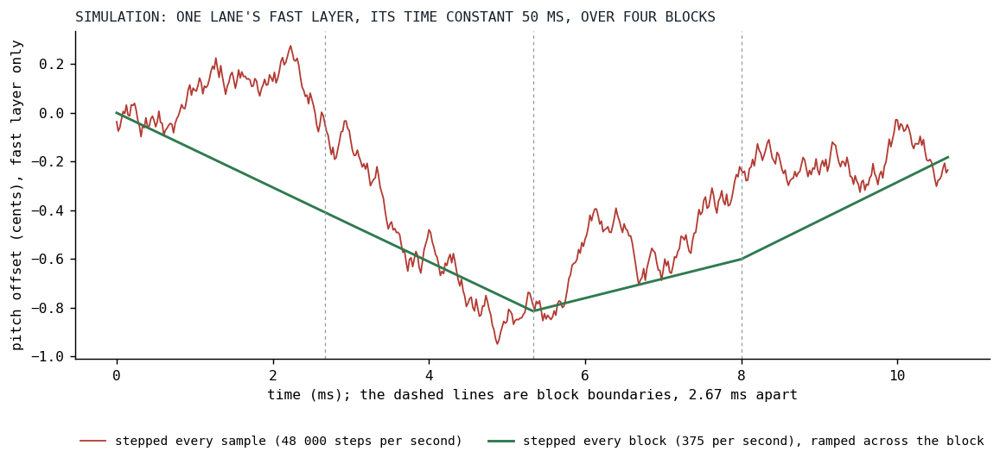
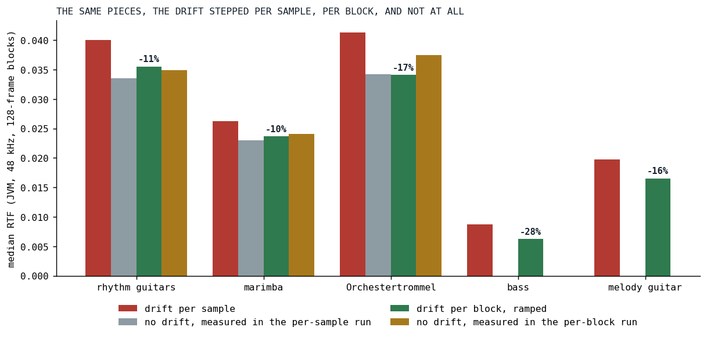
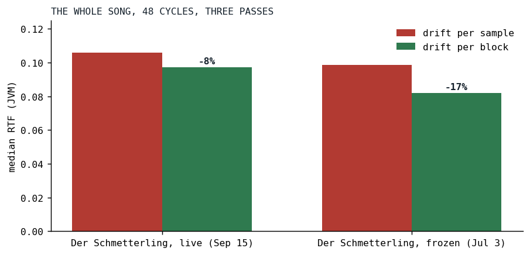

# Drift for Free

*A pitch wander with a fifty-millisecond time constant was being recomputed forty-eight thousand times a second.*

On September 15 [the Fairphone of the opening post](../2026-08-19-the-phone-that-does-not-get-faster/index.md) could barely run Der Schmetterling, and the census of a rhythm-guitar note that afternoon had a line in it that did not belong to the amplifier at all: the analog drift, the pitch wander every oscillator carries, was 19 percent of a drifting guitar, 13 percent of the marimba, 15 percent of the Orchestertrommel. The evening's change made that number zero, within the spread of the measurement, and the phone went from barely to smooth. This is the story of a modulation that ran at the wrong clock.

## What the drift is

[Killing the Plastic Pipe](../2026-06-30-killing-the-plastic-pipe/index.md) tells how the drift came to be and quotes its hot loop. In one paragraph: a real oscillator's pitch is never still, and Klangmotor models that with two layers of smoothed noise, a fast jitter with a time constant of 50 ms and a peak of 0.2 cents per unit of the `analog` knob, and a slow wander, an Ornstein-Uhlenbeck process [[1]](#uhlenbeck1930) with a time constant of ten seconds and 0.8 cents per unit. One uniform draw from an inlined xorshift feeds both, the fast layer is seeded warm and the slow layer at center so every note attacks in tune, and the sum becomes a multiplier on the oscillator's phase increment.

Each lane of that process costs a handful of operations: six bit operations for the draw, two one-pole updates, a blend. That is nothing, per sample, per lane. The guitars of Der Schmetterling carry twenty lanes per note, one for each of the nineteen unison voices and one shared, and every one of them was stepped for every one of the 48,000 samples a second. Here is the sine oscillator's loop at v0.3.12, the drift branch:

```kotlin
            if (d.active) {
                if (phaseMod == null) {
                    for (i in ctx.offset until end) {
                        buffer[i] = sin(phase)
                        phase += phaseInc * d.nextMultiplier()
                        phase = phase.wrapPhase(TWO_PI)
                    }
                } else {
```

*[Ignitors.kt at v0.3.12](https://github.com/PeekAndPoke/klang/blob/v0.3.12/audio_be/src/commonMain/kotlin/ignitor/Ignitors.kt#L139-L184)*

`nextMultiplier()` is the whole drift, every sample. For a unison stack the call sits inside a per-voice loop with the shared lane blended in; the blend had already been hoisted into an inline function so that V8 read no object property per sample, a story the DriftLanes post tells, and it was still the single largest slice of a drifting guitar that a stage swap could find.

## The clock

The fast layer's time constant is 50 milliseconds. A 128-frame block at 48 kHz is 2.67 milliseconds. Between two blocks the fast layer moves by about five percent of its distance to wherever it is heading, and the slow layer by a quarter of a thousandth. Nothing in either process needs a fresh value more often than once per block, and the filter drift, the same kind of process on a filter's cutoff, had been running once per block since before.

So every lane now steps once per block, and every consumer ramps the multiplier across the block. The lane's coefficients are computed for the block rate instead of the sample rate, 375 steps per second at 48 kHz, so that the time constants in seconds and the peak in cents are what they were:

```kotlin
    /**
     * Advances the lane one step and sets up the block's ramp: [blockStart] becomes the previous
     * [blockEnd] (continuity across blocks), [blockEnd] the new multiplier. Once per block.
     */
    fun beginBlock() {
        blockStart = blockEnd
        blockEnd = nextMultiplier()
    }
```

*[AnalogDrift.kt at v0.3.13](https://github.com/PeekAndPoke/klang/blob/v0.3.13/audio_be/src/commonMain/kotlin/ignitor/AnalogDrift.kt#L99-L106)*

And the same sine loop at v0.3.13:

```kotlin
            if (d.active) {
                d.beginBlock()

                var m = d.blockStart
                val dm = (d.blockEnd - m) / (end - ctx.offset).coerceAtLeast(1)

                if (phaseMod == null) {
                    for (i in ctx.offset until end) {
                        buffer[i] = fastSin(phase)
                        phase += phaseInc * m
                        m += dm
                        phase = phase.wrapPhase(TWO_PI)
                    }
                } else {
```

*[Ignitors.kt at v0.3.13](https://github.com/PeekAndPoke/klang/blob/v0.3.13/audio_be/src/commonMain/kotlin/ignitor/Ignitors.kt#L140-L192)*

One add per sample where the whole process used to be. The `sin` became `fastSin` the same day for a different reason, told in the post about polynomial transcendentals; the drift change is the three lines above the loop and the one inside it. The unison stacks and the strings got the same shape through their lane container, which now prepares the shared lane once per block and hands each voice the start and end of its blended multiplier:

```kotlin
    fun advanceLane(lane: Int) {
        if (useOwn && lane < live) {
            own[lane].beginBlock()
        }
    }
```

*[DriftLanes.kt at v0.3.13](https://github.com/PeekAndPoke/klang/blob/v0.3.13/audio_be/src/commonMain/kotlin/ignitor/DriftLanes.kt#L160-L170)*

Nine call sites took the change: the mono sine, the pulse train, the wave engine, the sine partial bank, both unison stacks, both strings and the sample player.



*Fig. 1: A simulation with the engine's constants, the fast layer only, over four blocks: the lane stepped every sample against the lane stepped every block and ramped. Each lane draws its own noise from one seed, so these are two walks of the same character, not the same walk; what to see is that the ramp keeps the wander and drops the fizz.*

## What it costs in sound

The change is not bit-identical, and the maintainer's decision was to make it everywhere and judge by ear. Two things made the ear's job easy.

First, the coefficients follow the rate exactly. The per-sample version had used small-alpha approximations for each layer's steady-state deviation, the number the output scale divides by so that a peak comes out in cents. At the sample rate those approximations were within 0.01 percent; at the block rate they were 1.4 percent off, so the exact AR(1) forms went in, and a specification now drives the fast recurrence twenty million steps at both rates, and the slow one at the block rate, and checks that the realized deviation is the coefficient's. Same cents, same seconds.

Second, what the ramp removes is above the block rate. A lane stepped per block has no noise above 187.5 Hz, which for the fast layer is about one percent of its variance, the fast layer being a fifth of the depth; and the linear ramp is a first-order hold, whose response falls to -3.9 dB at that edge and has an exact null at the block rate itself. The review measured the sidebands: for `analog = 20` they sit at -150 dBc at f0 plus or minus 375 Hz, against -110 dBc for the per-sample drift, and the ramp's sample-to-sample pitch step is ten times gentler. The ramp is not only cheaper than the thing it replaced; on the spectrum it is cleaner.

The guards, since "judged by ear" is not a test: a ramp specification holds the mono sine, the single-voice saw and the sample player against reference accumulators that model exactly one lane step per block from the same seed; a one-voice supersine's increment is read off three consecutive samples and shown to wander across blocks and only ramp within them, so the ramp is not a step; a mid-block onset ramps across its partial first window; a block starts where the last one ended. The unison stacks' golden render was retaken and pinned. Each row went red under a mutation of the code before it was trusted.

## Results



*Fig. 2: The rig suite on the same machine, back to back: each piece with the drift stepped per sample and per block, and for the three pieces whose suite has a drift-off row, that floor from each of the two runs. After the change the floor is inside the noise: for the marimba and the drum it measured above the drifting row. JVM, 48 kHz, 128-frame blocks, medians of five passes.*

| piece | drift per sample | no drift, same run | drift per block | no drift, same run | change |
|---|---:|---:|---:|---:|---:|
| rhythm guitars, full rig | 0.0401 | 0.0336 | 0.0356 | 0.0349 | -11% |
| marimba | 0.0263 | 0.0230 | 0.0237 | 0.0241 | -10% |
| Orchestertrommel | 0.0413 | 0.0343 | 0.0341 | 0.0375 | -17% |
| bass | 0.0087 | | 0.0063 | | -28% |
| melody guitar | 0.0198 | | 0.0165 | | -16% |

The floor columns are the row the rig suite calls "no analog", each measured in the same run as the column to its left. Before the change the drift cost the rhythm guitars 0.0065 of their 0.0401; after it, drifting against not drifting in one run is 0.0006, and for the marimba and the drum the floor came out above the drifting row. The drift is free, in the only sense that can be measured.



*Fig. 3: The whole song, 48 cycles, three passes each, before and after: the live Der Schmetterling and the frozen snapshot of July 3. The frozen song has fewer stages between its oscillators and the mix, so the drift was a larger share of it.*

The live song went from a median RTF of 0.106 to 0.097 on the desktop, the frozen July song from 0.099 to 0.082. On the phone, which has no such number to give, the maintainer deployed the build that evening and reported the song smooth.

## What transferred

Modulation has its own clock, and it is rarely the sample clock. A one-pole with a 50 ms time constant produces the same sound whether it is asked 48,000 or 375 times a second, provided its coefficients are computed for the rate it is actually asked at, and provided the consumer interpolates instead of holding. The block is the engine's natural clock: it is when parameters are read, when envelopes are checked, when a voice decides whether it still needs to render. A modulation that steps per block and ramps per sample costs one add where it used to cost a process, and the ramp's spectrum is the reason it can be trusted without listening, though we listened anyway.

The other lesson is the one the series keeps finding. The request that evening named the guitars' filter stages. The number that moved the phone was the drift.

## References

1. <a id="uhlenbeck1930"></a>Uhlenbeck, G. E., & Ornstein, L. S. (1930). On the Theory of the Brownian Motion. *Physical Review*, 36(5), 823-841. <https://link.aps.org/doi/10.1103/PhysRev.36.823>

*Sources inside the repository: `audio/MEMORY.md` ("Analog drift steps per block and ramps across it"), the commit `d4f0d868` (the sideband measurement in its message), `docs/tasks-archive/2026-09/20260916-ignitor-optimizer-arithmetic-folds.md` (the census with the drift's share), `docs/benchmarks/2026-09-15_175556_song_jvm.md` and `2026-09-15_175907_song_jvm.md` (the rig suite before and after), `2026-09-15_175711_song_jvm.md` and `2026-09-15_180013_song_jvm.md` (the whole song), `audio_be/src/commonMain/kotlin/ignitor/AnalogDrift.kt`, `AnalogDriftCoeffs.kt`, `DriftLanes.kt`, `Ignitors.kt` at v0.3.12 and v0.3.13, `AnalogDriftRampSpec.kt`, `AnalogDriftSpec.kt`.*
