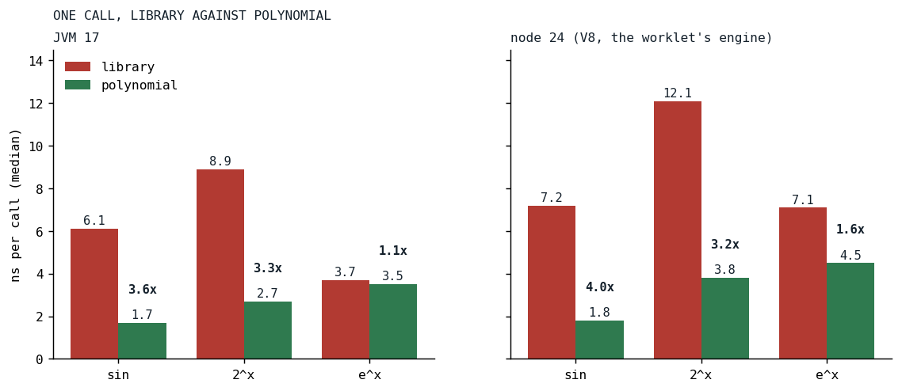
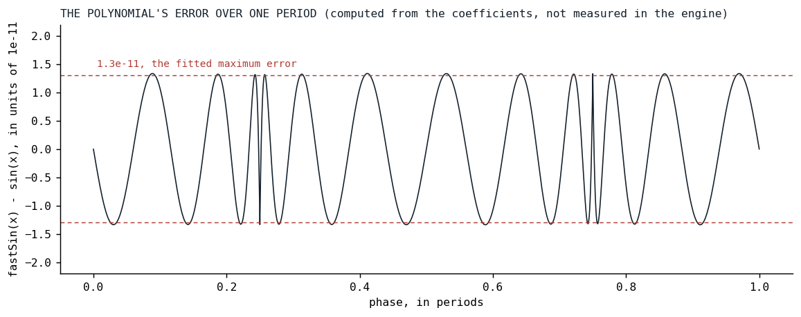
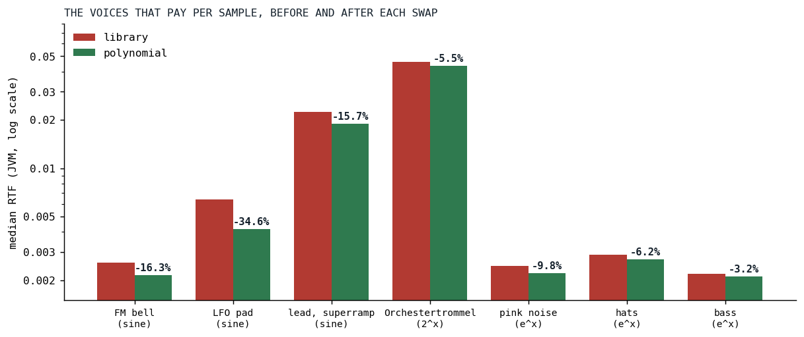

# Eleven Digits of Sine

*Three transcendentals left the per-sample loops for polynomials, and the one that barely paid says as much as the two that did.*

A sine oscillator in Klangmotor is a phase accumulator and one call to `kotlin.math.sin` per sample. The Orchestertrommel of Der Schmetterling is a bank of eight such partials, which is 384,000 sine calls a second for one drum hit, and on September 15 the bank alone measured 0.027 RTF, nearly half of the whole drum's 0.059. Every voice in the engine also pays one `exp` per sample, because the exponential curve has been the default envelope shape on every stage since August 24. Every vibrato and pitch envelope pays a `pow`. Three functions, four commits in one afternoon: the sine twice, the oscillators and then the modulators, and the commit that brought `e^x` also refitted `2^x` with its ends pinned so that `e^x` would be exact where it mattered. This is the post about them, and about the one that did not pay.

## What a library function costs

`sin`, `pow` and `exp` are correct for the whole real line, and that is what a caller pays for. A library sine reduces any argument to a small range before it evaluates anything, with enough care that a phase of ten million is handled as well as a phase of one. An oscillator never asks for that: its phase is wrapped to `[0, 2π)` every sample by the engine's phase wrap. A pitch path asks `pow` for `2^x` with `x` within an octave or two of zero, never for `7.3^x`. An envelope asks `exp` for arguments between zero and a small constant times one.

On the JVM, `Math.sin` and `Math.exp` are intrinsics, which is the reason the song benchmarks, which run on the JVM, could not see most of what follows. On V8, the engine under the browser's audio worklet, they are library calls, and V8 is where [the Fairphone of the opening post](../2026-08-19-the-phone-that-does-not-get-faster/index.md) runs. So the measurement that matters is per call, on node, and the engine's `audio_benchmark` module grew a harness for exactly this, with a note in its KDoc about why:

```kotlin
/**
 * The per-sample transcendentals the engine replaced with polynomials on 2026-09-15, each against
 * the library function it replaced, on the argument sweep its callers produce: a wrapped phase
 * for the sine, a pitch ratio's octaves for `2^x`, an envelope curve's `k · x` for `e^x`. Prints
 * ns per call per platform; the point is the JS number, where `Math.sin`, `Math.pow` and
 * `Math.exp` are not intrinsics and the song benchmarks (JVM only) cannot see the difference.
 */
```

*[MathBenchmark.kt at v0.3.13](https://github.com/PeekAndPoke/klang/blob/v0.3.13/audio_benchmark/src/commonMain/kotlin/MathBenchmark.kt#L58-L64)*



*Fig. 1: Median nanoseconds per call, the library function against its polynomial, on the argument sweep the callers produce. JVM and node 24, one Ryzen 9 PRO 7940HS, September 15. The sine is nearly four times faster on both; the exponential on the JVM is the bar that did not move.*

## The sine

The method is the oldest in the book, literally: Cecil Hastings' *Approximations for Digital Computers* [[1]](#hastings1955) laid out in 1955 how to fit a short polynomial to a function on a small interval so that the largest error over the interval is as small as it can be, the minimax criterion, and how a symmetry fold shrinks the interval first. For the sine, the fold is a half period: `sin(π - x) = sin(x)` maps `[0, 2π)` onto `[-π/2, π/2]`, and on that interval an odd polynomial of degree 11, six coefficients, is enough for eleven digits. The coefficients were fitted for Klang, least squares with a Remez-style reweighting [[3]](#remez1934) toward the equal-ripple optimum, and no third-party code was used, as the credits file records.

```kotlin
@Suppress("NOTHING_TO_INLINE")
inline fun fastSin(phase: Double): Double {
    // [0, 2π) -> x in [-π, π) with sin(phase) = -sin(x), then fold to [-π/2, π/2]: sin(π - x) = sin(x).
    var x = phase - PI

    if (x > HALF_PI) {
        x = PI - x
    } else if (x < -HALF_PI) {
        x = -PI - x
    }

    val x2 = x * x

    return -x * (SIN_S1 + x2 * (SIN_S3 + x2 * (SIN_S5 + x2 * (SIN_S7 + x2 * (SIN_S9 + x2 * SIN_S11)))))
}
```

*[DspUtil.kt at v0.3.13](https://github.com/PeekAndPoke/klang/blob/v0.3.13/audio_be/src/commonMain/kotlin/DspUtil.kt#L25-L77)*

Two compares, one subtract, six multiply-adds. The largest error over the period is 1.3e-11, which is -217 dB, and the specification asserts a bound of 1e-10 against a dense sweep rather than trusting the fit. It is pure arithmetic in a fixed order, so the function gives the same bits on the JVM and in the browser, which `Math.sin` never promised; a whole voice still does not, since `pow`, `ln` and `cos` upstream of the phase, in the partial gains, the detune and the drift seed, are still the platform's.



*Fig. 2: The error of the polynomial over one period, computed in Python from the six coefficients and the fold copied out of DspUtil.kt, against a correctly rounded library sine. Ripples of equal height all the way across, the signature of a minimax fit, and the same pattern in each quarter period, which is the fold at work; the two narrow spikes at a quarter and three quarters of the period are the fold's seam, where the error curve meets its own mirror image. Not a measurement of the engine; a check of its polynomial.*

A lookup table was the alternative and lost on every count: with linear interpolation it costs the same number of operations, its accuracy at 4096 entries is 3e-7, four decades worse, it competes with the audio buffers for cache, and on Kotlin/JS every read is bounds-checked.

### A faster function is a stricter function

The fold is exact for one more quarter period on either side of the wrapped range, and beyond that the polynomial diverges fast: -75 dB off at `3π`, past full scale at `4π`. The library sine had quietly tolerated any phase, and the review of the first commit found where that tolerance had been leaned on. The wave-engine unison stacks and the single-voice wave oscillator wrapped with a one-subtract fast modulo that is unsafe once the increment is a whole period or more, which a frequency past the sample rate, a spread typed in cents, or the analog drift riding near the edge could produce. With the library sine this aliased; with the polynomial the sine stack produced 1.8e34 and the trapezoids parked on a plateau. Those three sites now hoist a block-constant flag that chooses the full wrap when the increment can exceed the fast one, and the in-range path is bit-identical to before. The second sine commit swapped the modulators, the FM operator, both vibratos, both tremolos and the grain window, and each of them had to learn to wrap per sample first, since the FM modulator wrapped only at block end and the vibratos never wrapped a negative rate.

That is the lesson before the results: the polynomial did not make the engine faster and leave everything else alone. It made a contract explicit that the library function had been silently covering.

## The exponentials

`2^x` is what a pitch path computes: semitones over twelve is octaves, and two to that power is the frequency ratio. Cody and Waite's *Software Manual for the Elementary Functions* [[2]](#codywaite1980) gives the range reduction that every serious implementation uses: split `x` into an integer `n` and a fraction `f` in `[0, 1)`, evaluate `2^f` by a polynomial, and scale by `2^n`, which is exact. The table of powers of two is built by doubling, never by `pow`, so its bits are not a platform's business:

```kotlin
@PublishedApi
internal val EXP2_POW_TABLE: DoubleArray = DoubleArray(2 * EXP2_TABLE_HALF).also { table ->
    var v = 1.0

    repeat(EXP2_TABLE_HALF) { v *= 0.5 }

    for (i in table.indices) {
        table[i] = v
        v *= 2.0
    }
}
```

*[DspUtil.kt at v0.3.13](https://github.com/PeekAndPoke/klang/blob/v0.3.13/audio_be/src/commonMain/kotlin/DspUtil.kt#L85-L154)*

The polynomial for the fraction is written as `1 + f + f·(f - 1)·r(f)`, with `r` of degree 5. That form is the fourth commit's contribution, and it is there for a reason: `p(0) = 1` and `p(1) = 2` hold exactly in floating point, whatever `r` does. So `fastExp2` of an integer is that power of two bit for bit, a sweeping pitch has no step at an octave boundary, and, once `e^x` is built on top, `fastExp(0)` is exactly 1, which is what lets an envelope start at exactly zero and its release end there.

```kotlin
@Suppress("NOTHING_TO_INLINE")
inline fun fastExp2(x: Double): Double {
    if (!(x > -EXP2_TABLE_HALF.toDouble() && x < EXP2_TABLE_HALF.toDouble())) { // NaN-guard (NaN ≠ NaN), and ±Inf
        return 2.0.pow(x)
    }

    val n = floor(x)
    val f = x - n
    val r = EXP2_R0 + f * (EXP2_R1 + f * (EXP2_R2 + f * (EXP2_R3 + f * (EXP2_R4 + f * EXP2_R5))))
    val p = 1.0 + f * (1.0 + (f - 1.0) * r)

    // A pitch path's argument is within an octave of 0 almost always (a vibrato depth, a pitch
    // envelope inside ±12 semitones): those two octaves skip the table, whose read on Kotlin/JS
    // goes through the lazy-init accessor of a top-level val.
    val scale = if (n == 0.0) 1.0 else if (n == -1.0) 0.5 else EXP2_POW_TABLE[n.toInt() + EXP2_TABLE_HALF]

    return p * scale
}
```

*[DspUtil.kt at v0.3.13](https://github.com/PeekAndPoke/klang/blob/v0.3.13/audio_be/src/commonMain/kotlin/DspUtil.kt#L85-L154)*

The polynomial's relative error is 4.7e-11 and the bound asserted across `(-32, 32)` is 1e-10; outside that range, and for NaN and the infinities, the function is `pow` itself, the guard written as `!(inside)` so that NaN takes the fallback. The two octaves around zero skip the table because on Kotlin/JS a top-level array is read through a lazy-init accessor, and a vibrato lives in those two octaves. The vibrato renderer's loop shows the swap, and the per-sample wrap the sine demanded:

```kotlin
            for (i in 0 until ctx.length) {
                val idx = ctx.offset + i
                // Equal temperament: symmetric, never negative
                buf[idx] *= 2.0.pow(sin(phase) * depthSemitones / 12.0)
                phase += phaseInc
            }
```

*[VibratoRenderer.kt at v0.3.12](https://github.com/PeekAndPoke/klang/blob/v0.3.12/audio_be/src/commonMain/kotlin/voices/strip/pitch/VibratoRenderer.kt#L24-L50)*

```kotlin
            for (i in 0 until ctx.length) {
                val idx = off + i
                // Equal temperament: symmetric, never negative
                buf[idx] *= fastExp2(fastSin(phase) * depthOctaves)
                phase += phaseInc
                phase = if (safeWrap) phase.wrapPhase(TWO_PI) else phase.smallNumFastMod(TWO_PI)
            }
```

*[VibratoRenderer.kt at v0.3.13](https://github.com/PeekAndPoke/klang/blob/v0.3.13/audio_be/src/commonMain/kotlin/voices/strip/pitch/VibratoRenderer.kt#L27-L58)*

`e^x` is then one multiply away, `e^x = 2^(x · log2 e)`:

```kotlin
@Suppress("NOTHING_TO_INLINE")
inline fun fastExp(x: Double): Double = fastExp2(x * LOG2_E)
```

*[DspUtil.kt at v0.3.13](https://github.com/PeekAndPoke/klang/blob/v0.3.13/audio_be/src/commonMain/kotlin/DspUtil.kt#L156-L174)*

It went into the envelopes' exponential curve, the compressor's two dB-to-linear gain paths, the `exp()` ignitor and the two exponential waveshapers. The envelope curve is a one-line change whose weight is that it runs once per sample for every voice that is sounding:

```kotlin
internal inline fun adsrExpShape(x: Double): Double = (exp(ADSR_EXP_K * x) - 1.0) * ADSR_EXP_NORM
```

*[AdsrCurveMath.kt at v0.3.12](https://github.com/PeekAndPoke/klang/blob/v0.3.12/audio_be/src/commonMain/kotlin/AdsrCurveMath.kt#L30-L44)*

```kotlin
internal inline fun adsrExpShape(x: Double): Double = (fastExp(ADSR_EXP_K * x) - 1.0) * ADSR_EXP_NORM
```

*[AdsrCurveMath.kt at v0.3.13](https://github.com/PeekAndPoke/klang/blob/v0.3.13/audio_be/src/commonMain/kotlin/AdsrCurveMath.kt#L36-L49)*

## Results

| function | JVM, library | JVM, polynomial | node 24, library | node 24, polynomial |
|---|---:|---:|---:|---:|
| sin | 6.1 | 1.7 | 7.2 | 1.8 |
| 2^x | 8.9 | 2.7 | 12.1 | 3.8 |
| e^x | 3.7 | 3.5 | 7.1 | 4.5 |

Nanoseconds per call, medians. The sine and `2^x` are three to four times faster on both platforms. `e^x` on the JVM went from 3.7 to 3.5, because the JVM's `exp` is an intrinsic and there was almost nothing to win; on node it went from 7.1 to 4.5. The exponential costs more than `2^x` on both platforms for a reason the code comment above names: an envelope's `k · x` spans octaves 0 to 4, and only octaves 0 and -1 skip the table.



*Fig. 3: The benchmark voices, and the drum part, that pay a sine, a 2^x or an e^x per sample, before and after each swap, JVM, median RTF on a log scale. Each pair is two back-to-back runs, the library function in one and the polynomial in the other: the modulator sine (FM bell, the vibrato-and-tremolo pad, the unison lead), the 2^x in the pitch paths (the Orchestertrommel), the e^x in the envelopes and the compressor (pink noise, the hats, the bass). Between the two 2^x runs the cases without a pitch path moved by up to 14 percent, so the small pairs are inside the noise.*

The rig runs of that afternoon have the oscillator sine taking the Orchestertrommel from 0.055 to 0.042 RTF, the marimba from 0.030 to 0.025 and the bass from 0.011 to 0.0085, and the live song from 0.112 to 0.100 in an A/B against the library sine in the same run. The 16-bit render of the song was identical before and after that commit, which is the -217 dB in practice: eleven digits is more than a 16-bit bus can carry. The modulator sine took a third off the pad and a sixth off the FM bell and the lead. The `2^x` took five and a half percent off the drum, and the engine's own note on that commit is honest about it: `pow` was a twentieth of a pitch-enveloped voice. The `e^x` took two percent off the live song on the JVM, 0.1096 to 0.1073, which is the intrinsic again.

## The one not built

With `e^x` in place the question was whether `ln` should follow, since the compressor converts to decibels per sample with a logarithm. The rig suite gained a whole-song row without compressors, and the measurement said the song's nine compressor instances together are 2.6 percent of it, with the logarithm at most half of that. A polynomial logarithm without bit extraction, which the engine's no-`Long` rule forbids, needs a compare ladder for the exponent, a divide and an odd series, about 40 cycles against a 60-cycle library `ln` on the JVM and near parity on V8. Under one percent of the song, for a function of real complexity. It was not built, and the reasoning is recorded next to the three that were.

## What transferred

Generality is what a library function charges for, and an audio loop rarely needs it: a phase is wrapped, a pitch ratio is near one, an envelope argument is bounded. The savings come from the range the caller already guarantees, and the price is that the guarantee becomes a contract the code must actually keep, which is where the review earned its afternoon. Pin the ends of a polynomial when a downstream identity depends on them; an envelope whose start is not exactly zero is a small step at every note-on. And measure per call on the platform that matters, since a JVM song benchmark cannot see a V8 library call, and the two platforms disagreed by a factor of two on the very function whose JVM number said "leave it".

## References

1. <a id="hastings1955"></a>Hastings, C., Jr., assisted by Hayward, J. T., & Wong, J. P., Jr. (1955). *Approximations for Digital Computers*. Princeton University Press. <https://press.princeton.edu/books/hardcover/9780691653105/approximations-for-digital-computers>
2. <a id="codywaite1980"></a>Cody, W. J., Jr., & Waite, W. (1980). *Software Manual for the Elementary Functions*. Prentice-Hall. <https://search.worldcat.org/title/software-manual-for-the-elementary-functions/oclc/6250863>
3. <a id="remez1934"></a>Remez, E. Y. (1934). Sur la détermination des polynômes d'approximation de degré donnée. *Communications de la Société Mathématique de Kharkov*, 10, 41-63. <https://en.wikipedia.org/wiki/Remez_algorithm>

*Sources inside the repository: `audio/MEMORY.md` (the three entries of 2026-09-15 on the sine, the 2^x and the e^x), the commits `80915245`, `2aaaf62b`, `65b1842d` and `b9565f67`, `docs/benchmarks/2026-09-15_135441_song_jvm.md` and `_135839_` (the rig with the library sine and with the polynomial), `_141658_` and `_141813_` (the live song with and without the oscillator sine), `_153754_` and `_153812_` (the modulator sine), `_150939_` and `_150806_` (the 2^x), `_163229_`, `_163405_`, `_163346_` and `_163520_` (the e^x), `_171710_` (the song without compressors), `audio_be/src/commonMain/kotlin/DspUtil.kt` at v0.3.13, `FastSinSpec.kt`, `FastExp2Spec.kt`, `FastExpSpec.kt`, `audio_benchmark/src/commonMain/kotlin/MathBenchmark.kt`, `CREDITS.MD` lines 69 to 78.*
