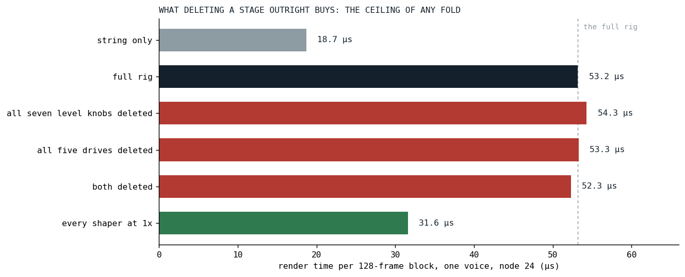
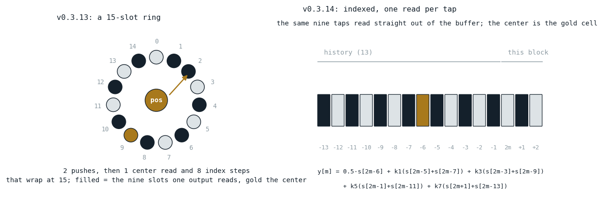
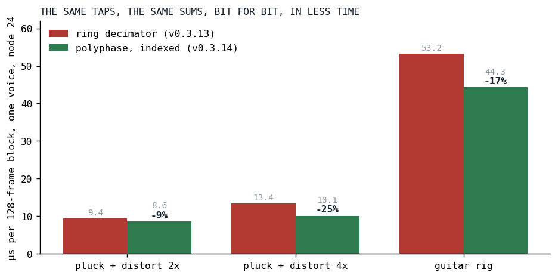

# Measure Before You Build

*Six benchmark rows said no to two planned optimizations and pointed at a third nobody had planned.*

On the evening of September 15 the Fairphone could barely run Der Schmetterling ([the series opener](../2026-08-19-the-phone-that-does-not-get-faster/index.md) tells why: the guitars had grown five-stage rigs). The maintainer's read was that the bottleneck sat in the guitars' filter stages, and the request was to revisit the graph optimizer against the current rigs and look for more that could be combined.

This post is about what we did instead of combining anything, and about the one change it led to.

## The plan we had

Klangmotor builds a voice from a tree of nodes and, at registration time, runs a graph optimizer over the tree: adjacent filters fuse into one equalizer pass, block-constant arithmetic folds into one affine node. A census of one rhythm-guitar note after that pass, taken the same day, read: 90 nodes, 11 equalizers carrying 18 filter sections, 5 drive stages each followed by a shaper (oversampled 2x, 4x, 4x, 4x, 2x), 7 multiplies for the level knobs between the stages, and about 35 passes over the block per note, counting the unison stack as one pass; the ledger of the opener counts each of its nineteen voices, which is where its 57 comes from.

The plan on the table had two more steps for exactly those 7 multiplies and 5 drives. Fold each level knob into the neighboring equalizer's output gain, so the multiply pass disappears and the equalizers on both sides of it can fuse into one. Fold each drive into the shaper's input read, so the drive pass disappears too. On paper, twelve passes of thirty-five.

The price on paper was also visible. The fused equalizer runs a section-major loop with eight per-sample loop bodies, one per section kind and coefficient shape, and every one of them would learn an input gain and an output gain. The shaper's oversampler would grow an input gain in its upsample. The project has a stone rule about this: complexity is the enemy, and before adding weight, stop and consult. What the rule does not say is how to know, before the weight is added, whether it will carry anything.

## Delete before you fold

The trick is a benchmark row. A fold can, at its very best, make a node cost nothing. Deleting the node outright makes it cost nothing for certain, and costs nothing to try. So the ceiling of "fold the level knobs into the equalizer" is measured by a voice with the level knobs removed, and the ceiling of "fold the drives into the shapers" by a voice with the drives removed, and both are one line each in the benchmark's case list.

The rhythm rig of Der Schmetterling went into the ignitor benchmark as an inline tree, built the way the song builds it, with two switches:

```kotlin
        private fun guitarRig(muls: Boolean, drives: Boolean, oversample: Boolean = true): IgnitorDsl {
            fun IgnitorDsl.level(gain: Double): IgnitorDsl = if (muls) mul(IgnitorDsl.Constant(gain)) else this

            fun IgnitorDsl.newEq(): IgnitorDsl.Eq = IgnitorDsl.Eq(inner = this)

            fun IgnitorDsl.distortion(amount: Double, shape: String, os: Int): IgnitorDsl {
                val driven = if (drives) IgnitorDsl.Drive(inner = this, amount = IgnitorDsl.Constant(amount)) else this

                return IgnitorDsl.Shape(inner = driven, shape = shape, oversample = if (oversample) os else 0)
            }
```

*[IgnitorBenchmark.kt at v0.3.14](https://github.com/PeekAndPoke/klang/blob/v0.3.14/audio_benchmark/src/commonMain/kotlin/IgnitorBenchmark.kt#L375-L422)*

Six rows: the string alone, the full rig, the rig without its level knobs, without its drives, without both, and, because it cost one more switch, the rig with every shaper at 1x. The rows are cost rows, not sound rows; without the drives the shapers see a quieter signal, and nobody listened to them. A filter runs only the matching rows, a few minutes per platform. One honest limit: the third helper opens every equalizer explicitly, so a deleted level knob does not let two equalizers merge into one. The no-knobs row bounds the multiply passes, which is what the fold would remove; the extra fusion it would allow is not in the number, and the filter passes it would save are the cheap kind, as the last row shows.



*Fig. 1: The rhythm rig as six benchmark rows, node 24, one voice, microseconds per 128-frame block. Deleting all seven level knobs, all five drives, or both, moves the bar by less than the run-to-run spread. Deleting the oversampling moves it by two thirds of the rig's cost.*

| row | node (µs) | JVM (µs) |
|---|---:|---:|
| string only: the 19-voice supersaw, the pluck burst, the envelope | 18.7 | 10.2 |
| the full rig | 53.2 | 29.7 |
| all seven level knobs deleted | 54.3 | 30.5 |
| all five drives deleted | 53.3 | 30.9 |
| both deleted | 52.3 | 28.4 |
| every shaper at 1x | 31.6 | 20.6 |

The rig adds 34.5 µs to the string on node. The two planned folds could recover, at the outside, one to two of them: under four percent of the voice, inside the spread of three runs. Both steps went into the record as won't-implement, with the table attached. A multiply pass over 128 doubles is nothing next to what the same table shows in its last row: with every shaper at 1x the rig costs 13 µs instead of 34.5. Oversampling was 63 percent of the guitar's amplifier.

## What a shaper at 4x does

A distortion stage in Klangmotor is a waveshaper wrapped in an oversampler, so that the harmonics the shaper creates above half the sample rate fold back into the audible band as little as possible. At 4x the stage upsamples the block by linear interpolation from 128 to 512 samples, runs the shaper on the 512, and decimates back in two half-band stages of 2x each, a 15-tap FIR per stage. It is a cheap-and-cheerful anti-aliasing design, documented as such, and its filter is the standard half-band FIR: every even tap but the center is zero, so an output costs one center multiply and four symmetric multiply-adds [[1]](#crochiere1983). The arithmetic is small. What the old decimator did around it was not. Each stage kept a fifteen-slot ring buffer; every input sample was pushed into the ring, and every output was read by walking eight indices around the ring with a wrap test on each step:

```kotlin
    private fun decimate2x(state: HalfBandState, work: AudioBuffer, currentLen: Int): Int {
        // currentLen is always even (factor is a power of 2). Unrolled by 2:
        // push the even sample (no output), then push the odd sample and emit.
        val outLen = currentLen ushr 1
        var outIdx = 0
        var i = 0
        while (i < currentLen) {
            state.push(work[i])
            state.push(work[i + 1])
            work[outIdx] = state.output()
            outIdx++
            i += 2
        }
        return outLen
    }
```

```kotlin
        fun output(): Double {
            // The most recent push wrote to `delay[pos-1]` (and incremented
            // pos). Center of a 15-tap window ending there is `pos-1-7`,
            // i.e. 7 positions behind the most recent push.
            var centerIdx = pos - HALF_LEN - 1
            if (centerIdx < 0) centerIdx += TAPS

            var sum = CENTER_TAP * delay[centerIdx]

            // Non-zero symmetric pairs at odd offsets from center: ±1, ±3, ±5, ±7.
            // Branch-free wrap (single conditional add/subtract) — avoids `% TAPS`
            // since TAPS=15 isn't a power of two.
            var idxPlus = centerIdx + 1
            if (idxPlus >= TAPS) idxPlus -= TAPS
            var idxMinus = centerIdx - 1
            if (idxMinus < 0) idxMinus += TAPS

            for (k in KERNEL.indices) {
                sum += KERNEL[k] * (delay[idxPlus] + delay[idxMinus])
                idxPlus += 2
                if (idxPlus >= TAPS) idxPlus -= TAPS
                idxMinus -= 2
                if (idxMinus < 0) idxMinus += TAPS
            }

            return sum
        }
```

*[Oversampler.kt at v0.3.13](https://github.com/PeekAndPoke/klang/blob/v0.3.13/audio_be/src/commonMain/kotlin/Oversampler.kt#L148-L206)*

For a 4x stage that is six pushes and three of those walks per input sample, before a single multiply. The block is already sitting in a buffer with every sample the FIR needs at a fixed distance from the output. There was never a reason to push it anywhere.

## The same taps, read in place

Write down which stream samples output *m* reads, and the ring disappears. After pushing samples 2m and 2m+1 the center of the window is 2m-6, and the four symmetric pairs sit at odd offsets from it, so:

```
y[m] = 0.5 · s[2m-6] + k1 · (s[2m-5] + s[2m-7]) + k3 · (s[2m-3] + s[2m-9])
                     + k5 · (s[2m-1] + s[2m-11]) + k7 · (s[2m+1] + s[2m-13])
```

Every read is at `2m` plus a constant. The thirteen samples before the block come from a small history array the stage keeps between blocks; everything else is read straight out of the work buffer, and the output is written in place at index *m*.



*Fig. 2: The two ways of reading one output's nine taps. Left, the ring at v0.3.13: two pushes and eight wrapping index steps per output. Right, the same taps at v0.3.14 as offsets from 2m, reaching thirteen samples back into the previous block's history. A construction from the two versions of the code, not a measurement.*

The one subtlety is the in-place write. Output *m* overwrites `work[m]`, and a later output reads down to `work[2m'-13]`. That read is still ahead of every write once `2m' - 13 >= m'`, that is from output 13 on. The first thirteen outputs read from a prefix view instead, the history followed by the first 26 samples of the block, copied before anything is overwritten. The code is longer than the ring's, and every line of it is bookkeeping around the same nine multiplies:

```kotlin
        val preOut = if (outLen < PRE_OUT) outLen else PRE_OUT

        for (m in 0 until preOut) {
            work[m] = tap(pre, HIST + 2 * m)
        }

        for (m in preOut until outLen) {
            work[m] = tap(work, 2 * m)
        }
```

```kotlin
    /** The FIR at `base = 2m` in [src]; the summation order is the one the ring version had. */
    @Suppress("NOTHING_TO_INLINE")
    private inline fun tap(src: DoubleArray, base: Int): Double {
        var sum = CENTER_TAP * src[base - 6]

        sum += K1 * (src[base - 5] + src[base - 7])
        sum += K3 * (src[base - 3] + src[base - 9])
        sum += K5 * (src[base - 1] + src[base - 11])
        sum += K7 * (src[base + 1] + src[base - 13])

        return sum
    }
```

*[Oversampler.kt at v0.3.14](https://github.com/PeekAndPoke/klang/blob/v0.3.14/audio_be/src/commonMain/kotlin/Oversampler.kt#L154-L234)*

The summation order is the ring's, term for term, which is what makes the claim in the next section possible.

## Bit for bit

The oversampler's decimator is the kind of change the engine's rules are strictest about: a filter with state, on the hot path, whose output feeds the rest of the voice. So the old ring was not deleted. It moved into a test as the oracle, unchanged in its arithmetic, and the new pass is held to it sample for sample over a sequence of block lengths chosen to cross every boundary the prefix view has:

```kotlin
    val lengths = listOf(1, 3, 5, 6, 7, 12, 13, 14, 25, 26, 27, 28, 29, 64, 128, 2, 0, 128, 128, 9, 128)
```

*[OversamplerDecimatorParitySpec.kt at v0.3.14](https://github.com/PeekAndPoke/klang/blob/v0.3.14/audio_be/src/commonTest/kotlin/OversamplerDecimatorParitySpec.kt#L15-L70)*

Blocks shorter than the history, shorter than the prefix, ending inside the in-place region, and empty. The comparison is `Double.equals`, which keeps `-0.0` and `0.0` apart where `==` would not; the claim is the same bits, not the same value. And the test was made to fail on purpose five times before it was trusted: a history one sample short, the in-place boundary one output early, a tap one index off, the short-block shift dropped, the history taken from the wrong end. Each went red.

The house review loop puts two fresh reviewers on every engine change, and both re-derived the tap indices from the ring code by hand. Three of their findings changed the code or the test. The in-place boundary constant was written as a literal 13 that is mathematically forced to equal the history length; it became `PRE_OUT = HIST`, so that a future change of the tap count cannot pull them apart. The copies into the prefix view used `copyInto`, which on Kotlin/JS allocates a typed-array view object per call, three times per stage per block; they became plain loops, and the guitar voice went from 45.5 to 44.3 µs. And the test's "seeded noise" was a constant: `(i * 2654435761.0).toInt()` saturates to one value for every positive `i`, so the signal had been a pure sine with a DC offset, clipping on one side only. The mutations had all gone red anyway, but the intended coverage had not existed until the reviewer read the arithmetic.

## Results



*Fig. 3: Node 24, one voice, microseconds per 128-frame block, before and after the decimator rewrite. The guitar rig is the full-rig row of Fig. 1.*

| voice | node before (µs) | node after (µs) | change |
|---|---:|---:|---:|
| pluck, distortion at 2x | 9.4 | 8.6 | -9% |
| pluck, distortion at 4x | 13.4 | 10.1 | -25% |
| the rhythm guitar rig | 53.2 | 44.3 | -17% |

The guitar's oversampling share went from 22 µs to 12. Every oversampled stage in the engine took the change: the shaper on the voice doors, and the shaper, the crusher and the rate reducer on the strip. None of them sounds different, because none of them computes anything different.

Sound cost: none. The output is bit-identical to the ring's for every block length, and the specification holds the old implementation as its witness.

## What transferred

The cheapest measurement is the one that says no. A benchmark row that deletes a node costs one line and a minute, and it bounds from above everything a fold of that node could ever buy. Ten loop variants in the equalizer would have been built, reviewed and mutation-checked for a rounding error's worth of time. The optimizer plan carries both steps as won't-implement with the six rows attached, so the next person does not have to redo the argument.

And the number you were sent to look at is not always the number. The request named the filter stages; the census agreed there were many; the rows said the filters were cheap and the oversampling was not. A census counts passes, a benchmark counts microseconds, and when they disagree the microseconds win.

## References

1. <a id="crochiere1983"></a>Crochiere, R. E., & Rabiner, L. R. (1983). *Multirate Digital Signal Processing*. Prentice-Hall, Englewood Cliffs, NJ. ISBN 0-13-605162-6. <https://books.google.com/books/about/Multirate_Digital_Signal_Processing.html?id=X_NSAAAAMAAJ>

*Sources inside the repository: `docs/tasks-archive/2026-09/20260916-ignitor-optimizer-arithmetic-folds.md` (the census, the six-row table with node and JVM numbers, the verdict on steps 3 and 4), `audio/MEMORY.md` ("The oversampler's decimator is polyphase and indexed", the before and after numbers), `audio_be/src/commonMain/kotlin/Oversampler.kt` at v0.3.13 and v0.3.14, `audio_be/src/commonTest/kotlin/OversamplerDecimatorParitySpec.kt`, `audio_benchmark/src/commonMain/kotlin/IgnitorBenchmark.kt` (the `guitar-rig*` rows), commit `6c1ae38b`.*
