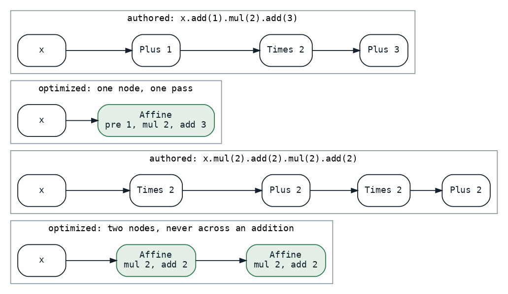
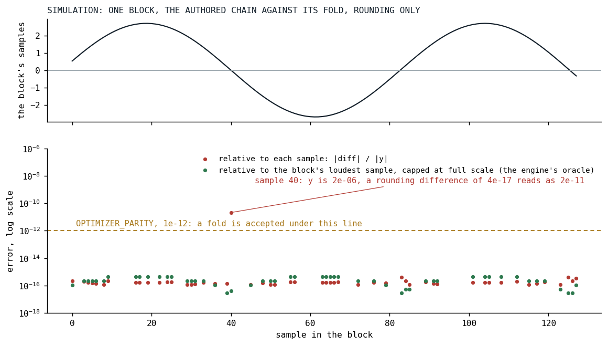

# The Promise Is a Margin

*The graph optimizer promised bit-identity, which forbade moving a multiply; it now promises a margin with no musical meaning, and a harness that holds every rule to it.*

An instrument in Klangmotor is a tree of nodes, oscillators and filters and arithmetic, that the author writes as a chain of calls and the engine renders once per voice per block. Since August 21 a pass rewrites that tree before it is rendered, and the first thing it did was fuse runs of adjacent filters into one multi-section node. Its promise, written into its KDoc, was absolute:

```kotlin
 * That is stricter than it needs to be mathematically, and deliberately so. A gain multiply
 * commutes with a linear filter on paper, but `k * lowpass(x)` and `lowpass(k * x)` do not
 * produce the same BITS, and bit-identity is a hard requirement here. So the pass never
 * reorders, never hoists, and never crosses a node it does not recognise. A chain like
 * `sine().bandpass().distort().lowpass()` yields two independent one-section Eqs, because the
 * distort between them is a wall.
```

*[IgnitorDslOptimizer.kt at v0.3.13](https://github.com/PeekAndPoke/klang/blob/v0.3.13/audio_bridge/src/commonMain/kotlin/IgnitorDslOptimizer.kt#L12-L46)*

Bit-identity is a wonderful promise to test and a terrible one to optimize under. Every level knob in a guitar rig is a multiply between two filters, and under that promise every one of them is a wall. On September 15, with [the phone](../2026-08-19-the-phone-that-does-not-get-faster/index.md) barely running the song and its guitars carrying seven such walls per note, the maintainer replaced the promise: the optimized graph may differ from the authored one by a margin that has no musical meaning. This post is about what a promise change costs when it is done properly, which is more than a constant.

## Step zero: the harness before the rule

The new promise is one constant and its KDoc:

```kotlin
/**
 * The margin an optimized graph may differ from its authored graph by, per sample, relative to
 * the block's scale (its loudest sample, at most full scale): rounding, not sound. NaN must stay NaN and an
 * infinity an infinity. Relative to the block and not to the sample itself since 2026-09-15: a
 * fold that is inexact by an ulp (a divide as a multiply by the reciprocal) passes through a
 * filter and lands next to a zero crossing, where the sample is tiny and the deviation is not,
 * though it is still -240 dB below the loudest sample of that block.
 */
const val OPTIMIZER_PARITY: Double = 1e-12
```

*[IgnitorDslOptimizer.kt at v0.3.14](https://github.com/PeekAndPoke/klang/blob/v0.3.14/audio_bridge/src/commonMain/kotlin/IgnitorDslOptimizer.kt#L56-L64)*

The last sentence of that KDoc was not there on the first day, and the first one said "relative to the larger magnitude"; the section on the fuzz seed tells how that changed. The first commit under the new promise added no rule. It put four corpora under the promise, three of them rendering a tree and its optimized twin through the real engine with same-seeded random streams and holding every sample to the margin: the existing rule table, a tree-in, tree-out specification that pins the shapes and, more importantly, the shapes that must not fold; the render-parity specification, now comparing within the margin instead of by bits, on the shapes people write plus the engine's whole warmup vocabulary; a new song corpus that compiles every builtin song and renders every distinct instrument in it both ways; and a new fuzz. The fuzz, a thousand graphs then and fifteen hundred now, composes graphs nobody wrote from sources, block-constant and modulated arithmetic, filters, shapers, envelopes, shared subtrees and the kill switch, with constants drawn from a generator that is mostly ordinary and sometimes not:

```kotlin
        return when (pick) {
            0 -> 0.0
            1 -> -0.0
            2 -> 1e300
            3 -> Double.POSITIVE_INFINITY
            4 -> Double.NaN
            5 -> 1e-12
            6 -> -1e9
            else -> (r.nextDouble() * 4.0 - 2.0)
        }
```

*[IgnitorDslOptimizerFuzzSpec.kt at v0.3.14](https://github.com/PeekAndPoke/klang/blob/v0.3.14/audio_be/src/jvmTest/kotlin/ignitor/IgnitorDslOptimizerFuzzSpec.kt#L81-L99)*

Every generated tree is also held to the pass's laws: optimizing twice is the same as once, the work never grows, the parameters survive in first-occurrence order, and the registry must have swallowed no failure over the run. A failure prints its seed, which reproduces the tree. All of this was green on the shipped rules, which still rendered bit-exact, and it was mutation-checked before it was trusted: a fused coefficient one percent off is red in the render rows and the fuzz.

## The node and the rule

The node the folds build is one pass of `mul · (x + pre) + add`:

```kotlin
    @WireName("affine")
    data class Affine(
        val inner: IgnitorDsl,
        val pre: IgnitorDsl = Constant(-0.0),
        val mul: IgnitorDsl,
        val add: IgnitorDsl = Constant(-0.0),
    ) : IgnitorDsl {
```

*[IgnitorDsl.kt at v0.3.14](https://github.com/PeekAndPoke/klang/blob/v0.3.14/audio_bridge/src/commonMain/kotlin/IgnitorDsl.kt#L863-L899)*

Two of its details came out of review rounds rather than the first draft. The pre-add exists because the obvious fold of `x.add(b).mul(a)` is `a·x + a·b`, and that expression cancels wherever `x` is near `-b`, which is every zero crossing of an offset-then-scale shape [[1]](#goldberg1991); no relative margin survives cancellation, so the node keeps the authored order and both orders fold bit for bit. And an absent pre-add or add is `-0.0`, not `0.0`, because `v + (-0.0)` is `v` for every `v` including a negative zero, where `v + 0.0` turns `-0.0` into `+0.0`. The multiply has no default: a chain without one stays plain additions, because the multiply's clamp is what the addition node refuses.



*Fig. 1: Two authored chains and what the rule makes of them. An add, a multiply and an add fold into one node. A multiply, an add, a multiply and an add fold into two, because nothing merges across an addition: pushing the inner add through the outer multiply has no relative bound.*

The rule folds one node per authored shape, `x [.add(p)] .mul(m) [.add(a)]`, and refuses everything else. The refusals are the contract, and the rule table names them one per row:

- never across an addition: a multiply, an add and a multiply is two nodes;
- a mixed run of literal multiplies, up then down, does not compose, because the chain's intermediate clamp could differ from the fold's single one;
- an attenuating run composes only over an input a clamping operation has already bounded, and an Affine that carries an add is not such an input, since its add sits outside the clamp;
- a run whose product overflows, or underflows to a subnormal, is not composed;
- a modulated operand is not a coefficient: a multiply by an LFO stays a multiply;
- a shared node is never absorbed, and a parameter on the left of a multiply stays where it was written, because first-occurrence order of parameters is a contract the UI keys on.

The composition condition is the part worth reading in the source, because its comment says why each clause is there:

```kotlin
                val product = m * factor
                val growing = abs(m) >= 1.0 && abs(factor) >= 1.0
                val attenuating = abs(m) <= 1.0 && abs(product) <= 1.0 && signal.inner.isClamped()
```

*[IgnitorDslOptimizer.kt at v0.3.14](https://github.com/PeekAndPoke/klang/blob/v0.3.14/audio_bridge/src/commonMain/kotlin/IgnitorDslOptimizer.kt#L526-L583)*

```kotlin
                val zeroFactor = m == 0.0 || factor == 0.0
                val normal = product.isFinite() && ((product == 0.0 && zeroFactor) || abs(product) >= 2.2250738585072014e-308)

                if ((growing || attenuating || flip) && normal) {
                    return signal.copy(mul = IgnitorDsl.Constant(product))
                }
```

*[IgnitorDslOptimizer.kt at v0.3.14](https://github.com/PeekAndPoke/klang/blob/v0.3.14/audio_bridge/src/commonMain/kotlin/IgnitorDslOptimizer.kt#L526-L583)*

The condition is on `x · product`, not on the product: two multiplies of 100 and 0.01 compose to 1 on paper, and on a sample of 1e14 the chain clamps at its ceiling after the first while the fold never does.

## Division, subtraction, negation, and the zero

The maintainer's instructions for the last step were three sentences: fully support `div()` and `minus()` in the current form; `neg()` is an alias of `mul(-1)` and should not have a dedicated node at all; `div(0)` results in a constant zero no matter what the graph before it is. The last one is an engine rule before it is an optimizer rule, and it reads as one line in the divide node:

```kotlin
    /** The guarded quotient: zero for a zero divisor, else `safeOut(a / safeDiv(b))`. */
    @Suppress("NOTHING_TO_INLINE")
    private inline fun divide(a: Double, b: Double): Double = if (b == 0.0) 0.0 else safeOut(a / safeDiv(b))
```

*[Ignitor.kt at v0.3.14](https://github.com/PeekAndPoke/klang/blob/v0.3.14/audio_be/src/commonMain/kotlin/ignitor/Ignitor.kt#L448-L537)*

Before it, a zero divisor was substituted with the engine's smallest safe magnitude and the quotient clamped at the largest, which is a loud way to say "undefined". Now a block-constant zero or infinite divisor is a dead branch: nothing upstream renders and the block is filled with zero. The fold of `x / k` is a multiply by the expression `1 / k`, evaluated once per block through the runtime's own guard; `x - k` fills the add with a bare negation; `-x` is a multiply by minus one and composes with a literal it follows.

Then the review loop found what it kept finding, three times in three different clothes. A parameter divisor that happens to be zero is a dead branch on the authored side, where the divide node skips its upstream, and was not on the optimized side, where an Affine with a zero multiplier rendered its inner node and threw the result away. The rendered samples were identical, zeros both, and the voice was not: the upstream held a noise source, its random stream had advanced on one side only, and the next noise node in the voice read a different position. So a multiplier of exactly zero became the same dead branch in every multiply node. Then a literal `x / 0` folded to a bare constant, which dropped the subtree at build time and shifted the construction-time draws of every phase pool built after it; now it is a multiply by a literal zero, dead but still built. Then a composed run whose product underflowed to zero would have been a dead branch the chain never was; it is refused. The lesson, as the task record states it: every coefficient the optimizer synthesizes must be zero exactly when the authored one is, or the dead branch renders on one side only and the voice's noise stream slips.

## Seed 433

The reciprocal is where the margin's definition moved. `x / 4` folded to `x · 0.25` is exact; `x / 3` folded to `x · (1/3)` is off by an ulp. On the first run of the fuzz with the division rule in place, seed 433 built a tree in which that ulp passed through a filter and landed next to a zero crossing, where the sample was tiny and the deviation, relative to it, was not. Relative to the block it was 240 dB down.



*Fig. 2: A simulation in doubles, not the engine: one block of an authored chain against its fold, differing by rounding only, with the phase chosen so that one sample lands two millionths from a zero crossing. Relative to each sample, that one point reads as a failure by a factor of twenty; relative to the block's loudest sample, the engine's oracle, every point sits at rounding.*

The oracle is now relative to the block's scale, its loudest finite sample on either side, and capped at full scale, so that one saturated sample cannot buy the musical samples next to it a tolerance of a thousand:

```kotlin
    fun withinParity(a: Double, b: Double, scale: Double = 0.0): Boolean = when {
        a.isNaN() || b.isNaN() -> a.isNaN() && b.isNaN()
        a.isInfinite() || b.isInfinite() -> a == b
        else -> abs(a - b) <= OPTIMIZER_PARITY * maxOf(abs(a), abs(b), scale, 1e-300)
    }
```

*[IgnitorDslOptimizerRenderSpec.kt at v0.3.14](https://github.com/PeekAndPoke/klang/blob/v0.3.14/audio_be/src/commonTest/kotlin/ignitor/IgnitorDslOptimizerRenderSpec.kt#L91-L101)*

Both reviewers of that round asked for the cap. The laws of the pass did not move in the end: a block-constant tree stays block-constant with the same value, and the parameters are equal on both sides, since the zero divisor keeps its subtree.

## Results

Measured alone, seeded, back to back: the rhythm rig went from 0.0345 to 0.0348, the fully stock rig from 0.0219 to 0.0219, the live song from 0.0786 to 0.0791. Nothing, inside the noise, and that is the arithmetic. A lone multiply was already one pass over the block, and an Affine over it is one pass with two more adds. The rule pays only where it merges a multiply with an add, or composes a run, and the guitar has few of either; its job was to be the shape that the next two steps would fold into the filters' and the shapers' gains, where the pass disappears entirely.

Those two steps were never built. Before touching the filter core the ceiling was measured by deleting the nodes outright, which is a stronger result than any fold, and it came to under four percent of a guitar voice; that measurement, and where the guitar's cost actually was, is [a companion post](../2026-09-15-measure-before-you-build/index.md). Merging two Affines across an addition, algebraically or as a fused runtime pass, is parked with its reasoning, last in line, in the maintainer's words "one of the optimizations you only do when there is nothing else to be done".

What the promise change bought is the harness. The node and the two rule commits went through seven review rounds and every finding they produced was a finding the corpora could then pin: sixteen new rows across the rule table, the render parity, the engine arithmetic and the constant-fold specifications in the last step alone, twenty mutations red. The optimizer can now be given a rule, and the rule can be wrong in a way that shows.

## What transferred

A promise is a contract with a test, and the test comes first: the margin was worth nothing until the corpora and the fuzz could hold a rule to it. A relative margin needs a scale, and the sample is the wrong one, because a zero crossing makes any deviation infinite; the block's loudest sample is the right one, capped so that saturation does not become tolerance. When an optimizer synthesizes a coefficient, its zeros must match the author's zeros exactly, because a zero is not a value in this engine, it is a decision not to render, and that decision has side effects on every random stream downstream. And the rule table's negatives are its contract: what a rule refuses to fold is where its correctness lives.

## References

1. <a id="goldberg1991"></a>Goldberg, D. (1991). What Every Computer Scientist Should Know About Floating-Point Arithmetic. *ACM Computing Surveys*, 23(1), 5-48. <https://doi.org/10.1145/103162.103163>

*Sources inside the repository: `docs/tasks-archive/2026-09/20260916-ignitor-optimizer-arithmetic-folds.md` (steps 0 to 4b with the rule derivations and the measurements), `audio/MEMORY.md` ("The ignitor optimizer's promise is a margin now", "div, minus and neg fold; a zero divisor is zero"), the commits `bb9bdbb3`, `a645a97d`, `1056a1c0` and `841cdb8b`, `docs/benchmarks/2026-09-15_203558_song_jvm.md`, `_203656_`, `_203855_` and `_203953_` (the rig and the live song before and after rule R2), `docs/tasks/future/affine-chain-fusion.md`, `audio_bridge/src/commonMain/kotlin/IgnitorDslOptimizer.kt` at v0.3.13 and v0.3.14, `IgnitorDsl.kt` and `audio_be/src/commonMain/kotlin/ignitor/Ignitor.kt` at v0.3.14, `IgnitorDslOptimizerSpec.kt`, `IgnitorDslOptimizerRenderSpec.kt`, `IgnitorDslOptimizerFuzzSpec.kt`, `OptimizerSongParitySpec.kt`.*
