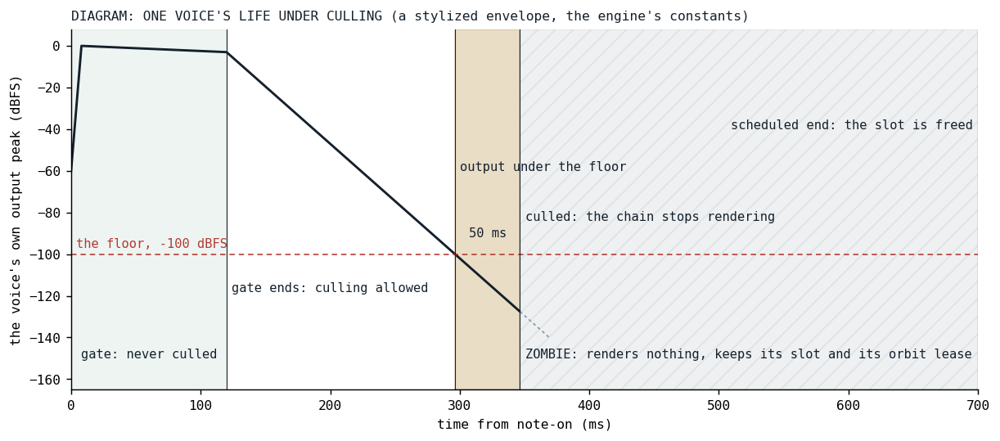
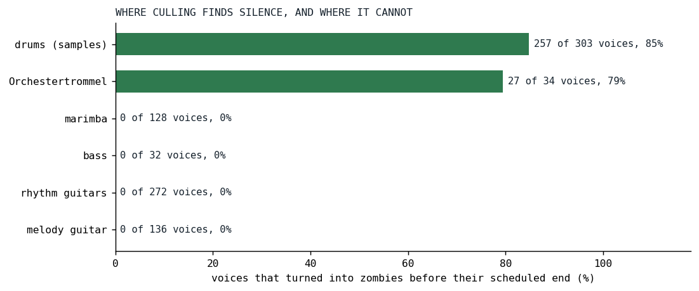
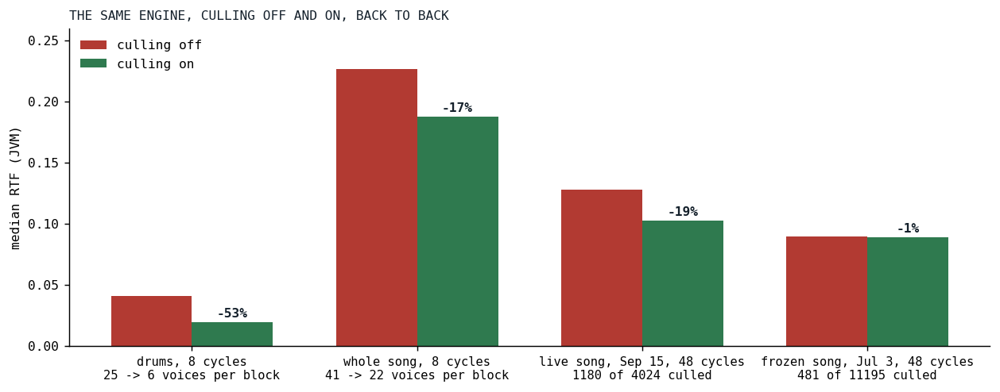

# Zombies

*A voice that has decayed to silence keeps rendering its whole chain until its scheduled end; stopping it early moved the mix by 28 dB.*

A note in Klangmotor is scheduled with a start frame and an end frame, the gate plus the release, and until September 15 it was rendered for every frame between them. The end frame was the only thing that ended a voice. For a sustained pad that is right. For a sampled hi-hat with a two-second release it means the sample has played out, the envelope has closed, the output has been zero for most of two seconds, and the voice strip is still running per block: pitch, ignition, filters, envelope, sends, all of it producing nothing. On the day of the change the hats of Der Schmetterling were silent for 85 percent of their own life, and every voice the song culled that day was a drum. This post is about the change that stopped it, and about the afternoon the first version of that change was found to alter the mix.

## The July design and what survived of it

The idea had been written down on July 4, during the orbit-body work, as a small task: measure the voice's real output, never infer silence from the envelope, and let a patch declare how early culling may fire through a per-voice fraction of its lifetime. The floor was -80 dB, the window three blocks. It waited two months in the task list, ranked as a nice-to-have, until [the phone](../2026-08-19-the-phone-that-does-not-get-faster/index.md) made every slice of the song's cost interesting.

The technique is older than the engine. SuperCollider's DetectSilence unit generator [[1]](#sc-detectsilence) watches a signal and evaluates its done action, usually freeing the synth, once the signal has stayed under an amplitude for a time, and its documentation carries the same caveat this post is about to reach: if the input starts silent it waits for the first sound before it begins to watch, so that a synth is not freed for being late.

Two of its decisions did not survive contact with the maintainer. There is no lifetime fraction: culling happens only in the release phase, once the gate has ended, because the gate is the held part of the note and a note may be silent there on purpose, a slow attack, a gated tremolo, sparse crackle. The release has been told to stop, which is the real "the sound has started ending" signal, and it needs no knob. And a voice that has not sounded yet is never culled, whatever its phase: a pitched-down sample with leading silence is not silent, it is late. What remains per voice is the window, `cull(seconds)`, with `noCull()` as the off switch, and the floor became the same constant the orbits use to decide that a bus has gone quiet, so that a culled voice is by definition below what keeps its orbit alive:

```kotlin
const val VOICE_CULL_FLOOR: Double = ORBIT_SILENCE_FLOOR
```

*[VoiceCullingDefaults.kt at v0.3.13](https://github.com/PeekAndPoke/klang/blob/v0.3.13/audio_bridge/src/commonMain/kotlin/constants/VoiceCullingDefaults.kt#L1-L50)*

That constant is 1e-5, which is -100 dBFS, and the default window is 50 ms.

## The decision

The measurement is one extra pass over the voice's output in the send stage, run only on the blocks that will read it: before the voice has been heard, and then in its release. It takes the block's peak magnitude, multiplies by the voice's gain and post-gain and by the larger of one and its send amounts, and stops before the solo and mute multiplier, so a voice that is merely faded out by a solo is not taken for a dead one. The decision sits in the voice's render method, after the strip has run:

```kotlin
        if (measure) {
            val silent = blockCtx.voiceOutputPeak < VOICE_CULL_FLOOR

            if (!silent) {
                heard = true
            }

            if (heard && ctx.blockStart >= gateEndFrame) {
                if (silent) {
                    silentFrames += length

                    if (silentFrames >= cullWindowFrames) {
                        culled = true
                    }
                } else {
                    silentFrames = 0
                }
            }
        }
```

*[Voice.kt at v0.3.13](https://github.com/PeekAndPoke/klang/blob/v0.3.13/audio_be/src/commonMain/kotlin/voices/Voice.kt#L225-L265)*

The window counts frames, not blocks, so it has the same length at any block size and the cut lands within one block of the same frame. An audible block inside the release resets the count, which is what protects a tail that dips and comes back, up to the width of the window. A release that goes silent for longer than that and then returns is the author's call: the doors are one line each on the pattern, and a voice with a tremolo is excluded by the factory unless the author sets the window themselves, since a square tremolo at full depth is exact silence for half of every cycle.

```kotlin
@KlangScript.Function
fun SprudelPattern.cull(seconds: PatternLike? = null, callInfo: CallInfo? = null): SprudelPattern =
    applyCull(this, listOfNotNull(seconds).asSprudelDslArgs(callInfo))
```

```kotlin
@KlangScript.Function
fun SprudelPattern.noCull(callInfo: CallInfo? = null): SprudelPattern = this.cull(VOICE_CULL_NEVER, callInfo)
```

*[lang_dynamics_cull.kt at v0.3.13](https://github.com/PeekAndPoke/klang/blob/v0.3.13/sprudel/src/commonMain/kotlin/lang/lang_dynamics_cull.kt#L1-L135)*



*Fig. 1: A diagram, not a render: one voice with a stylized envelope and the engine's constants. The gate is never culled. Once the release has stayed under -100 dBFS for 50 ms the strip stops. What happens after that is the subject of the next section.*

## The afternoon the mix moved

The first build did the obvious thing. When the window elapsed, the voice's render method returned false, which is how a voice reports its natural end, and the scheduler swap-removed it from the active list. The benchmark numbers were what they should be. Then the deterministic null-diff of the song, the same render with culling on and off, subtracted sample by sample, came back with a mix change of -28 dB RMS. Culling removes only output under -100 dBFS by construction; a 28 dB change is not a tail going missing. Something else had moved.

What had moved was ownership. An orbit, the bus a voice is mixed into, is leased to the first voice that renders into it, and that voice's bus configuration applies while it holds the lease. When an owner dies the lease passes to whichever voice renders first after it, and that order is the order of the active list. Swap-removing a culled hat from the middle of the list reordered the voices after it, and on Der Schmetterling that changed which of the third guitar and the bass owned orbit 3 when its owner ended, at -32 dBFS in the diff. The number is not large in absolute terms, but it is a different mix, and it would have been a different mix on every orbit whose voices carry different bus settings.

So a culled voice is a zombie. It renders nothing, and it keeps its slot in the active list and renews its orbit lease until its scheduled end frame, where it expires like any other voice:

```kotlin
    /**
     * True once this voice's release has stayed under [VOICE_CULL_FLOOR] for the whole cull window.
     * From then on [render] runs no strip: the voice is a ZOMBIE that only renews its orbit lease
     * and keeps its slot in the scheduler's active list until its scheduled [endFrame], where it
     * expires like any other voice. Staying in the list is the point: the orbit lease passes to
     * whichever voice renders FIRST after an owner dies, and that order is the active list, so an
     * early removal would reorder it and hand orbits to different successors (measured 2026-09-15
     * on Der Schmetterling: a culled hat changed which of guitar 3 and the bass owned orbit 3, at
     * -32 dBFS). The zombie's per-block cost is the lease renewal, and as the owner the bus config
     * re-application that comes with it, exactly what a sounding tail paid; the strip it skips is
     * the win.
     */
    var culled: Boolean = false
        private set
```

```kotlin
        // A culled voice renews its orbit lease and nothing else (see [culled]).
        if (culled) {
            ctx.cylinders.getOrInit(cylinderId, this, ctx.blockStart)

            return true
        }
```

*[Voice.kt at v0.3.13](https://github.com/PeekAndPoke/klang/blob/v0.3.13/audio_be/src/commonMain/kotlin/voices/Voice.kt#L103-L116), [and the early return](https://github.com/PeekAndPoke/klang/blob/v0.3.13/audio_be/src/commonMain/kotlin/voices/Voice.kt#L205-L210)*

With the zombie the null-diff sits at a peak of -90 dBFS and an RMS of -124 dBFS, with 99.96 percent of the samples identical. The per-block cost of a zombie is the lease renewal, which a sounding tail paid too; the strip it skips is the whole win.

## Results



*Fig. 2: The rig suite on the day of the change: the share of each piece's voices that turned into zombies before their scheduled end. Sampled drums with a two-second release and the Orchestertrommel, whose head rings out under a two-second release, give; the marimba, the bass and all three guitars have nothing to give, the guitars because their notes live 170 ms and are audible throughout.*



*Fig. 3: Culling off and on, back to back. The first two pairs are today's engine with the default window switched off by a one-line edit, on the drums piece and the whole song, eight cycles, with the voices rendering per block; the last two are the commit's own pair on the live song of September 15 and the frozen song of July 3, 48 cycles. JVM, median RTF.*

| case | culling off | culling on | change |
|---|---:|---:|---:|
| drums (samples), 8 cycles | 0.0411 | 0.0194 | -53% |
| the whole song, 8 cycles, ungated | 0.2265 | 0.1879 | -17% |
| live song of September 15, 48 cycles | 0.1277 | 0.1028 | -19% |
| frozen song of July 3, 48 cycles | 0.0899 | 0.0890 | -1% |

The drums piece goes from 25 rendering voices per block to 6, and the whole song from 41 to 22, which is the number the [ledger](../2026-08-19-the-phone-that-does-not-get-faster/index.md) counts as "voices" and the reason its drums row reads six. The July song barely moves: of its 11,195 voices only 481 ever went quiet before their end, since the long sampled releases came into the song later. The guitars, the marimba and the bass are untouched, because they are audible for their whole life, and so is anything else that is. Culling is not a discount on the engine; it is a refund on silence, and the refund is exactly as large as the silence a song carries. The song as it is written today culls its drum less than it did on September 15, 7 hits of 34 against 27, because the drum's sound has changed since; the shares in Fig. 2 are the day's, the A/B in Fig. 3 is today's engine.

## Guards

A voice specification with fifteen rows holds the rules, each of them a sentence: a silent release is culled once the default window has elapsed and never inside the gate; an audible release is not culled; the solo and mute fade is not silence; the window has the same length at any block size; a phase-inverted voice is as audible as an upright one; a zombie renders nothing and renews its orbit lease until its scheduled end; a later voice with its own bus configuration is refused while the zombie holds the lease; a voice that has not sounded yet is never culled, however long past its gate. A scheduler specification holds the counting, and a door specification the two doors. Thirteen mutations of the engine went red. The review loop ran three rounds, the third on the strongest tier, and found six majors in the first two.

Not built, by the maintainer's decision: a masking-aware floor, relative to the previous block's master peak, so that a tail under a loud mix is culled earlier. The absolute floor is the one that can be reasoned about, and -100 dBFS under a mix is already nothing.

## What transferred

Measure the output, not the envelope: an ignitor can shape its amplitude any way it likes, and the only thing that is true of every voice is what leaves it. The gate is a better signal than a parameter, because it is the note's own statement that the sound is ending. And the one this post is named for: any change to when a voice leaves the active list is a mix change on every orbit with mixed bus settings, and the null-diff render, not the benchmark, is the test that sees it. The benchmark said the first build was right. The diff said what the benchmark could not.

## References

1. <a id="sc-detectsilence"></a>SuperCollider documentation. *DetectSilence*: when the absolute value of the input signal remains below the threshold for a given window of time, evaluate the done action. <https://doc.sccode.org/Classes/DetectSilence.html>

*Sources inside the repository: `docs/tasks-archive/2026-09/20260915-voice-culling.md` (the July design and the September record), `audio/MEMORY.md` ("Silence culling"), the commit `2133056a`, `docs/benchmarks/2026-09-15_132518_song_jvm.md` and `_132340_` (the commit's own pair, off and on), `2026-09-15_172412_song_jvm.md` (the rig suite of the day, the culled column), `2026-09-16_132213_song_jvm.md` and `_132457_` (today's pair, off and on), `docs/benchmarks/ledger.md`, `audio_be/src/commonMain/kotlin/voices/Voice.kt`, `VoiceScheduler.kt`, `VoiceFactory.kt`, `voices/strip/send/SendRenderer.kt`, `audio_bridge/src/commonMain/kotlin/constants/VoiceCullingDefaults.kt`, `sprudel/src/commonMain/kotlin/lang/lang_dynamics_cull.kt` at v0.3.13, `VoiceCullingSpec.kt`, `VoiceSchedulerCullingSpec.kt`, `LangCullSpec.kt`.*
