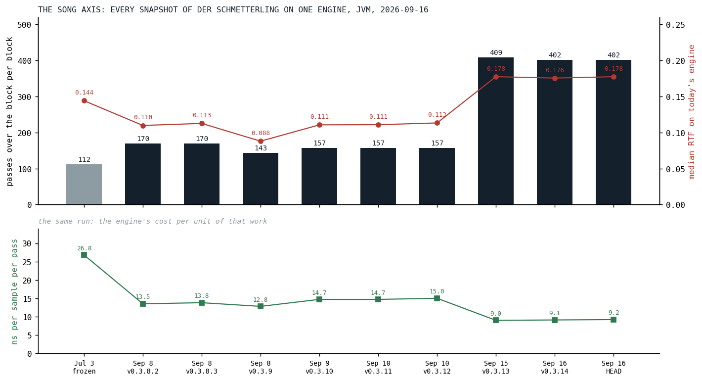
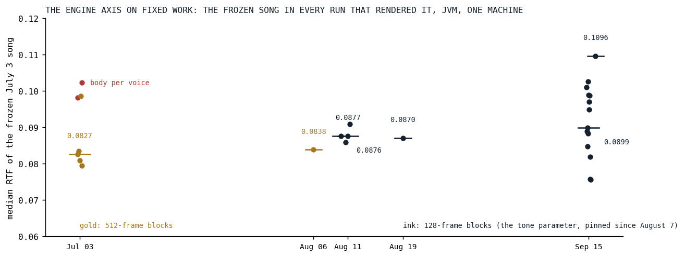
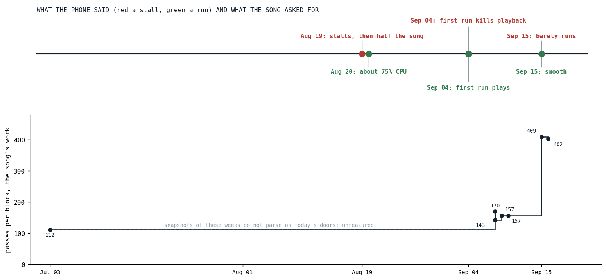

# The Score So Far

*Fourteen optimizations in one table, the song's work and the engine's cost pulled apart on two axes, and what the phone said with the song's weight written next to it.*

[The first post of this series](../2026-08-19-the-phone-that-does-not-get-faster/index.md) made one claim and one promise. The claim: the live song's real-time factor over the summer is not a score, because the engine got faster and the song got heavier at the same time, and one line cannot show two movements. The promise: every result in the series would be stated on fixed work, and the closing post would pull the two movements apart with measurements rather than with the sentence. This is that post. It has one table and three figures, and the sentence it exists for is that both movements were real: the song asked for three and a half times the census work it asked for in July, and on fixed work the engine's price fell, by the numbers in the table on node, where it mattered, and by 14 to 57 percent per frozen instrument on the JVM in the September round alone.

## The table

Every optimization the series covered, in the order it happened. The number is the post's headline number on fixed work, with its platform; the sound column is what the change cost by ear and what guarded it. Where a post's number comes from today's re-measurement rather than the day's record, the post says so.

| date | post | what changed | the number | platform | sound |
|---|---|---|---|---|---|
| May 29 | [the triplet that never drifted](../2026-05-29-the-triplet-that-never-drifted/index.md) | musical time from a BigInt rational to fixed-point ticks in a Double | a plus 92 to 5.7 ns, a step map 186 to 5.4 | node, transplant today | exact thirds, fifths, sevenths; rare subdivisions round to a tick |
| Jun 5 | [one engine for five waves](../2026-06-05-one-engine-for-five-waves/index.md) | one unison engine, one shape function, a block-constant read | supersquare 8.2 to 5.0 µs per note, supersine 18.7 to 15.7 | JVM, the day's record | a declared change; supersaw byte-identical |
| Jun 6 | [twenty allocations per note](../2026-06-06-twenty-allocations-per-note/index.md) | voice data mutable under a single owner, then grouped | about twenty copies per event to one; the leaf clone 78 ns | node, today | none; a golden of 2,822 events |
| Jun 7 | [sixty-seven microseconds to 385 nanoseconds](../2026-06-07-sixty-seven-microseconds-to-385-nanoseconds/index.md) | a generated wire codec on the audio thread | decode 67 µs to 385 ns, 174 times | node, the day's record | none |
| Jul 4 | [the body that played a thousand times](../2026-07-04-the-body-that-played-a-thousand-times/index.md) | body and vowel from the voice to the orbit | frozen song median -19 %, busiest block -73 % | JVM, 512-frame blocks | accepted by ear: the body of a sum |
| Aug 19 | [half a song](../2026-08-19-half-a-song/index.md) | constant folding gated by a block-constant flag | guitar chain -9 %, voice -4.7 %; half the song on the phone | desktop node; the phone | bit-identical by construction |
| Aug 20 | [eleven loops, one pass](../2026-08-20-eleven-loops-one-pass/index.md) | serial filters fused into one section-major pass | 11 nodes to 1 pass; the phone at about 75 % | node decided the shape | bit for bit, rule R1 |
| Sep 4 | [seven megabytes of silence](../2026-09-04-seven-megabytes-of-silence/index.md) | delay rings lazy, in classes, shelved on return | 7.68 MB per orbit at first touch to nothing; the first run plays | the phone | none |
| Sep 7 | [loop shape beats pass count](../2026-09-07-loop-shape-beats-pass-count/index.md) | partial-major sine bank; the drift lanes' hoisted locals | bank 41 to 22 µs against a 24 µs tree; supersaw +16 % on V8 undone | JVM and node | none |
| Sep 15 | [zombies](../2026-09-15-zombies/index.md) | silence culling that keeps the slot | drums -53 %, the song -17 to -19 % | JVM | a release under -100 dBFS for 50 ms |
| Sep 15 | [eleven digits of sine](../2026-09-15-eleven-digits-of-sine/index.md) | polynomial sine and exponentials | sin 7.2 to 1.8 ns, 2^x 12.1 to 3.8, e^x 7.1 to 4.5 | node | 1.3e-11, bit-identical JVM and JS |
| Sep 15 | [drift for free](../2026-09-15-drift-for-free/index.md) | analog drift stepped per block and ramped | 19 % of a drifting guitar to nothing measurable | JVM and node | sidebands at -150 dBc |
| Sep 15 | [the promise is a margin](../2026-09-15-the-promise-is-a-margin/index.md) | the arithmetic folds under a parity margin | the folds alone changed nothing measurable | JVM and node | within 1e-12 of the block's loudest sample |
| Sep 15 | [measure before you build](../2026-09-15-measure-before-you-build/index.md) | the polyphase decimator; the level folds not built | guitar voice 53 to 44 µs; the planned folds under 4 % | node | bit-identical, the ring as the oracle |

Two rows in that table are about things not built, and the series would be a weaker one without them: the level knobs and drives the census priced under four percent before anyone wrote them, and the native copy that measured twenty-two times slower. Three rows are sound changes declared as such and settled by ear, and every other row is bit-identical or within a stated margin with a named guard. That last column is the one the maintainer reads first.

## The song axis

To separate the two movements, hold one still. The song benchmark gained a suite this week that takes the text of Der Schmetterling at every tag since September 8, the earliest whose doors still parse, plus the frozen copy of July 3, and renders each on one engine, today's. The engine cannot move between those rows. What moves is the song.

*Fig. 1: Every snapshot of Der Schmetterling's text on today's engine, JVM, one run. The bars are the census's passes over the block per block, the song's work; the red line is the median real-time factor of each text on this engine; the lower panel is the render time per sample per counted pass on that text, the same run. The gray bar is the frozen July 3 copy, the rest are the tags. The ledger's own rule applies to the lower panel: that column compares an engine against itself on one piece, and across pieces it only says whose passes are the cheap ones.*

| snapshot | passes per block | median RTF, today's engine | ns per sample per pass |
|---|---:|---:|---:|
| July 3, frozen | 112 | 0.144 | 26.8 |
| September 8, v0.3.8.2 | 170 | 0.110 | 13.5 |
| September 10, v0.3.12 | 157 | 0.113 | 15.0 |
| September 15, v0.3.13 | 409 | 0.178 | 9.0 |
| September 16, HEAD | 402 | 0.178 | 9.2 |

The census says the September text asks for 3.6 times the passes of the July text, and one engine says it costs a quarter more to render. Both are true, and together they say that passes are not equal: the July song's twenty voices per block were filtered supersaws whose cost sits in the unison stack, the envelope and the orbit effects, which the census counts as few passes or none, and the September song's twenty voices carry the five-stage rigs, whose sections are the fused, section-major passes [the August post](../2026-08-20-eleven-loops-one-pass/index.md) built to be cheap. Per voice, on this engine, the two texts cost within a quarter of each other. So the line the first post warned about, the live song against the frozen one, 0.178 against 0.144 today, is not the engine getting slower and not the song getting 3.6 times heavier either; it is a heavier song whose added weight was the cheap kind, rendered by an engine that had made that kind cheap.

## The engine axis on fixed work

The other way to hold one still is the frozen song: the July 3 text, unchanged apart from door renames, rendered by every engine since. There was no engine-version matrix for this post, which would be a day of checkouts and is the maintainer's call; what exists is every song benchmark run since July 3 that rendered the frozen copy, on one machine, and that is a fair engine axis with one caveat, that the July and early August runs used 512-frame blocks, which the engine pinned to 128 on August 7 as a tone parameter.

*Fig. 2: The frozen July 3 song's median real-time factor in every run that rendered it, JVM, one machine, one dot per run and a bar at each day's median. Gold is 512-frame blocks, ink 128. The two red dots are the morning of July 3 before the body moved to the orbit, the engine's largest single step on this song. The vertical spread on September 15 is thirteen runs on one day.*

The honest reading of that figure is that on the JVM the engine axis is flat within its noise. The July median after the body moved was 0.083, August's runs sat between 0.084 and 0.091, and September 15's thirteen runs spread from 0.076 to 0.103 with a median of 0.090 while the code moved under them all day. The day-to-day spread is wider than the summer's movement, because the JVM was never where the problem was: [the first post](../2026-08-19-the-phone-that-does-not-get-faster/index.md) measured node at 1.92 times the JVM on the same rows, and every post since found its win on node and a smaller or absent one on the JVM. Where the engine's gain on fixed work is visible on the JVM, it is per instrument rather than per song: the ledger's first reading, in that same post, has the six frozen instruments between 14 and 57 percent cheaper from September 10 to September 16, medians of three runs each, which is the one engine-axis measurement in the series with a spread narrow enough to read.

## What the phone said, and what the song weighed

The phone has no benchmark harness. It has a timeline of six answers, and the first post drew it. What the series can add now is the song's work at each of those dates, so that the answers read as what they were.

*Fig. 3: Above, the phone's six answers between August 19 and September 15, red a stall and green a run. Below, the song's work per block from the snapshots of Fig. 1, on the same date axis. The dashed span is unmeasured: the song texts between July 3 and September 8 do not parse on today's doors, and the suite that measures the song axis needs one engine.*

On September 15 the phone said "barely runs" in the morning and "smooth" in the evening, and the lower track says why the morning was what it was: the song had gone from 157 passes per block to 409 in the five days before, the guitars rebuilt as rigs, and it met an engine that had not yet had its September round. The evening's engine was the one with the September round in it, the six rows of the ledger's first reading. The August 19 stall met a lighter song on a slower engine; the September 4 stall was not the engine's speed at all but its first frame, eight cylinders and four reverbs built cold. Each red dot has a different cause, and the one thing they share is that the phone did not change. What changed was the bill and who paid it.

## What is open

Four items are parked with their reasoning written down, and none is scheduled:

- **The optimizer's open items.** The catalogue of what the graph optimizer deliberately does not claim, with the two halves of the arithmetic-fold plan that stayed open, and a recommended order to decide by measurement.
- **Affine chain fusion.** Two nested affine nodes as one pass; the maintainer's verdict of September 16 is that it is the kind of optimization one does when nothing else is left, and the numbers so far agree.
- **The optimizer on the frontend.** The same pure transform run before the wire, for a smaller wire footprint and an optimized graph the UI can show.
- **A native engine.** Explicitly not scheduled, behind the engine work-streams, the tutorials and the launch, because reducing absolute work helps every backend, native included.

## What the next stage costs

The series ends with a price list rather than a promise. On today's engine and today's song text the engine spends 9.2 nanoseconds per sample per pass on the JVM, and the phone runs node, which the first post measured at about twice the JVM on the same rows. So a stage that adds one pass per block to every voice of a six-voice instrument adds, on the JVM, about 0.003 to the song's real-time factor, and about twice that on the phone; a hundred passes per block, which is what the rigs added in September, is about 0.044 on the JVM and something near 0.09 on the phone. Those are derived numbers, from the artifact's cost per pass and the platform ratio, and they will be wrong in the way all such numbers are wrong, because the cost per pass depends on what the pass is. But they answer the question the maintainer asked at the start of this series, which was not "how fast is the engine" but "what does the next thing I want to write cost me", and the ledger exists so that the answer is a lookup, not an opinion.

The phone still does not get faster. The song will keep getting heavier, because that is what songs do when the instrument works. The score so far is that the engine kept up, and the way to know whether it keeps up next time is already in the repository, one command, appended, never edited.

*Sources inside the repository: `docs/plans/blog-optimization-series.md` (the spine, sections 0 and 3), `docs/blog/BACKLOG.md` (the row of every post in the table), `docs/benchmarks/2026-09-16_144137_song_jvm.md` (the song axis), `docs/benchmarks/2026-09-16_144535_song_jvm.md` (today's frozen and live rows), the frozen-song rows of `docs/benchmarks/2026-07-03_*_song_jvm.md`, `2026-08-06_171456`, `2026-08-10_174658`, `2026-08-11_*`, `2026-08-19_121412` and `2026-09-15_*_song_jvm.md` (the engine axis), `docs/benchmarks/ledger.md`, `console/song-snapshots.sh` and `src/jvmMain/kotlin/SongBenchmarkCases.kt` (the snapshots suite), `docs/tasks-archive/2026-08/20260807-block-size-parity.md`, and `docs/tasks/future/ignitor-optimizer-open-items.md`, `affine-chain-fusion.md`, `optimizer-on-the-frontend.md`, `high-performance-audio-backend.md`.*
